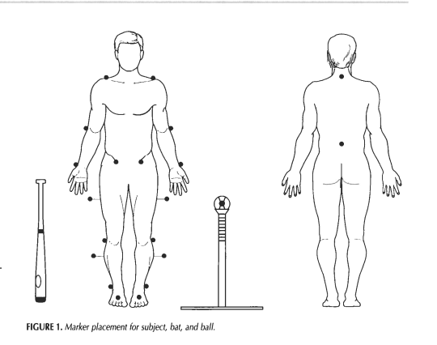

研究目的

野球の打撃における基礎的なバイオメカニクス（力学）を三次元のキネマティクス（運動学）とキネティクス（動力学）データを用いて定量的に定義すること。

Q：ここでのバイオメカニクス、三次元キネマティクス、キネティクスデータという言葉の意味

研究方法

7名

屋内のバイオメカニクス施設、**ティースタンドを用いたセンター方向へのライナー**

マーカーの装着位置

Welch et al,(1995)では合計23個の反射マーカーを

打者：左右肩（肩鎖関節）、頸部（首の後ろC7、頚椎第7棘突起当たり）、左右肘（外側上顆）、左右手首（尺骨茎状突起と橈骨茎状突起の間の背側）、仙骨（L5腰椎第５番あたり）、左右ASIS（上前腸骨棘、骨盤の左右の出っ張り）、左右大腿（stick marker,下腿の前額面を定義するため）、左右足関節（外果）、左右前足部（靴の上）

ボール、バット先端、バットのグリップ手のすぐ上

光学式

六台のハイスピードカメラ（200fps）で三次元動作分析

Q：カメラの配置は？

2枚のフォースプレート（1000Hz）で両足の床反力（Ground Reaction Force）を測定

Q：面積とヘルツがよくわからん、床反力もわからん
