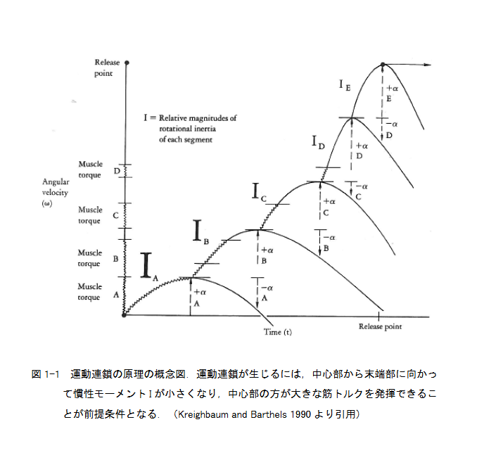
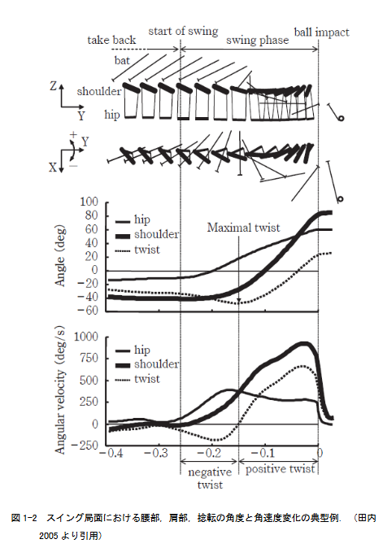

## 30分読書ログ

目的: 1週目は流し読み、2週目は本読み。合計30分以内で、この論文がProject001に使えるかを判断する。

| フェーズ       | 目安 | やること                           |
| -------------- | ---: | ---------------------------------- |
| 準備           |  2分 | タイトル、Abstract、結論を見る     |
| 1週目 流し読み |  8分 | 図表、方法、結果、結論をざっと見る |
| 2週目 本読み   | 15分 | 方法、指標、結果、限界を読む       |
| Project001接続 |  3分 | 自分の研究に使える点を書く         |
| パーキング整理 |  2分 | 気になる単語・疑問を下に残す       |

| 開始時刻 | 終了時刻 | 実読書時間 | 1週目 | 2週目 |
| -------- | -------- | ---------- | ----- | ----- |
|          |          |            | 未/済 | 未/済 |

## パーキングスロット

読んでいる途中で止まりそうになった疑問・知らない単語を一時退避する。ここでは深掘りせず、後日学習する。

| 日付     | 気になったこと・単語                  | 文脈                                                                       | 優先度   | 後日やること |
| -------- | ------------------------------------- | -------------------------------------------------------------------------- | -------- | ------------ |
| 20260714 | Adair(2002)                           | 衝突中にバットに力を加えることもよってボールに与える影響は重要視されない。 | 高/中/低 | 調べる       |
| 20260714 |                                       | バットの運動量を最大化した状態                                             | 中       | 調べる       |
| 20260714 | Slater-Hammel and Stumpner(1950,1951) | 反応時間課題                                                               |          |              |
|          |                                       |                                                                            |          |              |

Breen(1967)優秀な打者に共通した特徴

1. スイング中の身体重心の水平移動
2. 投じられたボールの軌道が見やすいように頭の位置の調整
3. バットのスピードを大きくするためにバットを把持するボトム側上肢の肘関節をスイング開始の直前からまっすぐにしていること
4. 投手側の足部の踏み足だし位置が一定であること
5. ボールをインパクト下後の上半身が打球方向に向いていること

3がいまいちわからないな、図示してほしいです。

この時代は映像解析

鉛直軸方向の回転方向を記述するために上からのカメラ設置

運動連鎖（Kreignhbaum and Barthels 1990）の図がほしい

あったんでいらないす

