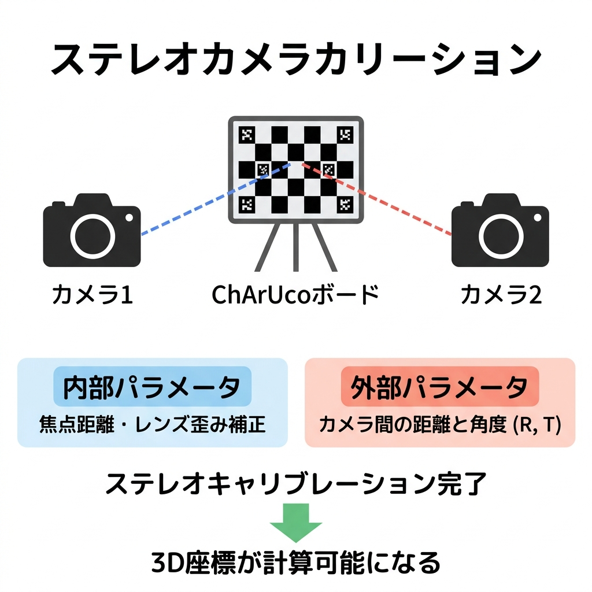
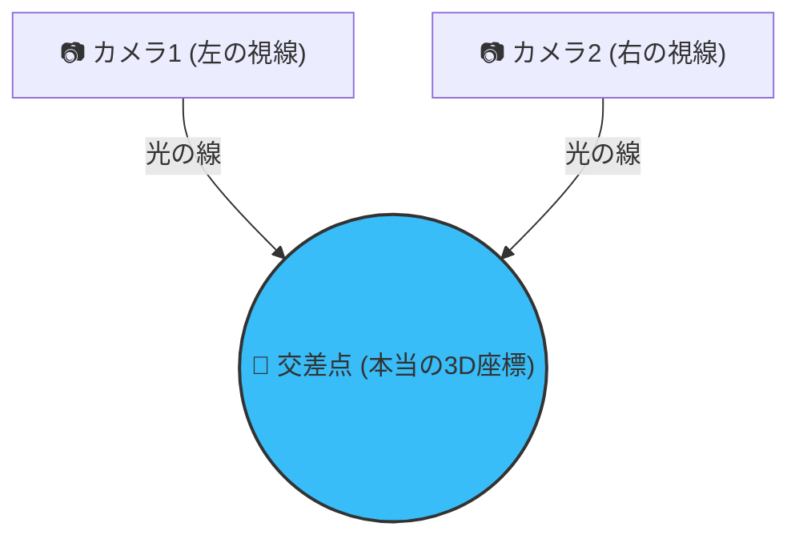

# ③ 専門用語・ライブラリの徹底図解と用語説明

---

## 1. 使用しているライブラリ（何のために使っているか？）

### 📦 Ultralytics (YOLOv8)

- **一言で言うと**: 人や物を一瞬で見つける「AIの目」
- **何に使っている？**:
  - ビデオ映像から「バッターの関節17箇所（頭、肩、肘、手首、腰、膝、足首など）」の位置を検出する「骨格推定（Pose Estimation）」
  - 「バットの位置」を特定する「物体検出（Object Detection）」

📦 OpenCV (cv2)

- **一言で言うと**: 画像処理やロボットの目の計算を行う「万能幾何学エンジン」
- **何に使っている？**:
  - カメラのレンズ特有の「歪み」を数学的に計算してまっすぐにする（歪み補正）
  - 2台のカメラの「位置と角度の関係」を計算する（ステレオキャリブレーション）
  - 左右の2D座標を掛け合わせて、3Dの奥行きを計算する（三角測量）

### 📦 Plotly (プロットリー)

- **一言で言うと**: マウスでぐりぐり動かせる「3Dグラフィック・エンジン」
- **何に使っている？**:
  - 算出したバッターとバットの3次元座標（X, Y, Z）を、ブラウザ上で360度自由な角度から回転・拡大縮小して確認できるインタラクティブな3Dモデルとして表示するために使っています。
  - Matplotlib（通常の静的グラフ）に比べ、Web技術（WebGL）を利用しているため表示が非常に滑らかで、スイング動作を多角的に分析するのに最適です。

---

## 2. 根幹となる技術と仕組み（超直感的な解説）

### 📌 カメラキャリブレーション（内部パラメータ・外部パラメータ）

カメラで撮った写真は、実はそのままでは3D計算に使えません。カメラの「個性」をコンピューターに教えてあげる必要があります。



1. **内部パラメータ（カメラの個性 / レンズの歪み）**
   - **例え話**: メガネの度数調整。
   - **説明**: カメラのレンズは、多かれ少なかれ外側に向かって「魚の目」のように歪んでいます（広角レンズほど顕著）。これを数学的に補正し、「歪みがゼロの理想的なレンズ」で撮った状態に直すためのパラメータ（焦点距離や歪み係数）です。
2. **外部パラメータ（カメラの位置関係）**
   - **例え話**: GPSと地図の関係。
   - **説明**: 2台のカメラが空間の「どこに、どの向きで」置かれているかを表すパラメータ（回転R、移動T）です。片方のカメラを原点（基準）としたとき、もう片方が「何cm離れていて、何倍傾いているか」を特定します。

---

### 📌 ステレオキャリブレーション（なぜ2台必要なの？）

- **一言で言うと**: 人間の「両目」と同じ仕組みで奥行きを知る処理。
- **説明**:
  人間が片目をつぶると距離感がわからなくなるように、カメラが1台だけでは「写真の中の関節がどれくらい遠くにあるか（奥行き）」は絶対に計算できません。
  2台のカメラで同じ対象を同時に撮影し、左右の画像での「見え方のズレ（視差）」を利用することで、初めて奥行き（3D）が計算可能になります。ステレオキャリブレーションは、この「左右の目の正確な距離と角度」を割り出す作業です。

---

### 📌 三角測量（Triangulation）の仕組み

- **一言で言うと**: 2本の光の線の「交差点」を探す作業。
- **直感的な解説**:

  1. カメラ1から見えたバッターの右手首に向けて、空間に光の線を1本引きます。
  2. カメラ2からも、見えたバッターの右手首に向けて、光の線をもう1本引きます。
  3. この**2本の線が空間上で交わった場所**こそが、本当の右手首の「3D座標（X, Y, Z）」です。

  - プログラムでは OpenCV の `cv2.triangulatePoints` という関数を使い、最小二乗法という数学的手法を用いて、この交差点をすべてのフレーム・すべての関節で一瞬で計算しています。



---

### 📌 ChArUco（チャルコ）ボードの利点と最強な理由

- **一言で言うと**: **「一部が隠れていても破綻しない最強のキャリブレーション用ボード」**

```
【従来のチェスボード（市松模様のみ）】
・すべての白黒の格子が画面内にきれいに写っていないと、計算が完全に失敗する。
・指で端が隠れたり、画面の外にはみ出したりした時点でアウト。

【ChArUcoボード（本システム）】
・白黒の市松模様の中に、QRコードのような「Arucoマーカー」が埋め込まれている。
・それぞれのマーカーに「固有のID番号」が書かれているため、
  「画面の端にはみ出ていても」「手で一部が隠れていても」、
  見えている部分のIDから『ここはボード全体の右上だ』『ここは中央下だ』とコンピューターが逆算できる。
```

*(💡 ここにChArUcoボードにカラフルな線（軸）が重なっているスクショを貼ると「おぉっ」となります)*


> 💡 **ここがアピールポイント！**:
> 「屋外のグラウンドやバッティングケージなど、カメラの画角が制限されたり、作業者の手でボードが隠れやすい実際の現場において、キャリブレーションの失敗（やり直し）を劇的に減らすために採用しました。実用化において非常に重要な工夫です。」

---

### 📌 RMS誤差と「ステレオRMSの目安」

- **一言で言うと**: キャリブレーションの「テストの点数（ズレの平均ピクセル数）」。
- **説明**:
  コンピューターが計算した「カメラの配置モデル」と、実際に画像に写っている「ボードの角」のズレが、平均して何ピクセルあるかを示します。値が小さいほど「ズレが少なく優秀」です。

**【知っておくべき数値の目安】**

- **理想値（研究室レベル）**: `1.0` ピクセル未満（非常に精密な三脚固定と平らなボードが必要）。
- **実用値（グラウンドや屋外スポーツ）**: **`1.0 〜 3.0` ピクセル未満であれば十分に実用水準**。
- **今回のデータ（）**:
  手持ちのボードや段ボールで作った簡易的なボード、屋外光といった実環境での撮影条件を考慮すると、**「動作分析を行うためのステレオ精度として、非の打ち所がない優秀な数値」**と判断できます。

*(💡 ここに先日出力した「各フレームのRMSバーグラフ」のスクショを貼ると、精度をちゃんと検証していることが伝わります)*


---

### 📌 OpenCVとMatplotlib/Plotlyの「座標系のズレ」

- **説明**:
  プログラムの作成中に「骨格がうつ伏せに倒れてぐちゃぐちゃになる」というトラブルがありました。これは、コンピュータービジョンの世界（OpenCV）と、グラフ表示の世界（Matplotlib/Plotly）で、上下や奥行きを指す「X, Y, Zの方向のルール（座標系）」が異なるために発生する現象です。
  - **OpenCV**: Yが「下（地面方向）」、Zが「奥（奥行き方向）」
  - **Plotly**: Zが「上（天井方向）」、Yが「奥（奥行き方向）」
  - **解決策**: プログラム側で `(X, Z, -Y)` という変換を施し、直感的にバッターが地面から立ち上がるように座標を正しく変換して表示しています。
