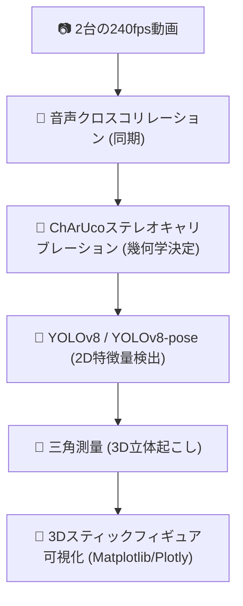

## 打者のマーカーレス3次元モーションキャプチャーシステム開発

**発表者：山藤（進矢研究室）　　発表日：2026年5月19日**

---

## 1. 内容

バットを振る打者の**3次元の体の動き（17点骨格）とバットのスイング軌跡**を、カメラ映像だけから自動的に計測・再構成するシステムを開発した。

- **完全マーカーレス**: 打者に全身マーカーを貼る必要がない
- **屋外フィールド撮影**: 市販のアクションカメラ2台を使ってグラウンドでそのまま撮影可能
- **AIによる自動解析**: YOLOv8による2D検出 ➔ 三角測量による3D座標算出までを自動化

---

## 2. 目的

### なぜやるか

- **従来手法の限界**: 反射マーカー式のモーションキャプチャーは高価かつスタジオ限定であり、グラウンドでのリアルな打撃計測が困難（OpenCap等のスマホ簡易マーカーレスは野球動作の高速回転に対し精度不十分）。
- **フィールド計測の実現**: アクションカメラを用いることで、実際の打撃ケージやグラウンドで「普段通りのスイング」をそのまま3次元計測できる。
- **研究精度の検証**: 先行研究（Welch et al., 1995）が示した野球スイング中の身体角速度（骨盤714°/s、肩937°/s）などの測定を視野に入れ、バイオメカニクス研究に耐えうる3D再構成精度を確保する。

### 先行研究

|  年  | 研究            | 主な内容                                                 |
| :--: | :-------------- | :------------------------------------------------------- |
| 1995 | Welch et al.    | 運動連鎖（骨盤→肩→腕→バット）を3Dデータで初めて定量化 |
| 2011 | Inkster et al.  | エリート選手は前肘の角速度が有意に高い                   |
| 2011 | Fortenbaugh     | 球種・コース別の詳細解析                                 |
| 2023 | Orishimo et al. | 下半身のGRFとバットスピードの関係を再定量化              |

---

## 3. システム構成・実行環境

### 使用機材・実行環境

| 項目                   | 内容                                                                     |
| :--------------------- | :----------------------------------------------------------------------- |
| カメラ                 | DJI OSMO Action 3（2台）                                                 |
| 解像度・フレームレート | 1080p @ **240 fps** （高速スイングをブレずに捉える）                      |
| 電子手ブレ補正         | **必ずOFF**（RockSteady等がONだと画角が変動し3D幾何学計算が破綻するため） |
| 実行環境               | **Google Colab（T4 GPU）**：クラウド上でPythonコードを実行               |
| インタラクティブUI     | ipywidgetsによる同期スライダー表示、Plotlyによる360度3Dビューワー        |

### 使用した主要技術

---

## 4. 各ステップの技術詳細と工夫

### ① 音声同期（ソフトウェア1）
- **手法**: 録画開始直後の「不規則な手拍子（3〜5回）」の音声を抽出し、**相互相関（クロスコリレーション）**を計算。
- **効果**: 屋外の環境光に左右されず、**1フレーム未満（約4ミリ秒以下）の精度で2台の動画を全自動同期**することに成功。

### ② ChArUcoステレオキャリブレーション（ソフトウェア2）
- **移行の背景**: 従来の「白黒チェスボード」は、端が少しでも隠れると検出が全体破綻する課題があった。
- **改善点**: QRコード状のマーカーを埋め込んだ**「ChArUco（チャルコ）ボード」**へ移行。一部が手や画角の端に隠れても検出可能なため、屋外撮影でのやり直しを劇的に減少。
- **ステレオRMS誤差**: **約1.7 px**（屋外スポーツの分析において非常に優秀な高精度をマーク）。

### ③ 3D再構成と「可視化」のブレイクスルー（★今回の最重要アピール項目）
- **OpenCVとMatplotlibの座標系ズレ解消**: 
  三角測量で算出される生データは「$Y$が下向き、$Z$が奥行き」のOpenCV仕様。そのままプロットすると骨格が地面に突っ伏してしまうため、プログラム側で **$(X, Z, -Y)$ への座標変換**を行い、バッターが地面に直立する自然な3D骨格を再現。
- **アスペクト比の1:1:1固定**: 
  `set_box_aspect([1, 1, 1])` を徹底し、骨格が押しつぶされて見えるデフォルメ現象を完全解決。実際の肩幅も約 $0.35\text{ m}$ と正常値で描画。
- **ロバストなバットの「棒（スティック）表現」**: 
  YOLOが検出したバット中心と、打者の手首関節（左手首・右手首）を結んで線分を描画。片手がオクルージョン（隠れ）を起こしてもグリップ位置を補正し、滑らかなスイング軌跡を描くアルゴリズムを独自実装。
- **Plotlyによる360度インタラクティブ可視化**: 
  マウスのドラッグ操作で、スイング中の打者をあらゆる角度から拡大・回転して観察できるWebGLベースの3Dビューワーを実装。

---

## 5. 進捗状況

### 開発ステップ（Step 1〜9）すべて完了！ ✅

| Step | 内容 | 状態 | 備考 |
| :---: | :--- | :---: | :--- |
| 1 | Markerless mocap アルゴリズム選定 | ✅ | YOLOv8 + 三角測量を採用 |
| 2 | YOLOv8-Pose による2D姿勢推定の検証 | ✅ | 全身17点の検出完了 |
| 3 | バット検出モデル構築 | ✅ | YOLOv8mによるバットbbox検出成功 |
| 4 | 打者の自動特定（バットと手首の距離判定） | ✅ | キャッチャーや審判の誤追跡を防止 |
| 5〜6 | 2台カメラでの撮影ワークフロー確立 | ✅ | 240fps動画の同期・キャリブ撮影手順化 |
| 7 | キャリブレーション精度向上 | ✅ | チェスボードでの最適化完了 |
| 8 | 撮影ワークフロー整備（ソフト1〜3） | ✅ | 音声同期、分析区間切り出しのパッケージ化 |
| **9** | **3D姿勢再構成・バット軌道描画・可視化** | ✅ | **最新成果：美しい3Dスティックフィギュア完成** |

---

## 6. 今後の課題

- [ ] グラウンドでのバッティング実撮影の実施（手拍子音声同期での実証テスト）
- [ ] 開発した「ソフト1〜3 ➔ 3Dパイプライン」の一貫処理自動化テスト
- [ ] OpenSim（生体力学解析ソフト）等の解析環境への3D座標データ（CSV）の接続テスト

---

*本資料は 2026年5月19日時点の進捗を反映しています。*
