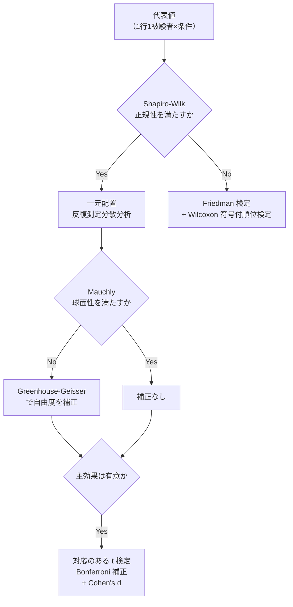
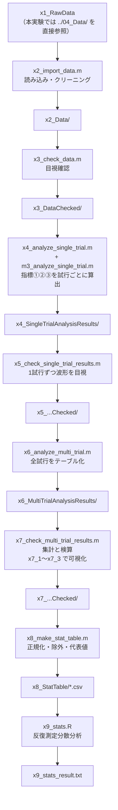

# 分析ワークフロー学習資料

**作成日**: 2026-08-18
**作成者**: 加藤 和太郎 (student)
**対象**: このプロジェクトの分析を初めて触る人、および分析の内容を他者に説明する必要がある人

## 構成案

各分析指標について
各分析指標の計算式

一般的な数値・傾向との比較

> **構成案への対応状況**（2026-08-18）
>
> | 構成案の項目               | 対応する節                                    | 状態                                   |
> | :------------------------- | :-------------------------------------------- | :------------------------------------- |
> | 各分析指標について         | §4.1 / §5.1 / §6.1（何を表す指標か・定義） | 記入済み                               |
> | 各分析指標の計算式         | §4.3–4.4 / §5.3 / §6.3（式と実装の対応）  | 記入済み                               |
> | 一般的な数値・傾向との比較 | §5.6 / §6.5（Orishimo et al., 2023）          | 記入済み                               |
> |                            | §4.6（反応時間）                              | **記入待ち**（参照文献の指定後）       |
>
> §1–§3 は指標の式を読むための前提（条件・信号・共通前処理）、§7 以降は指標を出したあとの処理（集計・統計）と補足である。

---

## 0. この資料の使い方

この資料は「**コードを読む前に、何をやっているのかを言葉と式で理解する**」ためのものである。

- `CLAUDE.md` … ワークフローの手順書（どのフォルダに何を置くか）
- `技術説明.md` … トラブルシューティングの記録（なぜ今の実装になったか）
- **本資料** … 指標の定義・計算式・その根拠

**本体は §4・§5・§6 の3つの指標の節**である。3節は同じ構成（何を表すか → 定義 → 計算式 → 実装の対応 → 一般値との比較 → 既知の課題）で書いてあり、どれか1つだけ読んでも完結する。

| 目的                             | 読む節                            |
| :------------------------------- | :-------------------------------- |
| 指標の意味と式を知りたい         | §4 / §5 / §6（必要なものだけ） |
| 式の記号や信号の前提を確認したい | §2・§3                          |
| 試行の値がどう論文の数値になるか | §7・§8                          |
| コードを触る／実行する           | §9・§10                         |
| 式を Word に貼りたい             | §15（LaTeX 一覧）                |

---

## 1. 研究の枠組み

### 1.1 問い

**認知的負荷が高くなるほど、バットスイングはどう変わるか。**

野球の打撃は「来た球を打つかどうかを判断しながら振る」動作である。判断の負荷が動作そのもの（速さ・力の使い方）に影響するのかを、負荷の異なる4条件を比較して調べる。

### 1.2 4条件（独立変数）

| 条件                  | 課題                                                 | 認知的負荷 |
| :-------------------- | :--------------------------------------------------- | :--------- |
| `free` 自由スイング | Ready cue のあと、好きなタイミングで全力スイング     | なし       |
| `simple` 単純反応   | Go cue が出たらできるだけ速く全力スイング            | 低         |
| `gonogo` Go/No-Go   | 緑（Go）なら振る／赤（No-Go）なら振らない            | 高         |
| `gostop` Go/Stop    | 振り始めた 0.25 秒後、赤（Stop）が出たら途中で止める | 最高       |

各条件 15 試行、計 60 試行。`gonogo` / `gostop` は Go:No-Go(Stop) = 10:5。

### 1.3 3つの指標（従属変数）

時系列の順に並んでいる。「刺激 → 反応の開始 → 動作の発揮 → その力学的背景」。

| #  | 指標                       | 何を表すか                     | 節  |
| :- | :------------------------- | :----------------------------- | :-- |
| ① | **反応時間 (RT)**    | 刺激が出てから体が動き出すまで | §4 |
| ② | **スイングスピード** | バット先端の並進速度のピーク   | §5 |
| ③ | **床反力 (GRF)**     | 両足の鉛直方向のピーク値       | §6 |

```
LED が光った時刻          ─┐
                           ├→ ① 反応時間 [ms]
体が動き出した時刻        ─┘

バット先端マーカーの座標  ──→ 微分 ──→ 速度 ──→ ② ピーク [m/s]

フォースプレートの出力    ──→ ③ ピーク鉛直分力 ──→ 体重で正規化 [BW]
```

**分析とは、この3本の矢印を、誰がやっても同じ結果になる手続きに落とすことである。**

---

## 2. 前提：データの正体

指標の式を読む前に、「手元にある信号が何か」を確認する。

### 2.1 2つのサンプリング系統

本プロジェクトの分析で最も混乱しやすい点である。

| 系統                 | 中身                           | サンプリング周波数 | コード上の呼び方                                       |
| :------------------- | :----------------------------- | :----------------- | :----------------------------------------------------- |
| **マーカー系** | 反射マーカーの3次元座標        | **250 Hz**   | `Data.Markers`, `Data.FrameRate`                   |
| **アナログ系** | LED 信号・フォースプレート出力 | **1000 Hz**  | `Data.LEDData`, `Data.Force1/2`, `Data.AnalogFs` |

**同じ「時刻」でも、番号のスケールが4倍違う。**

```
アナログ系: |||||||||||||||||||||||||||||||||||||||||  1000 Hz（1 サンプル = 1 ms）
マーカー系: |   |   |   |   |   |   |   |   |   |       250 Hz（1 フレーム = 4 ms）
```

換算はこの1行に集約されている（`m3_analyze_single_trial.m:108`）。

```matlab
tCueMarker = round(tCueAnalog / Data.AnalogFs * fs) ;
```

$$
t_{\text{cue}}^{(250)} = \mathrm{round}\!\left( t_{\text{cue}}^{(1000)} \times \frac{250}{1000} \right)
$$

> **単位を変数名に書く理由**
> `SwingOnsetHand` は 250 Hz のフレーム番号、`SwingOnsetForce` は 1000 Hz のサンプル番号である。取り違えると4倍ずれるため、下流では必ず ms に直した `RTHand_ms` / `RTForce_ms` を使う。

#### なぜ床反力のほうが速いのか

「力は位置より高速に変化するため、高い時間分解能が要る」というのが理由である。予備実験の学習ログ [step4_learning_log.md](<../../Preliminary%20experiments/2026-0604/MATLAB/s4_SingleTrialAnalysisScratch/s401_filter_mocap_data/step4_learning_log.md>)（2026-05-21）に、そのメカニズムが2つの視点で整理されている。

| 視点   | 内容                                                                                                                                                                |
| :----- | :------------------------------------------------------------------------------------------------------------------------------------------------------------------ |
| 身体的 | 筋肉（エンジン）は一瞬でフルパワーになるが、質量を持つ体（車体）が動き出すには必ずタイムラグがある。**位置が変わる前に力だけが立ち上がる**                    |
| 物理的 | フォースプレートや骨は「ものすごく硬いバネ」である。**0.001 mm という極小の変形だけで巨大な反発力を生む**ため、位置がほぼ動いていないのに力は一瞬で跳ね上がる |

同ログ §4 には、**サンプリング周波数が違っても遮断周波数は揃える**という原則（カットオフ周波数の不一致問題）も記録されている。§3.3 で両者を 30 Hz に揃えているのはこの理由による。

> 学習ログ内の `fs = 200 Hz` は予備実験の初期設定である。本実験のマーカーは **250 Hz**（Methods 2-2 で確定）なので、数値をそのまま引用しないこと。

### 2.2 座標系

| 軸          | 向き                                      |
| :---------- | :---------------------------------------- |
| **X** | 投手–捕手方向（**正 = 投手方向**） |
| Y           | 左右方向                                  |
| Z           | 鉛直方向                                  |

スイングは「捕手方向に引いて（テイクバック、$v_x<0$）、投手方向に振る（$v_x>0$）」ので、**X の符号がそのまま動作の向きを表す**。ピークを $\max(v)$ で取り $\max(|v|)$ にしないのは、テイクバックの逆向きピークを拾わないためである。

### 2.3 LED 信号（キューの判定）

`Data.LEDData` は 2 チャンネル。ch1 = Ready cue、**ch2 = 課題の cue**。

```
Go 試行（gonogo）      ─────┐        ┌──────   正のパルスのみ
                            └────────┘

No-Go 試行             ─────┐        ┌──────
                            └──(−)───┘         負のパルスのみ

gostop の go 試行      ──┐  ┌─┐   ┌──────  +5V(0.1s) → 0V(0.25s) → +5V
                         └──┘ └───┘

gostop の stop 試行    ──┐  ┌─┐            +5V(0.1s) → 0V(0.25s) → −5V
                         └──┘ └───┐  ┌───
                                   └──┘
```

判定規則（`parameters.m` の `Prm.Cue.*`）:

| 波形                 | 判定     | 起点$t_{\text{cue}}$           |
| :------------------- | :------- | :------------------------------- |
| 正のパルスのみ       | `Go`   | 正のパルスの立ち上がり           |
| 正 → 1.0 秒以内に負 | `Stop` | **正**のパルスの立ち上がり |
| 負のパルスのみ       | `NoGo` | 負のパルスの立ち上がり           |

**重要**: gostop は Stop 試行でも必ず先に go cue（正）が出る。「正があれば Go」と判定すると Stop 試行が全部 Go に混ざる（実際に起きた。`技術説明.md` §3.2）。

### 2.4 フォースプレート

|            | 配置                         | 3列の中身           |
| :--------- | :--------------------------- | :------------------ |
| `Force1` | **後ろ足**（軸足）     | Fx, Fy,**Fz** |
| `Force2` | **前足**（踏み込み足） | Fx, Fy,**Fz** |

本研究の主指標は**3列目の鉛直分力 Fz のみ**を使う。

```matlab
Fz1 = Data.Force1(:, 3) ;   % 後ろ足の鉛直分力 [N]
```

### 2.5 記号の約束（§4–§6 共通）

| 記号                 | 意味                                                                 | 単位                 |
| :------------------- | :------------------------------------------------------------------- | :------------------- |
| $\Delta t$         | サンプリング間隔。マーカー系$1/250$ s、アナログ系 $1/1000$ s     | s                    |
| $\mathbf{p}(t)$    | マーカーの位置ベクトル$(x,y,z)$                                    | m                    |
| $\mathbf{v}(t)$    | 速度ベクトル                                                         | m/s                  |
| $v_x(t)$           | 速度の投手方向成分                                                   | m/s                  |
| $t_{\text{cue}}$   | キューの点灯時刻                                                     | フレーム or サンプル |
| $t_{\text{onset}}$ | 動作開始時刻                                                         | フレーム or サンプル |
| $F_{z1}, F_{z2}$   | 後ろ足・前足の鉛直床反力                                             | N                    |
| $W$                | キュー起点の探索窓$[t_{\text{cue}},\; t_{\text{cue}}+2\,\text{s}]$ | —                   |

---

## 3. すべての指標に共通する前処理

3指標のうち①②はマーカー座標、③は床反力から算出するが、**「微分・ピーク検出の前に平滑化する」という考え方は共通**である。

### 3.1 手順

```
(1) 欠損の補間   →   (2) 30 Hz ローパス   →   (3) mm → m
                                                    ↓
                                            (4) 中心差分 → 速度
```

### 3.2 なぜこの順番か

**(1) 補間が先** — `filtfilt` は入力に `NaN` が1つでもあると、**出力全体が NaN になる**。フィルタの前に必ず埋める。

| 段階                        | 補間の方法                                                 | 対象     |
| :-------------------------- | :--------------------------------------------------------- | :------- |
| x2（`interp_nan_spline`） | スプライン。**10 サンプル以下**の欠損のみ埋める      | マーカー |
| m3                          | 線形＋外挿。埋め残しを処理                                 | マーカー |
| m3（床反力）                | 補間しない。**NaN を含む試行はフィルタごとスキップ** | Fz       |

> 10 サンプル（40 ms）を超える欠損を埋めないのは、補間が「前後が分かっているから間を推測できる」処理だからである。それを超えると推測ではなく捏造になる。埋めずに `ErrorCode` を立て、人間の判断に回す。

**(2) フィルタが微分の前** — **微分は高周波ノイズを増幅する**。

```
位置の信号:  ゆるやかな曲線 + 小さな高周波ノイズ
                    ↓ 微分（差分を Δt で割る）
速度の信号:  ゆるやかな曲線 + 【大きな】高周波ノイズ
```

微分は「隣との差」を $\Delta t = 0.004$ で割る操作なので、細かい振動ほど強調される。ノイズを乗せたまま微分すると速度波形がギザギザになり、ピークが実際より高く出る。

**(3) 単位変換が微分の前** — 先に $/1000$ して m にしておけば、微分結果が最初から m/s になる。

### 3.3 フィルタの仕様

```matlab
[b, a] = butter(2, fc/(fs/2)) ;              % 2次バターワース、遮断 30 Hz
M = filt_all_fields(b, a, Data.Markers) ;    % 中身は filtfilt
```

| 項目       | 内容                                                            |
| :--------- | :-------------------------------------------------------------- |
| 種類       | Butterworth ローパス、**2次**                             |
| 遮断周波数 | **30 Hz**（マーカー・床反力とも同じ）                     |
| 適用       | `filtfilt`（順方向＋逆方向）→ **ゼロ位相**・実効4次    |
| 引数の規約 | MATLAB は遮断周波数をナイキスト周波数$f_s/2$ で正規化して渡す |

- **`filtfilt` である必然性**: 通常の `filter` は位相を遅らせる。反応時間のように**時刻そのものを測る**分析では、位相ずれは検出時刻の系統誤差になる。順逆2回がけで位相ずれが打ち消される
- **30 Hz の根拠**: 5〜50 Hz で感度分析を行い、30 Hz 以上ではピーク変化が 0.04 m/s（約 0.15%）未満のプラトーに入ることを確認済み
- **マーカーと床反力で Hz を揃える理由**: サンプリング周波数が違っても（250 / 1000 Hz）、遮断周波数を Hz で揃えれば同じ帯域を落とせる

### 3.4 微分（中心差分・3点差分法）

`diff3p.m`。

$$
\mathbf{v}(t_i) = \frac{\mathbf{p}(t_{i+1}) - \mathbf{p}(t_{i-1})}{2\,\Delta t}
$$

端点（1点目・最終点）は前後どちらかが無いので、片側3点式を使う。

$$
\mathbf{v}(t_1) = \frac{-3\mathbf{p}(t_1) + 4\mathbf{p}(t_2) - \mathbf{p}(t_3)}{2\,\Delta t},
\qquad
\mathbf{v}(t_n) = \frac{\mathbf{p}(t_{n-2}) - 4\mathbf{p}(t_{n-1}) + 3\mathbf{p}(t_n)}{2\,\Delta t}
$$

|              | 前進差分$\dfrac{p_{i+1}-p_i}{\Delta t}$                  | 中心差分       |
| :----------- | :--------------------------------------------------------- | :------------- |
| 打ち切り誤差 | $O(\Delta t)$ | **$O(\Delta t^2)$** — 1桁小さい |                |
| 時間遅れ     | 半サンプル分ずれる                                         | **なし** |

出典：バイオメカニクス20講 p.166。

---

# 【本体】3つの分析指標

---

## 4. 指標①　反応時間（RT）

### 4.1 何を表す指標か

**刺激（Go cue）が呈示されてから、体が動き出すまでの時間。** 課題の認知的負荷が判断の速さに与える影響を、もっとも直接に反映する指標である。

条件による予測:

```
simple  <  gonogo  <  gostop
 反応するだけ   振るか判断    振ってから止める判断
```

`free` 条件は Go cue を呈示しないため、**論文上の分散分析からは除外**される（反応時間だけ3水準）。ただし「キューに反応していない条件」として、検出が妥当かを確かめる基準線に使えるので、テーブルには値を残す。

### 4.2 定義

$$
\mathrm{RT} = \frac{t_{\text{onset}} - t_{\text{cue}}}{f_s} \times 1000 \quad [\mathrm{ms}]
$$

$t_{\text{cue}}$ は §2.3 で決まる。**難しいのは $t_{\text{onset}}$（動作開始時刻）をどう決めるか**であり、本研究では**2通りの方法で算出して両方を並記する**。

|            | **Hand 方式**（Nasu et al., 2020 準拠）   | **Force 方式**（床反力） |
| :--------- | :---------------------------------------------- | :----------------------------- |
| 見る信号   | 手部重心 − 骨盤重心 の投手方向速度             | 後ろ足の$F_{z1}$             |
| 閾値       | 全スイング試行の**平均ピーク速度 × 10%** | 平常時から**10 SD** 逸脱 |
| 持続条件   | なし                                            | **30 ms** 継続           |
| 探索の向き | ピークから**時間を遡る**                  | 前向きに探す                   |
| 分解能     | 250 Hz（4 ms）                                  | 1000 Hz（1 ms）                |
| 出力列     | `RTHand_ms`                                   | `RTForce_ms`                 |

> **なぜ2方式なのか**
> 予備実験の検討で「$F_{z1}$ 単独では検出時刻の正しさを検証する手段がない」と結論された。身体マーカーによる検出を**照合相手**として持つことが目的である。実際この設計が §4.7 の問題の発見につながった。

### 4.3 計算式 ── Hand 方式

#### (1) セグメント重心

手部（手背3点）・骨盤（ASIS・PSIS 各2点）とも、構成マーカーの幾何学的重心を代表点とする。

$$
\mathbf{p}_{\text{hand}}(t) = \frac{1}{3}\sum_{i=1}^{3} \mathbf{p}_i(t),
\qquad
\mathbf{p}_{\text{pelvis}}(t) = \frac{1}{4}\sum_{j=1}^{4} \mathbf{p}_j(t)
$$

使用マーカー（`Prm.RT.HandMarkerNames` / `Prm.RT.PelvisMarkerNames`）:
`Firtst`, `Second`, `Third`（QTM 側の綴りのまま）／ `RASIS`, `LASIS`, `RPSIS`, `LPSIS`

#### (2) 体幹補正（骨盤の減算）

$$
\mathbf{p}_{\text{rel}}(t) = \frac{\mathbf{p}_{\text{hand}}(t) - \mathbf{p}_{\text{pelvis}}(t)}{1000}
\qquad [\mathrm{m}]
$$

$$
v(t) = \left. \frac{d}{dt}\mathbf{p}_{\text{rel}}(t) \right|_{x\text{ 成分}}
= v_{\text{hand},x}(t) - v_{\text{pelvis},x}(t)
$$

> **なぜ骨盤を引くのか**
> 手の速度には「体全体が前に動いた分」が含まれる。ステップして体重移動すれば、手を動かさなくても手のマーカーは前に進む。骨盤の速度を引くことで、**体幹に対する手の相対的な動き**だけを取り出す。

> **実装メモ**: 原法は「補間 → 重心 → フィルタ」の順だが、コードは「補間 → フィルタ → 重心」である。`filtfilt` も平均も線形操作なので**数学的に同一**の結果になる。

#### (3) 閾値（全試行から決まる）

各試行のピークを、キュー起点2秒の窓 $W_j$ 内で取る。

$$
v_{\text{peak},j} = \max_{t \in W_j} v_j(t)
$$

被験者ごとに、**No-Go / Stop を除く全条件・全試行**で平均する。

$$
\bar{v}_{\text{peak}} = \frac{1}{N}\sum_{j=1}^{N} v_{\text{peak},j}
\qquad\Longrightarrow\qquad
v_{\text{thr}} = 0.10 \times \bar{v}_{\text{peak}}
$$

> **なぜ条件別に平均しないのか**
> 条件ごとに平均すると、**条件差そのものが閾値の差に吸収されて消える**。全条件をまとめることで、すべての試行を同じものさしで測る。
>
> `free` を含めるかは実測で判断した。free 込み 0.742 m/s / free 抜き 0.757 m/s と差が 2% しかなく、条件別平均も free 6.99 / simple 7.84 / gonogo 7.08 / gostop 7.67 m/s と free が突出していないため、**free 込みで確定**した。

#### (4) 動作開始（ピークから遡る）

$$
t_{\text{onset}} = \max\{\, t \le t_{\text{peak}} \;\mid\; v(t) \le v_{\text{thr}} \,\}
$$

「ピーク時刻から時間を遡り、**閾値を下回った最後の点**」である。

```
速度
  │                        ╱╲  ← ピーク
  │                       ╱  ╲
  │    ∧      ∧         ╱
  │   ╱ ╲    ╱ ╲       ╱      構え・ステップの小さな山
  │──╱───╲──╱───╲─────╱────── ← 閾値 v_thr
  │
  └──────────────────────────→ 時間
      ↑誤検出            ↑正解
   （前向きに探すとここで引っかかる）
```

> Methods 本文の式2は $t_{\text{onset}} = \min\{ t \mid v(t) > 0.10\,\bar{v}_{\text{peak}} \}$ という前向きの表現になっているが、**実装はピークから遡る形**である。前向きに探すと構え・ステップの小さな山を誤検出するため（`00_RT分析/技術説明.md` §2.3 手順9）。本文の表記は実装に合わせて確認が必要。

#### (5) 反応時間

$$
\mathrm{RT}_{\text{hand}} = \frac{t_{\text{onset}} - t_{\text{cue}}^{(250)}}{250} \times 1000 \quad [\mathrm{ms}]
$$

### 4.4 計算式 ── Force 方式

#### (1) 平常時の統計量

キュー直前 0.5 秒を「平常時」とみなす。$n_{\text{base}} = 0.5 \times 1000 = 500$ サンプル。

$$
\mu = \frac{1}{n_{\text{base}}}\sum_{t = t_{\text{cue}}-n_{\text{base}}}^{t_{\text{cue}}-1} F_{z1}(t),
\qquad
\sigma = \mathrm{SD}\left[ F_{z1}(t) \right]_{t = t_{\text{cue}}-n_{\text{base}}}^{t_{\text{cue}}-1}
$$

#### (2) 逸脱の判定

$$
\mathrm{over}(t) = \bigl[\; |F_{z1}(t) - \mu| > k\sigma \;\bigr],
\qquad k = \texttt{Prm.RT.FzK} = 10
$$

#### (3) 持続条件つきの最初の時点

$$
t_{\text{onset}} = \min\left\{\, t \in W \;\middle|\; \mathrm{over}(\tau) = 1 \ \ \forall \tau \in [t,\; t + n_{\text{hold}} - 1] \,\right\},
\qquad n_{\text{hold}} = 30
$$

「30 ms 連続で閾値を超えた区間の、最初のサンプル」である。持続を要求するのは**単発のノイズ1点で誤検出しないため**。

実装は `firstSustained()`（`m3_analyze_single_trial.m:216`）。差分をとって立ち上がり・立ち下がりの位置を求め、長さが $n_{\text{hold}}$ 以上の最初の区間を返す。

#### (4) 反応時間

$$
\mathrm{RT}_{\text{force}} = \frac{t_{\text{onset}} - t_{\text{cue}}^{(1000)}}{1000} \times 1000 \quad [\mathrm{ms}]
$$

アナログ系は 1000 Hz なので、**サンプル差がそのまま ms になる**。

### 4.5 実装の対応

#### なぜ2パス構成なのか

Hand 方式の閾値は「その被験者の**全試行**の平均ピーク × 10%」なので、**1試行だけ見ても決まらない**。そこで処理を2段階に分けている。

| パス    | 場所                          | 内容                                                                   |
| :------ | :---------------------------- | :--------------------------------------------------------------------- |
| 第1パス | `m3_analyze_single_trial.m` | 手部速度の波形とピーク（`PeakVelHandX` / `TPeakVelHandX`）だけ出す |
| 第2パス | `x4_analyze_single_trial.m` | 全試行のピークから閾値を確定 →`detectHandOnset()` で onset 検出     |

Force 方式は「その試行のキュー前 0.5 秒」だけで閾値が決まるので `m3` 内で完結する。

> **一般化できる考え方**: 「1試行で決まる量」と「全試行が揃わないと決まらない量」を分け、処理する場所を変える。この切り分けはどの分析にも出てくる。

#### 変数の対応

| 式の記号                      | 変数                                   | 場所 | 単位                        |
| :---------------------------- | :------------------------------------- | :--- | :-------------------------- |
| $v(t)$                      | `Result.VelHandX`                    | m3   | m/s                         |
| $v_{\text{peak},j}$         | `Result.PeakVelHandX`                | m3   | m/s                         |
| $t_{\text{peak}}$           | `Result.TPeakVelHandX`               | m3   | フレーム                    |
| $\bar{v}_{\text{peak}}$     | `meanPeak`                           | x4   | m/s                         |
| $v_{\text{thr}}$            | `thrVelHand`                         | x4   | m/s                         |
| $t_{\text{onset}}$（Hand）  | `Result.SwingOnsetHand`              | x4   | **フレーム(250 Hz)**  |
| $t_{\text{onset}}$（Force） | `Result.SwingOnsetForce`             | m3   | **サンプル(1000 Hz)** |
| $\mu, \sigma$               | `Result.Fz1BaseMean` / `Fz1BaseSD` | m3   | N                           |
| RT                            | `Result.RTHand` / `Result.RTForce` | —   | ms                          |

#### 関連パラメータ（`parameters.m`）

```matlab
Prm.RT.HandThrRatio = 0.10 ;   % 平均ピーク速度に対する閾値の比
Prm.RT.FzK          = 10 ;     % ベースライン SD の何倍か
Prm.RT.DurMs        = 30 ;     % 持続時間 [ms]
Prm.RT.BaseSec      = 0.5 ;    % ベースライン窓 [s]
Prm.RT.WinSec       = 2.0 ;    % 探索窓 [s]
Prm.RT.FloorMs      = 150 ;    % 生理的下限（目視照合の基準。強制 NaN 化はしない）
Prm.RT.PrimaryMethod= 'Force' ;% Result.RT に入れる方式
```

#### 算出の対象

**RT はすべての試行で算出する**（No-Go / Stop も含む）。抑制試行でも姿勢制御による荷重変化は生じるため、検出値そのものを見て判断できるようにしておく。どの試行を反応時間として報告するかは、下流（x6 以降）で `CueText` 列により選別する。

### 4.6 一般的な数値・傾向との比較

> **記入待ち**（参照文献の指定後に埋める）

| 項目               | 本研究（S01・参考値） | 先行研究の値 | 出典 |
| :----------------- | :-------------------- | :----------- | :--- |
| 単純反応課題の RT  |                       |              |      |
| Go/No-Go 課題の RT |                       |              |      |
| Go/Stop 課題の RT  |                       |              |      |
| 条件間の序列       |                       |              |      |
| 動作開始検出の閾値 |                       |              |      |

**本研究の実測値（S01、Go 試行の条件別平均）** ── 比較の材料として先に置いておく。

| 条件   | n  | RTHand [ms]    | RTForce [ms]   | 差 [ms]                 |
| :----- | :- | :------------- | :------------- | :---------------------- |
| free   | 13 | 952.9 ± 134.1 | 804.8 ± 227.0 | +148.1 ± 260.4         |
| simple | 15 | 583.2 ± 41.5  | 483.3 ± 79.6  | **+99.9 ± 54.4** |
| gonogo | 10 | 622.8 ± 84.0  | 459.5 ± 149.8 | +163.3 ± 145.9         |
| gostop | 10 | 664.8 ± 58.7  | 517.0 ± 156.1 | +147.8 ± 107.2         |

- **床反力が手部に先行**する。simple / gonogo / gostop は 35/35 試行すべてで差が正であり、後ろ足の荷重変化が手の動き出しに先行するという運動連鎖と整合する
- 課題の序列は RTHand で **simple < gonogo < gostop** と仮説どおり。RTForce は逆転している（§4.7）
- free は両方式で最も遅く SD も最大。キューに反応していない条件が明確に分離されている
- 2方式の相関は $r = 0.555$（free 抜き n=35）

> プロジェクト内に既にある比較候補：Nasu et al. (2020) の閾値 0.61 ± 0.09 m/s（`Manuscript/2. Methods/draft.md` 2-4-1 の対照表）。文献の指定後に本節へ整理する。

### 4.7 この指標の既知の課題

**【最優先】Force 方式が条件の順序を逆転させている。**

| 方式    | simple | gonogo           | gostop | 順序                                  |
| :------ | :----- | :--------------- | :----- | :------------------------------------ |
| RTHand  | 583 ms | 623 ms           | 665 ms | simple < gonogo < gostop ✅           |
| RTForce | 483 ms | **460 ms** | 517 ms | **gonogo < simple** < gostop ❌ |

判断が加わる Go/No-Go 課題が単純反応課題より速くなることは理論上ありえない。試行単位で見ると、RTForce のみ SD が倍近く大きく、生理的にありえない短い値が混じる。

| 条件   | RTForce                                      | RTHand                   |
| :----- | :------------------------------------------- | :----------------------- |
| simple | 483 ± 80 ms（最小 287）                     | 583 ± 42 ms（最小 536） |
| gonogo | 460 ±**150** ms（最小 **231**） | 623 ± 84 ms（最小 460） |
| gostop | 517 ±**156** ms（最小 **107**） | 665 ± 59 ms（最小 540） |

350 ms を下回る試行は gonogo に3件、gostop に1件。gostop の 107 ms は生理的下限 150 ms すら下回る。**この短い値が gonogo の平均を押し下げ、順序を逆転させている。**

- ベースライン荷重の不良試行（`IsBadBW`）を除いても、gonogo は 459.5 → 455.9 ms とほぼ動かない。**原因は不良試行ではない**
- 原因は $k = 10$（ベースライン SD の10倍）という閾値が緩く、**キュー直後の姿勢調整を動作開始と誤検出している**と考えられる
- 現在 `Prm.RT.PrimaryMethod = 'Force'` であり、**主指標が不安定なほうになっている**。$k$ の見直しか、主指標を `'Hand'` に切り替えるかの判断が必要

> **これは失敗ではなく、2方式を並記した設計が機能した結果である。** 床反力だけで解析していたら、この値がおかしいことに気づく手段がなかった。

その他:

- **RT にベースライン荷重のガードがない。** `bw = -8.7 N`（ゼロ点が壊れている）の試行が `RTForce = 244 ms` を出力している
- **Methods 本文の式2が前向き探索の表記**になっており、実装（ピークから遡る）と食い違っている

---

## 5. 指標②　スイングスピード

### 5.1 何を表す指標か

**バット先端がどれだけ速く動いたか。** 認知的負荷が動作の出力そのものを低下させるかを見る指標である。野球の現場で「スイングスピード」と呼ばれる量に対応する。

**定義は1つ（バット先端 top マーカーの並進速度）だが、そこから2つの値を導く。**

| 指標                                         | 定義                         | 位置づけ           |
| :------------------------------------------- | :--------------------------- | :----------------- |
| **ピーク合成速度** `PeakVelTop`      | 速度ベクトルのノルムの最大値 | **主要指標** |
| **ピーク投手方向速度** `PeakVelTopX` | X 成分の最大値               | 副次指標           |

補助的に `VelTopXAtPeak`（合成速度がピークになった瞬間の $v_x$）も算出する。これは合成速度の約 90%（0.90〜0.93）になり、**スイングのほとんどが投手方向の運動である**ことを示す。

### 5.2 定義

バット先端マーカー `top` の位置ベクトルを $\mathbf{p}(t)=(x,y,z)$ とし、その時間微分を速度とする。

$$
\mathbf{v}(t) = \frac{d\mathbf{p}(t)}{dt}
$$

### 5.3 計算式

#### (1) 前処理（§3 のとおり）

```
欠損の線形補間 → 30 Hz ローパス（filtfilt） → mm から m へ
```

```matlab
posTop = M.top / 1000 ;   % [m]
```

#### (2) 速度ベクトル（中心差分）

$$
\mathbf{v}(t_i) = \frac{\mathbf{p}(t_{i+1}) - \mathbf{p}(t_{i-1})}{2\,\Delta t},
\qquad \Delta t = \frac{1}{250}\ \mathrm{s}
$$

#### (3) 合成速度（ノルム）

$$
|\mathbf{v}(t)| = \sqrt{v_x(t)^2 + v_y(t)^2 + v_z(t)^2}
$$

#### (4) 2つの従属変数

$$
\text{PeakVelTop} = \max_{t} |\mathbf{v}(t)|
\qquad\qquad
\text{PeakVelTopX} = \max_{t} v_x(t)
$$

$$
t_{\text{peak}} = \arg\max_{t} |\mathbf{v}(t)|
\qquad\Longrightarrow\qquad
\text{VelTopXAtPeak} = v_x(t_{\text{peak}})
$$

> **窓の扱いに注意**: スイング速度のピークは**試行全体**から取る（`max(netVelTop)`）。反応時間（§4）や床反力（§6）がキュー起点2秒の窓を使うのとは異なる。試行内に大きな山が1つしかないため実害は出ていないが、指標ごとに窓が違うことは把握しておく。

> **$\max(v_x)$ であり $\max(|v_x|)$ ではない理由**: テイクバックでは $v_x < 0$ になる。絶対値を取ると捕手方向の動きを「投手方向のピーク」として拾ってしまう。

#### (5) 検算に使える関係

$$
v_x(t) \le |\mathbf{v}(t)| \qquad \text{（常に成立）}
$$

これが破れていたら、どこかで列を取り違えている。`x7_check_multi_trial_results.m` はこれを機械的にチェックしている。

```matlab
fprintf('  Vx > 合成速度 の行（ありえない）: %d\n', ...
    sum(ResultsTable.VelTopXAtPeak > ResultsTable.PeakVelTop + 1e-9)) ;
```

### 5.4 実装の対応

| 式の記号              | 変数                     | 場所 | 単位     |
| :-------------------- | :----------------------- | :--- | :------- |
| $\mathbf{p}(t)$     | `posTop`               | m3   | m        |
| $\mathbf{v}(t)$     | `velTop`               | m3   | m/s      |
| $\|\mathbf{v}(t)\|$ | `Result.NetVelTop`     | m3   | m/s      |
| $v_x(t)$            | `Result.VelTopX`       | m3   | m/s      |
| PeakVelTop            | `Result.PeakVelTop`    | m3   | m/s      |
| $t_{\text{peak}}$   | `Result.TPeakVelTop`   | m3   | フレーム |
| PeakVelTopX           | `Result.PeakVelTopX`   | m3   | m/s      |
| VelTopXAtPeak         | `Result.VelTopXAtPeak` | m3   | m/s      |

該当箇所は `m3_analyze_single_trial.m:25-45`。可視化は `x7_2_visualize_swing_speed.m`。

**集計対象**: No-Go 試行・Stop 試行は**除外する**（スイングを抑制すること自体が課題であり、発揮された速度を比較する対象にならない）。除外は可視化・統計テーブル側で行い、x4〜x6 には全試行を残す。

### 5.5 マーカー配置（参考）

バット長軸に沿って top ▸ barrel ▸ knob ▸ grip ▸ bottom の5点。**解析に使うのは top のみ**で、残り4点は剛体としての追従性を確保するためのものである。

| マーカー         | 貼付位置                                       |
| :--------------- | :--------------------------------------------- |
| **top**    | バット先端の端面（上面）＝**解析に使用** |
| barrel           | top から 14 cm                                 |
| knob             | bottom から 39 cm                              |
| grip             | bottom から 21 cm                              |
| **bottom** | グリップエンドの端面（底面）                   |

使用バットは木製・質量 900 g（SO Sports 社製）。

### 5.6 一般的な数値・傾向との比較

参照先は **Orishimo et al. (2023)**（`Manuscript/References/10_床反力とバットスピード_Orishimo_et_al_2023/`）。バットスピードを**バット先端マーカーの並進速度**として定義しており、本研究と方法論的に最も近い先行研究である。

| 項目 | 本研究（S01・参考値） | Orishimo et al. (2023) |
| :--- | :--- | :--- |
| ピーク合成速度 | free 27.8 / simple 32.0 / gonogo 30.5 / gostop 32.1 m/s | **30.0 ± 2.0 m/s** |
| ピーク投手方向速度 | free 21.1 / simple 30.2 / gonogo 27.2 / gostop 30.6 m/s | 報告なし（合成のみ） |
| $v_x / \|v\|$ の比 | 約 0.90〜0.93 | 報告なし |
| 対象 | 野球経験5年以上・**1名**（S01） | 大学野球選手 **20 名** |
| 課題 | **素振り**（ボールなし） | **ティー打撃**（静止球） |
| 使用バット | 木製 900 g（全員同一） | 記載を要確認 |

**値のオーダーは一致している。** simple 32.0 / gostop 32.1 m/s は Orishimo の 30.0 ± 2.0 m/s（＝28〜32）の上端に収まり、gonogo 30.5 m/s はほぼ中央にある。**算出手続きが妥当であることの傍証**として使える。

比較にあたって注意すべき手続きの違い。

| 項目 | 本研究 | Orishimo et al. |
| :--- | :--- | :--- |
| 速度を取る時点 | 試行内の**最大値** | **ボールコンタクト時**の値 |
| バットマーカーのフィルタ | 30 Hz ローパス | **無フィルタ**（Tabuchi et al., 2007 準拠） |
| サンプリング周波数 | 250 Hz | 500 Hz |

原著は「bat speed ideally peaks at ball contact」を前提としているため、**最大値とコンタクト時の値はほぼ一致する想定**である。フィルタの有無は効く方向が分かっており、**30 Hz ローパスをかけている本研究のほうが低めに出る**。それでも同等の値が得られている点は押さえておく。

> **free 条件だけが 27.8 m/s と低い。** 他3条件が 30〜32 m/s であるのに対し明確に下回り、$v_x$ では 21.1 m/s とさらに差が開く（他条件は 27〜31 m/s）。キューに反応せず任意のタイミングで振る条件で、スイングの質が変わっている可能性がある。n=1 の観察なので解釈は保留するが、被験者が増えた段階で確認すべき点である。

**認知的負荷による低下**は Orishimo の対象外である。二重課題研究（Gray, 2004／Dai et al., 2018／Imai et al., 2022）が参照先として適切なので、必要になった段階で追記する。

### 5.7 この指標の既知の課題

- **ピークの探索窓が他指標と揃っていない**（試行全体 vs キュー起点2秒）
- `free` 行11（`S01_free0012.mat`）は骨盤マーカー4点がラベリング漏れで、試行ごと解析対象外になっている。QTM で再ラベリングが必要
- 投手方向速度 $v_x$ を報告する理由づけ（打球への寄与）は、素振りでは検証できない。考察で今後の課題として扱う

---

## 6. 指標③　床反力（GRF）

### 6.1 何を表す指標か

**スイングという出力を生み出すために、両足が地面をどれだけ強く押したか。** 認知的負荷が「力の使い方」に及ぼす影響を見る指標であり、スイングスピードの背景にある力学を説明する。

| プレート                  | 足                           | 役割                           |
| :------------------------ | :--------------------------- | :----------------------------- |
| `Force1` → `PeakFz1` | **後ろ足**（軸足）     | 動作の始動・体重の保持         |
| `Force2` → `PeakFz2` | **前足**（踏み込み足） | 体重移動の受け止め・回転の支点 |

**鉛直成分（Fz）のみ**を用いる（上向きが正）。前後・左右成分や合成床反力は本研究の対象外である。

### 6.2 定義

探索窓内の鉛直床反力の最大値を、体重で正規化した値。

$$
\text{PeakFz}_i^{\text{BW}} = \frac{\displaystyle\max_{t \in W} F_{zi}^{\text{filt}}(t)}{\text{BW}}
\qquad (i = 1, 2)
$$

### 6.3 計算式

#### (1) フィルタ（マーカーと同一条件）

$$
F_{zi}^{\text{filt}} = \mathrm{filtfilt}(b, a, F_{zi}^{\text{raw}}),
\qquad [b,a] = \mathrm{butter}\!\left(2, \frac{30}{1000/2}\right)
$$

**`filtfilt` の前に `NaN` を弾くこと。** 1つでも含むと出力全体が NaN になる。

```matlab
if ~any(isnan(Fz1_raw)) && ~any(isnan(Fz2_raw))
```

#### (2) ベースライン荷重（正規化の分母）

キュー前の全区間の平均を、両プレートで足す。

$$
\text{BW}_{\text{base}} = \overline{F_{z1}^{\text{filt}}}\Big|_{1}^{\,t_{\text{cue}}-1} + \overline{F_{z2}^{\text{filt}}}\Big|_{1}^{\,t_{\text{cue}}-1}
\qquad [\mathrm{N}]
$$

静止して構えている間は、両足が支えている力の合計が体重に一致するはずである。

#### (3) ピーク値（生値）

$$
\text{PeakFz}_i = \max_{t \in W} F_{zi}^{\text{filt}}(t),
\qquad W = [\,t_{\text{cue}},\ t_{\text{cue}} + 2\,\text{s}\,]
\qquad [\mathrm{N}]
$$

#### (4) 正規化（x8 で実施）

$$
\text{PeakFz}_i^{\text{BW}} = \frac{\text{PeakFz}_i}{\text{BW}_{\text{base}}}
\qquad [\mathrm{BW}]
$$

> **単位に注意**: 実装が返すのは**比**（例 1.3 BW）であり、Methods 本文の %BW（例 130 %BW）とは 100 倍違う。報告時にどちらで書くかを揃える必要がある。

#### (5) 計測不良試行の判定

**「値が異常」ではなく「分母が壊れている」試行**を機械的に弾く。被験者内の中央値を基準にする。

$$
\text{BW}_{\text{ref}} = \mathrm{median}_j\left( \text{BW}_{\text{base},j} \right)
$$

$$
\text{IsBadBW}_j = \Bigl[\; \bigl| \text{BW}_{\text{base},j} - \text{BW}_{\text{ref}} \bigr| > 0.2 \times \text{BW}_{\text{ref}} \;\Bigr]
\ \ \lor\ \
\bigl[\,\text{BW}_{\text{base},j} = \mathrm{NaN}\,\bigr]
$$

該当した試行は $\text{PeakFz}_i^{\text{BW}}$ を NaN にして代表値の平均から外す（行そのものは残す）。

**S01 で実際に弾かれた3試行**:

```
simple 行2   bw = 158.0 N   ← 正常な他試行は 719〜723 N
gonogo 行1   bw =  -8.7 N   ← 負値。ゼロ点がずれている
gonogo 行9   bw =  18.7 N
```

`simple` 行2 は生の $\max(F_{z2}) = 917$ N で、正しい 720 N で割れば 1.27 BW と他試行並みだが、158 N で割ったために **5.81 BW** という外れ値になっていた。

> **なぜ平均でなく中央値か**: 平均は外れ値に引きずられる。壊れた試行を検出するための基準値が、その壊れた試行に影響されては意味がない。
>
> **なぜ試行番号をベタ書きしないか**: `if iTrial == 2, continue, end` と書くと被験者が増えるたびに書き換えが必要になり、なぜ外したかも読めなくなる。**判定基準を書けば、基準そのものが説明になる。**

### 6.4 実装の対応

#### 正規化を m3 でやらない理由

| 理由                                   | 内容                                                                                      |
| :------------------------------------- | :---------------------------------------------------------------------------------------- |
| ① 分母の妥当性が1試行では判定できない | `IsBadBW` は被験者内の中央値との比較で決まる。m3 は1試行しか見えない                    |
| ② 分母を将来差し替える予定がある      | Methods は実測体重（`mass_kg × 9.81`）で割る方針。正規化が1か所なら差し替えは1行で済む |

したがって **m3 は生値 [N] だけを出し、正規化と除外は x8 が担当する**。

| 式の記号                        | 変数                                  | 場所     | 単位   |
| :------------------------------ | :------------------------------------ | :------- | :----- |
| $F_{zi}^{\text{filt}}$        | `Fz1_filt` / `Fz2_filt`           | m3       | N      |
| $\text{BW}_{\text{base}}$     | `Result.BWBase` → `BWBase_N`     | m3 → x6 | N      |
| $\text{PeakFz}_i$             | `Result.PeakFz1/2` → `PeakFz1_N` | m3 → x6 | N      |
| $\text{BW}_{\text{ref}}$      | `bwRef`                             | x8       | N      |
| IsBadBW                         | `T.IsBadBW`                         | x8       | 論理値 |
| $\text{PeakFz}_i^{\text{BW}}$ | `PeakFz1_BW` / `PeakFz2_BW`       | x8       | BW     |

```matlab
Prm.GRF.BWTolerance = 0.2 ;   % 被験者中央値からの許容ずれ（±20%）
Prm.GRF.WinSec      = 2.0 ;   % ピーク Fz の探索窓 [s]
```

### 6.5 一般的な数値・傾向との比較

参照先は **Orishimo et al. (2023)**。本研究の床反力の手続き（%BW 正規化・踏み込み足接地の定義・探索区間）は、そもそもこの論文に準拠して設計されている（Methods 2-4-3）。

| 項目 | 本研究（S01・参考値） | Orishimo et al. (2023) |
| :--- | :--- | :--- |
| ピーク鉛直 GRF（**前足**） | free 149 / simple 129 / gonogo 136 / gostop 150 %BW | **159 ± 29 %BW** |
| ピーク鉛直 GRF（後ろ足） | free 111 / simple 104 / gonogo 103 / gostop 104 %BW | 論文メモに記載なし（**要原著確認**） |
| ピーク後方（A/P）GRF | 算出していない | −57 ± 12 %BW |
| ピーク合成 GRF | 算出していない | 170 ± 30 %BW |

**前足の値は整合している。** 129〜150 %BW は Orishimo の 159 ± 29 %BW（＝130〜188）の下端から中央にかかる範囲にあり、**桁も傾向も一致する**。

やや低めに出る理由は3つ考えられ、いずれも下方向に効く。

| 要因 | 効く方向 |
| :--- | :--- |
| 本研究は**素振り**、Orishimo は**ティー打撃**（打球を打つ） | 本研究が低い |
| 本研究は**全 Go 試行の平均**、Orishimo は**最速3スイングの平均** | 本研究が低い |
| 本研究の探索窓は**キュー起点2秒**、Orishimo は**接地→コンタクト** | 窓が広いぶん本研究は高くなりうる（逆方向） |

> **後ろ足（Force1）は 103〜111 %BW で、条件によらずほぼ体重どおり。** 前足が 129〜150 %BW まで上がるのと対照的である。Orishimo が「踏み込み脚の GRF がバットスピードを最もよく説明する」（$r = 0.57$〜$0.66$、単一指標で分散の約 39% を説明）と結論しているのと整合する。**力を発揮しているのは前足**という描像が、本研究のデータでも確認できる。

#### 比較にあたっての注意

- **正規化の分母が違う。** Orishimo は**実測体重**、本研究は**静止時の $F_{z1}+F_{z2}$**（§6.6）。分母が変われば %BW の絶対値も変わるため、この差し替えが済むまでは概数としての比較にとどめる
- **本研究は BW（比）、原著は %BW（百分率）**。100 倍の違いがあるので混同しない
- **後方 GRF・合成 GRF は本研究では算出していない。** Orishimo の主結果（合成 GRF が最も強く相関）と直接は比較できない。算出していた `x7_4_visualize_grf_new.m` は削除済みで、Methods でも対象外と決定している

#### 認知的負荷による変化

Orishimo の対象外である（同論文は認知課題を扱っていない）。二重課題研究（Dai et al., 2018／Imai et al., 2022）が参照先として適切であり、「認知負荷 → GRF 変化 → スイングスピード変化」という説明の骨格を組むときに Orishimo と組み合わせる、というのが `03_notes.md` の想定である。

### 6.6 この指標の既知の課題

#### Methods 本文と実装の食い違い

| 項目         | Methods 本文                       | 現在の実装                           |
| :----------- | :--------------------------------- | :----------------------------------- |
| 探索範囲     | 踏み込み足の接地 → スイングピーク | **キュー起点 2 秒**            |
| 正規化の分母 | 実測体重（`mass_kg × 9.81`）    | **静止時の $F_{z1}+F_{z2}$** |
| 単位         | %BW                                | **BW（比）**                   |

論文を書く段階までに、どちらかへ揃える必要がある。**実際に解析に用いた手続きを本文に書くのが原則。**

#### `x7_3` の二重計算（方針決定済み・実装は未反映）

**現状**、`x7_3_visualize_grf.m` は m3 の結果を使わず、生の `Data.Force1(:,3)` から `bw`・ピーク値・時系列を**すべて計算し直している**。そのため次の食い違いが生じている。

|            | `m3` → `x8`（統計に使う値） | `x7_3`（図の値）                        |
| :--------- | :------------------------------- | :---------------------------------------- |
| フィルタ   | 30 Hz 適用済み                   | **生波形**（ピークが高く出る）      |
| 欠損試行   | `filtfilt` 前のガードで除外    | `max()` が NaN を無視して**混入** |
| 読み込み元 | `x5_...Checked`                | **`x2_Data`**（未確認データ）     |

**2026-08-18 に、`x7_3` を「m3 が算出した値と波形をそのまま使う」形に改める方針を決定した。** これは `x7_2_visualize_swing_speed.m` が既に採っている方式（`Result.NetVelTop` / `Result.PeakVelTop` を読むだけで再計算しない）に揃えるものである。

| 変更点         | 内容                                                                                |
| :------------- | :---------------------------------------------------------------------------------- |
| ピーク値・体重 | `Result.PeakFz1 / Result.BWBase` を読むだけにする                                 |
| 時系列         | `m3` に `Fz1Filt` / `Fz2Filt`（30 Hz フィルタ後の波形）を出力させ、それを描く |
| `isBadBW`    | `Result.BWBase` から判定する（生データの読み直しが不要になる）                    |

> **副次的な効果**：時系列を「波形全体を描いて `XLim` で切る」方式（x7_2 と同じ）に変えることで、§10.3 の「図が空になる」不具合が**構造的に発生しなくなる**。固定長の切り出しをやめるため、`iEnd > nAnalog` という判定そのものが消える。
>
> **注意**：`m3` に2フィールド増えるため、§10.2 の3か所ルールが発動する。x4 → x5 → x6 → x7 の再実行も必要。

当初は「`x7_3` が `x8_StatTable` のテーブルを読む」案も検討したが、**x7 は x8 の上流**であり、下流の出力を読むとワークフローの向きが逆になるため採らなかった。

#### その他

- **gonogo Trial 5 / gostop Trial 5 の床反力に欠損がある。** `BWBase_N` が NaN になり集計から外れる。上記の変更後は `x7_3` の有効試行数も **free 13 / simple 14 / gonogo 8 / gostop 9** となり、`x8` の `n_PeakFz*_BW` と一致するはずである（これが変更の成否を確認する基準になる）
- 実測体重を解析側に渡す仕組み（被験者情報テーブル等）が未整備
- 遮断周波数 50 Hz を使っていた `x7_4_visualize_grf_new.m` は削除済み。この不一致は解消している

---

# 指標を出したあとの処理

---

## 7. 試行から代表値へ（x6 → x8）

### 7.1 データの形が2回変わる

```
構造体配列                 テーブル（1行1試行）        テーブル（1行1被験者×条件）
SingleTrialResultArray  →  TrialTable              →  SubjectTable
（波形も入る）             （数値だけ）                （代表値）
        x6                        x8                       x8
```

- **x6 で波形を捨てる**。構造体配列は「1試行の中の多様な情報」を持つのに向き、テーブルは「試行をまたいだ集計」に向く
- **x8 で試行を畳む**。ここで初めて「どの試行を使うか」を決める

### 7.2 2つの除外フラグ

| 列          | 条件                | 落とす対象                                 |
| :---------- | :------------------ | :----------------------------------------- |
| `IsGo`    | `CueText == "Go"` | No-Go・Stop 試行を**全指標**から外す |
| `IsBadBW` | §6.3 (5) の判定    | **床反力の指標のみ** NaN にする      |

`IsBadBW` で RT やスイング速度を落とさないのは、これらが床反力の正規化に依存しないためである。

### 7.3 代表値

$$
\bar{y}_{s,c} = \frac{1}{n_{s,c}} \sum_{j \in \{\text{Go 試行}\}} y_{s,c,j}
\qquad (\text{NaN は除外})
$$

```matlab
row.(dv)        = mean(v, 'omitnan') ;
row.(['n_' dv]) = sum(~isnan(v)) ;      % 実際に何試行が平均に入ったか
```

> **`n_` 列を残す意味**: `mean(..., 'omitnan')` は NaN を黙って飛ばす。n=15 のつもりが n=8 だったという事故を防ぐため、実際の試行数を必ず併記する。実際にこれで「gonogo が n=8 に減っていた」ことが発見された。

### 7.4 出力ファイル

| ファイル                   | 単位             | 用途                     |
| :------------------------- | :--------------- | :----------------------- |
| `stat_table_trial.csv`   | 1行1試行         | 除外の妥当性を後から追う |
| `stat_table_subject.csv` | 1行1被験者×条件 | **R に渡す代表値** |

**全試行を行として残し、除外はフラグで表現する。** 行を消すと「消したこと自体」が見えなくなるためである。

---

## 8. 統計処理（x9・R）

MATLAB から R に移る。反復測定分散分析まわり（球面性検定・GG 補正・効果量）を `rstatix` が一式で提供しているためである。

### 8.1 手続きの流れ



| 段階     | 関数                                                    | 何のためか                                     |
| :------- | :------------------------------------------------------ | :--------------------------------------------- |
| 正規性   | `shapiro_test()`                                      | 分散分析の前提を確認                           |
| 主検定   | `anova_test(dv, wid=Subject, within=Condition)`       | 条件の主効果                                   |
| 球面性   | 上の戻り値に含まれる                                    | 反復測定に特有の前提                           |
| 事後検定 | `pairwise_t_test(paired=TRUE, p.adjust="bonferroni")` | どの条件間に差があるか                         |
| 効果量   | `effect.size="pes"` / `cohens_d(paired=TRUE)`       | 差の**大きさ**（p 値だけでは分からない） |
| 代替     | `friedman_test()` など                                | 正規性を満たさない場合                         |

有意水準 5%。指標をまたぐ多重性の補正は行わない（各指標を独立した仮説として扱う）。

### 8.2 指標ごとに水準数が違う

```r
dv_spec <- list(
  RTForce_ms  = c("simple", "gonogo", "gostop"),   # 3 水準
  RTHand_ms   = c("simple", "gonogo", "gostop"),   # 3 水準
  PeakVelTop  = levels(df$Condition),              # 4 水準
  PeakVelTopX = levels(df$Condition),
  PeakFz1_BW  = levels(df$Condition),
  PeakFz2_BW  = levels(df$Condition)
)
```

**free 条件には Go cue がないので反応時間が定義できない**（§4.1）。そのため反応時間だけ3水準になり、分散分析の自由度が指標によって変わる。Results の表記でも区別する。

### 8.3 被験者が足りない場合

```r
if (n_distinct(d$Subject) < 3) {
  cat("被験者数が足りないため、検定は実行しません（記述統計のみ）。\n")
```

**反復測定分散分析は被験者間の分散を使うため、被験者1名では計算できない。** 2026-08-18 時点では S01 のみなので、R は記述統計だけを出す。

これは「まだ回せない」のではなく、**被験者が揃った時点で無修正で回る状態になっている**という意味である。パイプラインが正しく組めているかは、`stat_table_subject.csv` が4行になり `n_` 列が期待どおりかで確認できる。

### 8.4 実行方法

```bash
cd "Experiments/Main experiments/03_Analysis"
Rscript x9_Statistics/x9_stats.R
```

R コンソールからは `setwd()` で作業ディレクトリを `03_Analysis` に合わせてから `source("x9_Statistics/x9_stats.R")`。スクリプトは相対パスで CSV を読むため、揃えないと `read_csv` が失敗する。

---

# 付録

---

## 9. ワークフローとファイル対応

### 9.1 x1 〜 x9



### 9.2 なぜ「分析」と「確認」が交互に並ぶのか

奇数ステップ（x3, x5, x7）は**すべて人間の目視確認**である。

|          | 確認する内容                                       |
| :------- | :------------------------------------------------- |
| x2 → x3 | データが正しく読めたか（マーカー欠損、LED の有無） |
| x4 → x5 | 1試行ずつ速度波形と LED を並べ、検出時刻が妥当か   |
| x6 → x7 | 条件別の平均・SD、および「ありえない値」の検算     |

自動処理は**間違っていても止まらずに最後まで走る**。Stop 試行が全部 Go になっていても、平均値は普通に出てしまう（実際に起きた）。**波形を目で見る工程を挟むこと自体が、分析手続きの一部**である。

もう1つの効果は「**確認済みフォルダが常に安全な出発点になる**」ことである。x4 を書き直して壊しても x5 のデータは残る。

### 9.3 スクリプトの命名規則

| 接頭辞           | 意味                                                                                                      |
| :--------------- | :-------------------------------------------------------------------------------------------------------- |
| `x<n>_`        | ワークフローのステップに対応する**実行スクリプト**（上から順に走らせる）                            |
| `m3_`          | x4 から呼ばれる**関数**（1試行を受け取って結果構造体を返す）                                        |
| 接頭辞なし       | 汎用の**補助関数**（`diff3p`, `filt_all_fields`, `interp_nan_spline` など。研究室共通の資産） |
| `parameters.m` | **すべての定数を1か所に集めた設定ファイル**                                                         |

### 9.4 指標とスクリプトの対応表

|              | 指標① RT                | 指標② スイング速度 | 指標③ 床反力      |
| :----------- | :----------------------- | :------------------ | :----------------- |
| 算出（試行） | `m3` + `x4`（2パス） | `m3`              | `m3`（生値のみ） |
| 可視化       | `x7_1`                 | `x7_2`            | `x7_3`           |
| 正規化・除外 | —                       | —                  | **`x8`**   |
| 統計         | `x9`（3水準）          | `x9`（4水準）     | `x9`（4水準）    |

### 9.5 分析を貫く5つの設計思想

| # | 原則                                    | 理由                                          |
| :- | :-------------------------------------- | :-------------------------------------------- |
| 1 | 段階ごとにフォルダを分け、上書きしない  | どの段階で結果が変わったかを特定できる        |
| 2 | 除外は下流で行い、データは全部残す      | 除外の判断は後から変わりうる                  |
| 3 | 判定基準はすべて`parameters.m` に置く | 設定ファイルがそのまま Methods の材料になる   |
| 4 | 1試行で決まらないものは2パスに分ける    | 集団を見ないと決まらない量が必ずある（§4.5） |
| 5 | 同じ計算を2か所に書かない               | 片方だけ直すと値が食い違う（§6.6 が実例）    |

---

## 10. つまずきやすい点

詳細は `技術説明.md` §3。ここでは**何を学べるか**をまとめる。

### 10.1 `filtfilt` は NaN を1つでも含むと出力が全部 NaN になる

信号処理関数の多くは NaN を想定していない。前処理の順番（補間 → フィルタ）は、この制約から決まっている。

なおこのガードを入れたことで、それまで気づかれていなかった床反力の欠損が表面化した（§6.6）。

### 10.2 MATLAB の構造体配列はフィールド集合が完全一致しないと代入できない

```
異なる構造体での添字による代入です。
```

`m3` にフィールドを1つ足したら、**3か所を同時に更新する**。

1. `m3` の正常経路
2. `m3` の **LED 未検出時の早期 return ブロック**
3. `x4` の `makeEmptyResult()`

**フィールド名だけでなく並び順も揃える。** そして最も重要な教訓：

> **フィールドの初期化は必ず条件分岐の外に置く。**
> 「値が入るかどうか」は分岐してよいが、「フィールドが存在するかどうか」は分岐させてはいけない。

```matlab
Result.BWBase  = NaN ;   % ← if の外で必ず作る
Result.PeakFz1 = NaN ;
Result.PeakFz2 = NaN ;

if isfield(Data, 'Force1') && ~isempty(Data.Force1)
    Result.PeakFz1 = max(...) ;   % ← 値を入れるのは中でよい
end
```

守らないと「S01 では動くが次の被験者で落ちる」時限爆弾になる。

### 10.3 「エラーが出ない」は「正しい」ではない

| 症状                                   | 実際に起きていたこと                                                                 |
| :------------------------------------- | :----------------------------------------------------------------------------------- |
| 床反力の図が**空**（エラーなし） | 描画窓 [-1, 3] 秒がデータ長 5.0 秒を超え、**全試行が `continue` されていた** |
| gostop の RT が普通に出る              | **Stop 試行が全部 Go と判定**されていた                                        |
| 床反力の平均が普通に出る               | 欠損を含む試行が`max()` の NaN 無視で混ざっていた                                  |

**エラーで止まらない間違いのほうが危険である。** だからこそ x3・x5・x7 の目視確認と、x7 の検算行が要る。

### 10.4 拡張子と実行環境を間違えない

R のスクリプトを `.m` で保存して MATLAB から実行すると、1行目で構文エラーになる（`#` は MATLAB のコメントではない）。R スクリプトは `x9_Statistics/` に `.R` で置く。

### 10.5 試行数を決め打ちしない

計測のやり直しでファイル番号に欠番・飛び番ができる（S01 の free は 0002〜0014, 0016 の14ファイル）。`for iTrial = 1:15` と書くと落ちる。

```matlab
TrialFileList = dir(fullfile(rawDataFolder, sprintf('S%02d_%s*.mat', iSubject, conditionName))) ;
```

条件ごとに試行数が違うと構造体配列に空の余り要素ができるので、`ErrorCode = 3`（NoData）を入れて後段が判別できるようにする。

> 「データがない」と「値が 0 である」と「まだ処理していない」は、すべて違う状態である。これらを区別できる設計かどうかが、分析コードの品質を決める。

---

## 11. 未解決事項（2026-08-18 時点）

| # | 内容                                                                                                                                      | 節     |
| :- | :---------------------------------------------------------------------------------------------------------------------------------------- | :----- |
| 1 | **【最優先】** `Prm.RT.FzK = 10` の見直し、または主指標を `'Hand'` へ切り替え                                                   | §4.7  |
| 2 | Methods 本文と実装の食い違い（床反力の探索範囲・%BW の分母・単位・R のバージョン）                                                        | §6.6  |
| 3 | **`x7_3` の作り直し（方針決定済み・未実装）。** m3 の値と波形を使う形に改める。`m3` への2フィールド追加と x4〜x7 の再実行を伴う | §6.6  |
| 4 | gonogo Trial 5 / gostop Trial 5 の床反力の欠損（原因未調査）                                                                              | §6.6  |
| 5 | free 行11 の骨盤マーカーのラベリング漏れ（QTM で再エクスポートが必要）                                                                    | §5.7  |
| 6 | RT 算出にベースライン荷重のガードがない                                                                                                   | §4.7  |
| 7 | `m3` の早期 return ブロックが正常経路とフィールド順序が食い違っている（LED 未検出試行が出た時点で顕在化）                               | §10.2 |
| 8 | 実測体重を解析側に渡す仕組みが未整備                                                                                                      | §6.6  |

---

## 12. 理解を確認するための演習

説明できれば理解できている、という問い。

**共通**

1. なぜフィルタを微分の**前**にかけるのか。後にかけると何が起きるか
2. `filtfilt` と `filter` の違いは何か。なぜこの分析では `filtfilt` でなければならないか
3. `SwingOnsetHand = 1200`、`SwingOnsetForce = 1200` のとき、それぞれ試行開始から何秒後か

**指標① 反応時間**

4. Hand 方式の onset を、ピークから遡らずに前向きに探すと何が起きるか
5. Hand 方式の閾値を「条件ごとの平均ピーク」から決めてはいけないのはなぜか
6. Force 方式が「30 ms 持続」を要求するのはなぜか

**指標② スイングスピード**

7. `PeakVelTopX` が `PeakVelTop` を超えている行が見つかった。何を疑うか
8. $v_x$ のピークを $\max(|v_x|)$ で取ってはいけないのはなぜか

**指標③ 床反力**

9. なぜ `IsBadBW` の基準に平均ではなく中央値を使うのか
10. 正規化を `m3` ではなく `x8` で行う理由を2つ挙げよ

**全体**

11. `m3` に新しい出力フィールドを1つ足すとき、ほかにどこを直すか（3か所）
12. 被験者が S01 の1名しかいない状態で、x9 が「検定を実行しない」のは正しい挙動か。なぜか
13. RTForce の条件順序が逆転している。原因の候補を2つ挙げ、それぞれをどう検証するか

---

## 13. 用語集

| 用語                                     | 意味                                                                |
| :--------------------------------------- | :------------------------------------------------------------------ |
| **Go cue / No-Go cue / Stop cue**  | 緑 LED = 振れ、赤 LED = 振るな（No-Go）／止めろ（Stop）             |
| **Foreperiod**                     | Ready cue から Go cue までの予告時間（1.2〜1.8 秒のランダム）       |
| **動作開始 (onset)**               | 速度または床反力が閾値を超えた時点。反応時間の終点                  |
| **バターワース・ローパスフィルタ** | 遮断周波数より高い成分を落とす。通過域が平坦なのが特徴              |
| **`filtfilt`（ゼロ位相）**       | 順方向・逆方向の2回がけで位相ずれを打ち消す。実効次数は2倍          |
| **ナイキスト周波数**               | サンプリング周波数の半分。MATLAB は遮断周波数をこれで正規化して渡す |
| **中心差分（3点差分法）**          | 前後1サンプルの差を$2\Delta t$ で割る微分法。時間遅れがない       |
| **合成速度**                       | 速度ベクトルのノルム$\sqrt{v_x^2+v_y^2+v_z^2}$                    |
| **%BW (body weight)**              | 床反力を体重で割った無次元量。参加者間の体格差を除く                |
| **ベースライン荷重**               | 静止時の$F_{z1}+F_{z2}$。体重に一致するはずの値。正規化の分母     |
| **tidy テーブル**                  | 1行1観測、1列1変数の形式。統計ソフトが直接読める                    |
| **反復測定分散分析**               | 同一参加者が全条件を実施した場合の分散分析                          |
| **球面性 (sphericity)**            | 反復測定分散分析の前提。条件間の差の分散が等しいこと                |
| **Greenhouse-Geisser 補正**        | 球面性が満たされないときに自由度を補正する方法                      |
| **偏イータ二乗 (partial η²)**    | 分散分析の効果量。要因が説明する分散の割合                          |
| **Bonferroni 補正**                | 多重比較で有意水準を比較回数で割る補正                              |

---

## 14. 参照ファイル

| ファイル                                                                        | 内容                                       |
| :------------------------------------------------------------------------------ | :----------------------------------------- |
| [CLAUDE.md](CLAUDE.md)                                                           | ワークフロー9ステップの手順書              |
| [技術説明.md](技術説明.md)                                                       | トラブルシューティング記録・設計判断の経緯 |
| [parameters.m](parameters.m)                                                     | すべての定数                               |
| [m3_analyze_single_trial.m](m3_analyze_single_trial.m)                           | 指標①②③の試行ごとの算出                 |
| [x4_analyze_single_trial.m](x4_analyze_single_trial.m)                           | 第2パス（Hand 方式の閾値確定）             |
| [x8_make_stat_table.m](x8_make_stat_table.m)                                     | 正規化・除外・代表値                       |
| [x9_Statistics/x9_stats.R](x9_Statistics/x9_stats.R)                             | 統計処理                                   |
| `Manuscript/2. Methods/draft.md`                                              | 論文の Methods（分析手続きの記述）         |
| `Experiments/Preliminary experiments/2026-0604/MATLAB/00_予備実験解析し直し/` | RT 定義を検討した経緯                      |

**予備実験の学習教材**（信号処理の基礎はこちらに詳しい）

| ファイル                                                                                                                                                      | 内容                                                                                                |
| :------------------------------------------------------------------------------------------------------------------------------------------------------------ | :-------------------------------------------------------------------------------------------------- |
| [s401_filter_mocap_data.md](<../../Preliminary%20experiments/2026-0604/MATLAB/s4_SingleTrialAnalysisScratch/s401_filter_mocap_data/s401_filter_mocap_data.md>) | 周波数成分・パワースペクトル・バターワース・`filtfilt` の教材本体（Step 1〜3 の確認ポイント付き） |
| [step2_learning_log.md](<../../Preliminary%20experiments/2026-0604/MATLAB/s4_SingleTrialAnalysisScratch/s401_filter_mocap_data/step2_learning_log.md>)         | 遮断周波数を下げすぎたときの**過平滑化**                                                      |
| [step4_learning_log.md](<../../Preliminary%20experiments/2026-0604/MATLAB/s4_SingleTrialAnalysisScratch/s401_filter_mocap_data/step4_learning_log.md>)         | **サンプリング周波数の違い**（§2.1）・カットオフ周波数の不一致問題・CoP                      |
| [学習用_8_床反力分析/技術説明.md](<../../Preliminary%20experiments/2026-0604/MATLAB/00_分析学習/学習用_8_床反力分析/技術説明.md>)                              | `Data.FrameRate` と `Data.Analog.Frequency` の対応                                              |

> これらは `2026-05-13` / `2026-0604` / `2099-99-99 Template` の3か所に同一内容で存在する。上表は `2026-0604`（新しいほう）を指している。

---

## 15. 付録：計算式の LaTeX 一覧

本資料に登場するディスプレイ数式を、Word の数式エディタ（LaTeX 入力モード）にそのまま貼り付けられる形でまとめたもの。`Manuscript/2. Methods/LaTeX変換用数式一覧.md` と同じ方針で作成している。

**Word での使い方**：`Alt`+`=` で数式ボックスを挿入 → 数式タブの入力形式を「LaTeX」に切り替え → 下記の文字列を貼り付ける。

**出現箇所**は節番号で示す。行番号は改稿のたびにずれるため用いない。

**式番号は付けていない。** `Manuscript/2. Methods/draft.md` の式1〜式4と番号が衝突し、参照が混乱するためである。本文で参照する必要が生じた場合は、Methods 側の採番（式5以降）に合わせること。

---

### 15.1 共通（§2・§3）

**時刻の換算（アナログ → マーカー）** ― §2.1

```
t_{\mathrm{cue}}^{(250)} = \mathrm{round}\!\left( t_{\mathrm{cue}}^{(1000)} \times \frac{250}{1000} \right)
```

**中心差分（3点差分法）** ― §3.4／§5.3　※Methods draft ［式3］と同一

```
\mathbf{v}(t_i) = \frac{\mathbf{p}(t_{i+1}) - \mathbf{p}(t_{i-1})}{2\,\Delta t}
```

**端点の片側3点式** ― §3.4

```
\mathbf{v}(t_1) = \frac{-3\mathbf{p}(t_1) + 4\mathbf{p}(t_2) - \mathbf{p}(t_3)}{2\,\Delta t}
```

```
\mathbf{v}(t_n) = \frac{\mathbf{p}(t_{n-2}) - 4\mathbf{p}(t_{n-1}) + 3\mathbf{p}(t_n)}{2\,\Delta t}
```

> 資料本文では2式を `\qquad` で1行に並べているが、Word では別々の数式ボックスに分けたほうが崩れにくい。

---

### 15.2 指標①　反応時間（§4）

**反応時間の定義（両方式に共通）** ― §4.2

```
\mathrm{RT} = \frac{t_{\mathrm{onset}} - t_{\mathrm{cue}}}{f_s} \times 1000 \quad [\mathrm{ms}]
```

**セグメント重心（手部・骨盤）** ― §4.3 (1)

```
\mathbf{p}_{\mathrm{hand}}(t) = \frac{1}{3}\sum_{i=1}^{3} \mathbf{p}_i(t)
```

```
\mathbf{p}_{\mathrm{pelvis}}(t) = \frac{1}{4}\sum_{j=1}^{4} \mathbf{p}_j(t)
```

**体幹補正済みの相対位置** ― §4.3 (2)

```
\mathbf{p}_{\mathrm{rel}}(t) = \frac{\mathbf{p}_{\mathrm{hand}}(t) - \mathbf{p}_{\mathrm{pelvis}}(t)}{1000} \qquad [\mathrm{m}]
```

**体幹補正後の手部速度** ― §4.3 (2)　※Methods draft ［式1］と同一

```
v(t) = v_{\mathrm{hand},x}(t) - v_{\mathrm{pelvis},x}(t)
```

> 資料本文では左辺に `\left. \frac{d}{dt}\mathbf{p}_{\mathrm{rel}}(t) \right|_{x\text{ 成分}}` を併記しているが、`\text{ 成分}` は日本語を含むため Word で崩れやすい。論文に載せるのは上の簡潔な形でよい。日本語つきの形が必要な場合は次を用いる。
>
> ```
> v(t) = \left. \frac{d}{dt}\mathbf{p}_{\mathrm{rel}}(t) \right|_{x} = v_{\mathrm{hand},x}(t) - v_{\mathrm{pelvis},x}(t)
> ```

**各試行のピーク手部速度** ― §4.3 (3)

```
v_{\mathrm{peak},j} = \max_{t \in W_j} v_j(t)
```

**閾値（全試行の平均ピークの 10%）** ― §4.3 (3)

```
\bar{v}_{\mathrm{peak}} = \frac{1}{N}\sum_{j=1}^{N} v_{\mathrm{peak},j}
```

```
v_{\mathrm{thr}} = 0.10 \times \bar{v}_{\mathrm{peak}}
```

**動作開始（ピークから遡る／実装どおり）** ― §4.3 (4)

```
t_{\mathrm{onset}} = \max\{\, t \le t_{\mathrm{peak}} \;\mid\; v(t) \le v_{\mathrm{thr}} \,\}
```

> Methods draft ［式2］は前向き探索の表記（`t_{\mathrm{onset}} = \min\{\, t \mid v(t) > 0.10\,\overline{v_{\mathrm{peak}}} \,\}`）になっており、**実装と食い違っている**（§4.7・§11）。本文を実装に合わせる場合は上の式に差し替える。

**反応時間（Hand 方式）** ― §4.3 (5)

```
\mathrm{RT}_{\mathrm{hand}} = \frac{t_{\mathrm{onset}} - t_{\mathrm{cue}}^{(250)}}{250} \times 1000 \quad [\mathrm{ms}]
```

**平常時の統計量（キュー前 0.5 秒）** ― §4.4 (1)

```
\mu = \frac{1}{n_{\mathrm{base}}}\sum_{t = t_{\mathrm{cue}}-n_{\mathrm{base}}}^{t_{\mathrm{cue}}-1} F_{z1}(t)
```

```
\sigma = \mathrm{SD}\left[ F_{z1}(t) \right]_{t = t_{\mathrm{cue}}-n_{\mathrm{base}}}^{t_{\mathrm{cue}}-1}
```

**逸脱の判定** ― §4.4 (2)

```
\mathrm{over}(t) = \bigl[\; |F_{z1}(t) - \mu| > k\sigma \;\bigr], \qquad k = 10
```

**持続条件つきの動作開始** ― §4.4 (3)

```
t_{\mathrm{onset}} = \min\left\{\, t \in W \;\middle|\; \mathrm{over}(\tau) = 1 \ \ \forall \tau \in [t,\; t + n_{\mathrm{hold}} - 1] \,\right\}, \qquad n_{\mathrm{hold}} = 30
```

**反応時間（Force 方式）** ― §4.4 (4)

```
\mathrm{RT}_{\mathrm{force}} = \frac{t_{\mathrm{onset}} - t_{\mathrm{cue}}^{(1000)}}{1000} \times 1000 \quad [\mathrm{ms}]
```

---

### 15.3 指標②　スイングスピード（§5）

**定義（バット先端の並進速度）** ― §5.2

```
\mathbf{v}(t) = \frac{d\mathbf{p}(t)}{dt}
```

**中心差分（サンプリング間隔つき）** ― §5.3 (2)

```
\mathbf{v}(t_i) = \frac{\mathbf{p}(t_{i+1}) - \mathbf{p}(t_{i-1})}{2\,\Delta t}, \qquad \Delta t = \frac{1}{250}\ \mathrm{s}
```

**合成速度（ノルム）** ― §5.3 (3)　※Methods draft ［式4］と同一

```
|\mathbf{v}(t)| = \sqrt{v_x(t)^2 + v_y(t)^2 + v_z(t)^2}
```

**2つの従属変数** ― §5.3 (4)

```
\mathrm{PeakVelTop} = \max_{t} |\mathbf{v}(t)|
```

```
\mathrm{PeakVelTopX} = \max_{t} v_x(t)
```

**合成速度ピーク時の投手方向成分** ― §5.3 (4)

```
t_{\mathrm{peak}} = \arg\max_{t} |\mathbf{v}(t)| \qquad \Longrightarrow \qquad \mathrm{VelTopXAtPeak} = v_x(t_{\mathrm{peak}})
```

**検算に使える関係** ― §5.3 (5)

```
v_x(t) \le |\mathbf{v}(t)|
```

> 資料本文の `\text{（常に成立）}` は日本語なので、Word へ移す際は本文の説明文に吸収させる。

---

### 15.4 指標③　床反力（§6）

**定義（体重正規化後のピーク鉛直分力）** ― §6.2

```
\mathrm{PeakFz}_i^{\mathrm{BW}} = \frac{\displaystyle\max_{t \in W} F_{zi}^{\mathrm{filt}}(t)}{\mathrm{BW}} \qquad (i = 1, 2)
```

**フィルタ** ― §6.3 (1)

```
F_{zi}^{\mathrm{filt}} = \mathrm{filtfilt}(b, a, F_{zi}^{\mathrm{raw}}), \qquad [b,a] = \mathrm{butter}\!\left(2, \frac{30}{1000/2}\right)
```

**ベースライン荷重（正規化の分母）** ― §6.3 (2)

```
\mathrm{BW}_{\mathrm{base}} = \overline{F_{z1}^{\mathrm{filt}}}\Big|_{1}^{\,t_{\mathrm{cue}}-1} + \overline{F_{z2}^{\mathrm{filt}}}\Big|_{1}^{\,t_{\mathrm{cue}}-1} \qquad [\mathrm{N}]
```

**ピーク値（生値）** ― §6.3 (3)

```
\mathrm{PeakFz}_i = \max_{t \in W} F_{zi}^{\mathrm{filt}}(t), \qquad W = [\,t_{\mathrm{cue}},\ t_{\mathrm{cue}} + 2\,\mathrm{s}\,] \qquad [\mathrm{N}]
```

**正規化** ― §6.3 (4)

```
\mathrm{PeakFz}_i^{\mathrm{BW}} = \frac{\mathrm{PeakFz}_i}{\mathrm{BW}_{\mathrm{base}}} \qquad [\mathrm{BW}]
```

**計測不良試行の判定** ― §6.3 (5)

```
\mathrm{BW}_{\mathrm{ref}} = \mathrm{median}_j\left( \mathrm{BW}_{\mathrm{base},j} \right)
```

```
\mathrm{IsBadBW}_j = \Bigl[\; \bigl| \mathrm{BW}_{\mathrm{base},j} - \mathrm{BW}_{\mathrm{ref}} \bigr| > 0.2 \times \mathrm{BW}_{\mathrm{ref}} \;\Bigr] \ \lor\ \bigl[\,\mathrm{BW}_{\mathrm{base},j} = \mathrm{NaN}\,\bigr]
```

> `\lor`（論理和）が Word で表示されない場合は `\text{or}` または「または」と日本語で書く。

---

### 15.5 集計（§7）

**参加者ごと・条件ごとの代表値** ― §7.3

```
\bar{y}_{s,c} = \frac{1}{n_{s,c}} \sum_{j \in G_{s,c}} y_{s,c,j}
```

> 資料本文は総和記号の下に `\{\text{Go 試行}\}` と日本語で書いているが、Word では上のように集合 `G_{s,c}` と置き、「$G_{s,c}$ は参加者 $s$・条件 $c$ の Go 試行の集合」と本文で定義するほうが崩れない。NaN の除外も本文で述べる。

---

### 15.6 インライン数式（文中に埋め込む記号）

| 記号 | 意味 | LaTeX 文字列 | 出現箇所 |
| :--- | :--- | :--- | :--- |
| $\Delta t$ | サンプリング間隔 | `\Delta t` | §2.5 |
| $\mathbf{p}(t)$ | マーカーの位置ベクトル | `\mathbf{p}(t)` | §2.5 |
| $\mathbf{v}(t)$ | 速度ベクトル | `\mathbf{v}(t)` | §2.5 |
| $v_x(t)$ | 速度の投手方向成分 | `v_x(t)` | §2.5 |
| $t_{\text{cue}}$ | キューの点灯時刻 | `t_{\mathrm{cue}}` | §2.5 |
| $t_{\text{onset}}$ | 動作開始時刻 | `t_{\mathrm{onset}}` | §2.5 |
| $t_{\text{peak}}$ | ピーク時刻 | `t_{\mathrm{peak}}` | §4.3 |
| $F_{z1}, F_{z2}$ | 後ろ足・前足の鉛直床反力 | `F_{z1}, F_{z2}` | §2.5 |
| $W$ | キュー起点の探索窓 | `W = [\,t_{\mathrm{cue}},\ t_{\mathrm{cue}} + 2\,\mathrm{s}\,]` | §2.5 |
| $f_s$ | サンプリング周波数 | `f_s` | §4.2 |
| $\bar{v}_{\text{peak}}$ | 全試行の平均ピーク速度 | `\bar{v}_{\mathrm{peak}}` | §4.3 |
| $v_{\text{thr}}$ | 動作開始の判定閾値 | `v_{\mathrm{thr}}` | §4.3 |
| $\mu, \sigma$ | 平常時の平均・標準偏差 | `\mu, \sigma` | §4.4 |
| $k$ | 閾値の SD 倍率（= 10） | `k` | §4.4 |
| $n_{\text{hold}}$ | 持続に要するサンプル数（= 30） | `n_{\mathrm{hold}}` | §4.4 |
| $r$ | 相関係数 | `r` | §4.6 |

> **`\text{}` と `\mathrm{}` の使い分け**：本資料の本文は表示の見やすさを優先して `\text{}` を使っているが、上表と 15.1〜15.5 では Word 互換性を優先して `\mathrm{}` に統一している。数学的な意味は同じで、`\mathrm{}` のほうが対応するエディタが多い。

---

### 15.7 Methods draft との対応

`Manuscript/2. Methods/LaTeX変換用数式一覧.md` に既に登録済みの式との対応。**論文に載せるのは Methods 側**であり、本資料は学習用に式を増やしたものである。

| Methods draft | 本資料 | 状態 |
| :--- | :--- | :--- |
| ［式1］体幹補正後の手部速度 | §4.3 (2) | 一致 |
| ［式2］動作開始時刻の判定 | §4.3 (4) | **食い違い**（本文は前向き探索、実装は遡り）。§11 の未解決事項 |
| ［式3］中心差分 | §3.4／§5.3 (2) | 一致 |
| ［式4］合成速度 | §5.3 (3) | 一致 |
| （なし） | §6 床反力の全式 | Methods 2-4-3 は文章のみ。数式化する場合は**式5以降**を採番 |
| （なし） | §4.4 Force 方式の全式 | Methods は Hand 方式のみ記載。2方式を併記するか要判断 |
