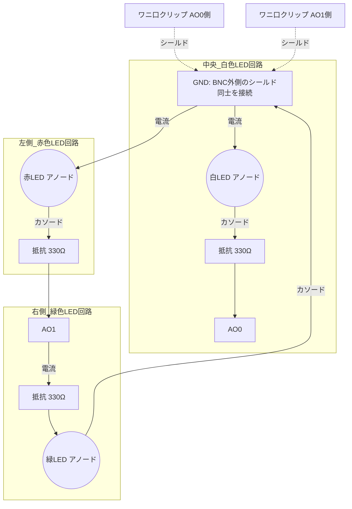

# 本実験用LED基盤 設計および作成マニュアル（AO直接駆動・逆並列回路版）

## 概要

本設計は、現状のMATLABコードのロジックをそのまま活かし、NI DAQのアナログ出力（AO）2チャネルの**プラス・マイナス電圧**を利用して3色のLEDを制御する、シンプルかつ堅牢な設計です。トランジスタや外部電源を必要としない「逆並列（Anti-parallel）回路」を採用しています。
被験者（打者）から見やすい提示用ボックス（設備）を作成することを目的とします。

## 物理レイアウト（配置案）

被験者から見て、LEDは以下のように**横一列**に配置します。（※ケースは使用せず、基板上に直接配置して構成します）

- **左側**：赤色LED（No-Go / ボール）
- **中央**：白色LED（Ready / 投球モーション開始）
- **右側**：緑色LED（Go / ストライク）
  ※ 中央の白を注視点（投手のリリースポイント）とします。左右に配置することで、周辺視野でも空間的な区別がつきやすくなります。

## 回路設計の考え方（逆並列回路）

LEDは一方向にしか電流を流さない特性（ダイオード特性）を持ちます。これを利用し、同じチャネルに2つのLEDを逆向きに接続することで、出力する電圧のプラス/マイナスで光る色を切り替えます。

- **【AO0チャネル】 トリガー ＆ 白色LED**

  - **+5V出力時**：Qualisysの計測開始トリガー信号として利用します（※LED側は電流の向きが逆になるため白LEDは光りません）。
  - **-5V出力時**：白色LEDが点灯します（電流経路：GND → 白LED → AO0）。
- **【AO1チャネル】 緑色LED ＆ 赤色LED**

  - **+5V出力時**：緑色LEDが点灯します（電流経路：AO1 → 緑LED → GND）。
  - **-5V出力時**：赤色LEDが点灯します（電流経路：GND → 赤LED → AO1）。

## 必要物品（買い物リスト）

| 部品カテゴリ           | 品名・スペック                         | 数量    | 備考                                                                                                                          |
| ---------------------- | -------------------------------------- | ------- | ----------------------------------------------------------------------------------------------------------------------------- |
| **LED**          | 超高輝度LED（白・赤・緑）              | 各色1個 | **【✅ 購入済】** DAQの微弱な電流（数mA）でも明るく光る「超高輝度」タイプを強く推奨。5mm〜10mmサイズ。                  |
| **抵抗**         | 330Ω 〜 1kΩ                          | 3個     | **【✅ 購入済】** 各LEDに直列に繋ぐ電流制限用。DAQの出力ピン保護のため必須です。                                        |
| **配線ケーブル** | BNC-ワニ口クリップ変換ケーブル（オス） | 2本     | **【✅ 購入済】** DAQから直接接続し、基板側の回路をワニ口クリップで挟んで配線します（長さ1.5m）。                                                            |
| **基板**         | ユニバーサル基板（穴あき基板）         | 1枚     | LEDと抵抗をはんだ付けする土台。（※クリップで挟むためのピンを立てるか、抵抗の足等を挟みます）                                 |
| **アクセサリ**   | 光拡散キャップ                         | 3個     | 高輝度LEDの直進的な光を拡散させ、どの角度からでも見やすくするため（推奨）。                                                   |

## 回路図（結線図）

## 実装時の注意点と工夫

1. **LEDの極性（プラス・マイナス）に細心の注意を**
   LEDには極性があります。足が長い方（アノード）が電流の「入り口」、短い方（カソード）が「出口」です。回路図に従って正しくはんだ付けしてください。**特に白と赤は、GND側がアノードになる特殊な繋ぎ方（逆接続）です。**
2. **DAQの出力電流制限について**
   NI DAQのアナログ出力は、通常数mA程度の電流しか流せません。そのため、必ず「超高輝度タイプ」のLEDを使用してください（少ない電流でも十分な明るさを得られます）。抵抗値は330Ωから始め、もし明るさが足りなければDAQの仕様（最大出力電流）の範囲内で抵抗値を下げて調整してください。
3. **ワニ口クリップを用いた接続（代替案2）**
   DAQのアナログ出力端子に直接「BNC-ワニ口クリップケーブル」を接続し、マウンドの基板まで伸ばします（※長さ1.5m）。クリップの赤色（信号線）と黒色（GND）を間違えないように、基板上の回路（または抵抗の足）をしっかりと挟んで固定してください。振動で外れないよう、ケーブルをテープで台座に固定するなどの工夫が必要です。
4. **被験者の見やすさ（生態学的妥当性）の確保**
   ケースを使用しないため、基板ごとテープ等で三脚やスタンドに固定し、打者が自然な視線で構えられる高さや位置（投手のリリースポイント付近）に設置してください。背景が乱雑な場合は、基板の後ろに黒い画用紙などを貼ると視認性が上がります。
