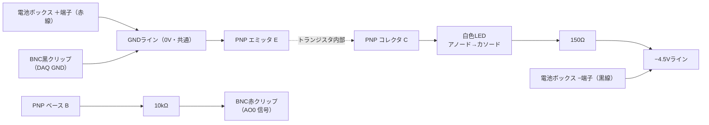

# 2.6. 刺激提示LED トランジスタ駆動回路の作成（AO0：白 / AO1：緑・赤）

## 概要

刺激提示用の白色LED（Ready cue）を、NI DAQのAO0チャネルから **トランジスタを介して外部電源で駆動する** 回路を、ユニバーサル基板上に作成する手順をまとめます。

`sandbox/2.5_実験用LED基盤作成/led_board_design.md` の当初設計は「DAQのAO出力で直接LEDを光らせる（逆並列回路）」でしたが、DAQのアナログ出力は数mA程度しか流せず輝度が不足するため、**DAQは「スイッチのON/OFF信号」だけを担当し、LEDを光らせる電流は外部電源（電池）から供給する** 方式に変更します。

### 採用する方式：PNPトランジスタによる負電圧駆動

**AO0が −5V のときだけ白色LEDが点灯する回路を、PNPトランジスタで構成します。**

現行の `Experiments/Main experiments/Script/demo_5_4_simplereaction_main_experiments.m` は、AO0の1本を極性で2役に使い分けています（+5V＝Qualisysトリガー、−5V＝白色LEDのReady cue）。DAQ側ではBNC分岐によりトリガー用ケーブルとLED用ケーブルが分かれていますが、**分岐した両方のケーブルには同じAO0の電圧がかかる**ため、電気的には並列です。したがって「+5Vではトリガーだけが反応し、LEDは光らない」という切り分けは、回路側の極性で実現する必要があります。

PNPトランジスタを使うことで、この動作を正確に再現できます。

| AO0の出力 | 回路の動作                                   | 対応する用途              |
| --------- | -------------------------------------------- | ------------------------- |
| **+5V**   | **消灯**（ベースがエミッタより高く、逆バイアス） | Qualisysトリガーのみ動作  |
| **0V**    | **消灯**（ベース＝エミッタ電位）             | 待機                      |
| **−5V**   | **点灯**（ベースが約4.3V低くなりON）         | Ready cue（投球モーション開始） |

**この方式の最大の利点は、MATLABコードおよびQualisysトリガーの接続を一切変更せずに済むことです。**

まずAO0チャネル（白色LED）のみを作成・検証し、動作確認後にAO1チャネル（緑・赤LED）へ展開します（§10-3）。

---

## 1. 使用部品

| 部品                       | 仕様・数量           | 役割                                                         |
| -------------------------- | -------------------- | ------------------------------------------------------------ |
| 白色LED                    | 超高輝度タイプ 1個   | Ready cue（投球モーション開始）の提示                        |
| **PNPトランジスタ**        | **2N3906** 1個       | AO0が−5Vのときにスイッチが入り、電池からの電流をLEDに流す |
| 外部電源                   | 電池ボックス 単3×3本 | LEDを光らせる電流源（4.5V）。**GNDに対して負側の電源として使う** |
| 抵抗                       | 150Ω 1個            | LEDの電流制限（LEDと直列）                                   |
| 抵抗                       | 10kΩ 1個            | トランジスタのベース電流制限（DAQ出力の保護）                |
| ジャンパー線               | 適量                 | 基板上の配線                                                 |
| BNC-ワニ口コード（赤・黒） | 2本                  | DAQのBNC端子と基板の接続。今回はAO0用の1本を使用            |
| ワニ口-ワニ口コード        | 適量                 | 電池ボックスと基板の接続など                                 |

> **NPNトランジスタ（2N2222）について**：当初はNPNで検討し、ブレッドボードでの予備検証も実施しました（§5-8に記録）。しかしNPNは「+5Vで点灯」となりQualisysトリガーと衝突するため、**本設計ではPNPを採用します。** NPNは緑LED（AO1の+5V側）で使用します。

### 抵抗のカラーコード（取り違え防止）

- **150Ω**：茶 – 緑 – 茶（＋許容差の金など）
- **10kΩ**：茶 – 黒 – 橙（＋許容差の金など）

2本目の帯（緑 vs 黒）と3本目の帯（茶 vs 橙）で区別します。読み間違えやすいので、**基板に付ける前にテスターの抵抗測定モードで実測してください。**

---

## 2. 回路の考え方

### 2-1. なぜトランジスタを使うのか

トランジスタは「小さな電流で、大きな電流をON/OFFする蛇口」の役割をします。3本の足（ベース B / コレクタ C / エミッタ E）を持ちます。

**PNPトランジスタは、ベースがエミッタより約0.7V以上「低い」ときにONになります**（NPNとは逆で、NPNはベースがエミッタより高いときにONです）。

この回路では、DAQのAO0はベースから **約0.43mA** を引き抜くだけで済みます（後述の計算）。LEDを光らせる約7.3mAは電池から供給されるため、DAQの出力電流の制限を受けません。

### 2-2. 電源の取り方（NPN版との最大の違い）

「−5Vのときだけ点灯」を実現するには、**エミッタをGND（0V）に置き、LEDの先を0Vより低い電位につなぐ**必要があります。そのため、電池ボックスを次のように**逆向き**に使います。

- 電池ボックスの **＋端子 → 共通GND（0V）** として使う
- 電池ボックスの **−端子 → −4.5Vのレール** として使う

電池は他の回路から絶縁されて浮いているため、どちらの端子を基準（0V）に定めても問題ありません。これにより、GND（0V）から −4.5V へ向かって電流が流れる経路ができます。

**なぜ電池を素直に＋4.5Vで使えないのか：** PNPのエミッタを＋4.5Vに置くと、AO0が0Vのときもベースがエミッタより4.5V低くなるため、**0VでもLEDが点灯してしまいます。** 「−5Vのときだけ」を実現するには、エミッタをGNDに置く構成が必要です。

### 2-3. 動作の詳細

| AO0の電圧 | ベースの電位 | エミッタ(GND)との関係 | トランジスタ | LED  |
| --------- | ------------ | --------------------- | ------------ | ---- |
| +5V       | 約+5V        | エミッタより**高い**  | OFF（逆バイアス） | 消灯 |
| 0V        | 0V           | エミッタと**同電位**  | OFF          | 消灯 |
| −5V       | 約−0.7V      | エミッタより**低い**  | **ON**       | **点灯** |

AO0が−5Vのとき、ベース電位はダイオードの順方向電圧により約−0.7Vに固定され、残りの電圧（4.3V）が10kΩにかかります。

### 2-4. 電流値の見積もり

**LED側（コレクタ回路）**

GND（0V）から −4.5V までの4.5Vが使えます。ここから白色LEDの順方向電圧（Vf ≈ 3.2V）とトランジスタの飽和電圧（Vec(sat) ≈ 0.2V）を差し引いた分が150Ωにかかります。

```
I_LED = (4.5 - 3.2 - 0.2) / 150 ≈ 7.3 mA
```

超高輝度LEDであれば十分な明るさが得られる電流値です。

**DAQ側（ベース回路）**

```
I_B = (0.7 - 5) / 10k → 大きさは (5 - 0.7) / 10k ≈ 0.43 mA
```

この電流は、ベースから10kΩを通ってAO0へ**流れ込みます**（DAQが吸い込む＝シンクする側になります）。NI USB-6212のアナログ出力は±2mA程度の吸い込み・吐き出しが可能なため、0.43mAは十分に余裕があります。

トランジスタが7.3mAを流すのに必要な電流増幅率は `7.3 / 0.43 ≈ 17` 倍です。2N3906・2N2907の増幅率（hFE）は最低でも100程度あるため、**十分に余裕をもってスイッチONの状態（飽和領域）に入ります。**

### 2-5. GNDの共通化（この回路で最も重要な点）

**電池の＋端子と、DAQのGND（BNCの外側シールド＝黒クリップ）を、必ず基板上でつないでください。**

ベースから引き抜かれた電流は、エミッタ側（GND）から供給される必要があります。この経路がないと**配線が全て正しくてもLEDは光りません。** 電池とDAQという別々の電源を使うため、最もつまずきやすい箇所です。

### 2-6. 2N3906の定格確認

採用する **2N3906** の定格と、この回路での使用値を照合します。

| 項目                            | 2N3906の定格            | この回路での使用値 | 余裕                       |
| ------------------------------- | ----------------------- | ------------------ | -------------------------- |
| コレクタ電流 Ic                 | 最大 200 mA             | 約 7.3 mA          | 約27倍                     |
| コレクタ-エミッタ間電圧 Vceo    | 40 V                    | 約 4.3 V           | 約9倍                      |
| 電流増幅率 hFE                  | 最小 100（Ic = 10 mA時） | 必要 17倍          | 約6倍                      |
| 許容損失 Pd                     | 625 mW                  | 約 1.5 mW          | 約400倍                    |
| **ベース-エミッタ間逆電圧 Vebo** | **5.0 V**               | **5.0 V**          | **余裕なし（下記参照）**   |

電流・電圧・損失・増幅率のいずれも大きな余裕があり、**2N3906はこの用途に適しています。**

### 2-7. ベース-エミッタ間の逆電圧について（唯一の留意点）

AO0が+5Vのとき、PNPのベース-エミッタ間には**5Vの逆電圧**がかかります。2N3906の定格（Vebo = 5.0V）とちょうど同じ値です。

ただし**実用上の問題はありません。** データシートの Vebo = 5.0V は「降伏電圧の最小値」であり、実際の素子は5V以上（多くは6〜8V）で降伏します。仮に5.0Vちょうどで降伏したとしても、10kΩが直列に入っているため流れる電流は `(5.0 − 5.0) / 10k ≈ 0`、DAQの出力に多少の誤差があっても数十µA以下に収まります。

ベース-エミッタ間の逆方向降伏でhFEが劣化する現象は、mAオーダーの電流が流れた場合に問題になるものです。µAオーダー、しかも1試行あたり0.1秒という短時間であれば、影響はありません。またhFEの必要値（17倍）に対して実力（100倍以上）の余裕が大きいため、多少の劣化があっても動作に影響しません。

**さらに安全側に倒したい場合**は、ベースと10kΩの間に小信号ダイオード（1N4148など）を、**アノードをベース側・カソードをAO0側**の向きで直列に入れると、+5V印加時にベースが完全に保護されます。必須ではありません。

---

## 3. 結線図



### 結線リスト（はんだ付け時はこちらを参照）

| No. | 接続元                           | 接続先                              |
| --- | -------------------------------- | ----------------------------------- |
| 1   | 電池ボックス **赤線（＋端子）**  | **GNDライン（0V）**                 |
| 2   | 電池ボックス **黒線（−端子）**   | **−4.5Vライン**                     |
| 3   | BNC-ワニ口コード **黒クリップ**  | **GNDライン（0V）**                 |
| 4   | PNP **エミッタ(E)**              | **GNDライン（0V）**                 |
| 5   | PNP **コレクタ(C)**              | 白色LED **アノード（長い足）**      |
| 6   | 白色LED **カソード（短い足）**   | 150Ω抵抗 の片足                    |
| 7   | 150Ω抵抗 のもう片足             | **−4.5Vライン**                     |
| 8   | PNP **ベース(B)**                | 10kΩ抵抗 の片足                    |
| 9   | 10kΩ抵抗 のもう片足             | BNC-ワニ口コード **赤クリップ**     |

No.1・3・4が同じ「GNDライン」に集まる点が §2-5 で説明した共通GNDです。基板上に1本のGNDライン（銅線やジャンパー線でつないだ一列）を作り、そこへ3本を集めてください。

> **⚠️ 電池の向きに注意**：一般的な回路と異なり、**電池の赤線（＋）がGND、黒線（−）が−4.5V** になります。逆にするとLEDは光りません。

---

## 4. 部品の向き・ピン配置の確認（はんだ付け前に必ず実施）

### 4-1. 白色LEDの極性

- **足が長い方＝アノード（＋側、電流の入口）**、短い方＝カソード（−側、出口）
- 足を切ってしまった場合は、樹脂の縁が平らにカットされている側がカソード
- テスターのダイオードモードで、赤棒をアノード・黒棒をカソードに当てるとうっすら光る

**この回路では、アノードがトランジスタ（コレクタ）側、カソードが150Ω側です。**

### 4-2. PNPトランジスタのピン配置（B / C / E）

2N3906（TO-92パッケージ、黒い樹脂の半円形）の標準的なピン配置は、**平らな面を手前に向けて足を下にしたとき、左から E – B – C** です。

これは前回テストした2N2222（PN2222A）と同じ並びです。したがって **ブレッドボード上でのトランジスタの向きは、NPN版のテストとまったく同じで構いません**（e13=C、e14=B、e15=E）。変わるのは周辺の配線（LEDの向きと電源レールの役割）だけです。

ただし、同じ型番でもメーカーによって配置が異なる製品が存在するため、**必ずテスターで実測して確認してください。**

**テスターのダイオードモードによる判別手順（PNPの場合）**

1. **ベース(B)を特定する**：**黒棒**をある1本に固定し、赤棒を残り2本に順に当てる。**両方とも0.6〜0.7V程度の導通反応が出る足がベース**です
   - PNPはベースが2つのダイオードの共通**カソード**になっているため、NPNとは黒棒・赤棒の役割が逆になります。これがNPNとPNPの判別方法でもあります
2. **コレクタ(C)とエミッタ(E)を区別する**：黒棒をベースに当てたまま、残り2本の電圧降下を比較します。一般に **数値がわずかに大きい方がエミッタ、小さい方がコレクタ** です（例：B-E間 0.70V、B-C間 0.66V）

> **補足**：万一CとEを逆に付けても、この程度の電流ではトランジスタは壊れません（増幅率が極端に落ち、LEDが光らないか非常に暗くなるだけです）。「光らない／異常に暗い」場合はC-Eの入れ替えを疑ってください。

---

## 5. 【テスト】ブレッドボードでの動作確認

> **この章はテスト工程です。** はんだ付けは一度行うとやり直しに手間がかかるため、まずブレッドボード上で同じ回路を組み、LEDが正しく点灯することを確認します。ここで動作が確認できてから §6 のはんだ付けに進んでください。

### 5-1. ブレッドボードの内部構造（配置を理解するための前提）

ブレッドボードは、穴同士が内部で以下のようにつながっています。

- **同じ行番号の a・b・c・d・e の5穴は、内部でつながっている**（1つの電気的な接続点）
- 同様に **f・g・h・i・j の5穴もつながっている**
- **e と f の間の溝（中央の溝）をまたぐ穴同士はつながっていない**
- 両端の赤(+)・青(−)のライン（電源レール）は、**行番号に関係なく横方向に一直線につながっている**

つまり「**同じ行番号に挿した部品の足は、互いに配線したのと同じ**」になります。この性質を使って、ジャンパー線を減らしながら §3 の結線リストを再現します。

今回は **a〜e の列と、電源レールだけ** を使います（f〜j は使いません）。

### 5-2. 電源レールの役割（⚠️ NPN版から変更されています）

| レール           | この回路での役割 | つなぐもの                            |
| ---------------- | ---------------- | ------------------------------------- |
| **赤(+)レール**  | **GND（0V）**    | 電池ボックス**赤線（＋）**、BNC黒クリップ、PNPエミッタ |
| **青(−)レール**  | **−4.5V**        | 電池ボックス**黒線（−）**、150Ω      |

**赤いレールが+4.5Vではなく0V（GND）である点に注意してください。** この回路ではGNDが最も高い電位になるため、赤（＝より正側）をGNDに割り当てています。

### 5-3. 部品の挿し込み位置

| No. | 部品                            | 挿す穴 ①                    | 挿す穴 ②                                  |
| --- | ------------------------------- | --------------------------- | ----------------------------------------- |
| 1   | PNP **コレクタ (C)**            | **e13**                     | —                                         |
| 2   | PNP **ベース (B)**              | **e14**                     | —                                         |
| 3   | PNP **エミッタ (E)**            | **e15**                     | —                                         |
| 4   | 白色LED **アノード（長い足）**  | **b13**                     | —                                         |
| 5   | 白色LED **カソード（短い足）**  | **b10**                     | —                                         |
| 6   | 150Ω抵抗                       | **a10**                     | **青(−)レール**〔−4.5V〕                  |
| 7   | ジャンパー線                    | **a15**                     | **赤(+)レール**〔GND〕                    |
| 8   | 10kΩ抵抗                       | **a14**                     | **a20**                                   |
| 9   | ジャンパー線（AO0受け）         | **b20**                     | 反対の端は挿さず、BNC**赤**クリップで挟む |
| 10  | ジャンパー線（GND受け）         | **赤(+)レール**〔GND〕      | 反対の端は挿さず、BNC**黒**クリップで挟む |
| 11  | 電池ボックス **赤線（＋端子）** | **赤(+)レール**〔GND〕      | —                                         |
| 12  | 電池ボックス **黒線（−端子）**  | **青(−)レール**〔−4.5V〕    | —                                         |

> **行番号について**：10・13・14・15・20 という行番号は一例です。お手持ちのブレッドボードの行数に合わせて、**行の相対的な位置関係（間隔）さえ保たれていれば、開始行はどこでもかまいません。** ただし No.1〜3（トランジスタの3本足）は必ず**連続した3行**である必要があります。
>
> **ワニ口クリップについて**：ワニ口クリップはブレッドボードの穴に直接挿せません。No.9・No.10 のように**ジャンパー線を挿しておき、その反対側の端をクリップで挟んでください。**

### 5-4. 接続のイメージ図

```
  [赤(+)レール ＝ GND (0V)] ──┬── 電池ボックス 赤線（＋端子）
                               ├── ジャンパー線 ──→ BNC 黒クリップで挟む（DAQ GND）
                               │
                               └── ジャンパー線 ──→ a15
                                                     │
  行15 :  a15 ●━━━━━━━━━━━━━━━━━━━━━━━━━━━━━━━━━━━● e15  ← PNP エミッタ (E)

  行14 :  a14 ●━━━━━━━━━━━━━━━━━━━━━━━━━━━━━━━━━━━● e14  ← PNP ベース (B)
           │
         10kΩ
           │
  行20 :  a20 ●━━━━━━━━━━━━━━━━━━● b20 ──→ BNC 赤クリップで挟む（AO0信号）

  行13 :  b13 ●━━━━━━━━━━━━━━━━━━━━━━━━━━━━━━━━━━━● e13  ← PNP コレクタ (C)
        （LED アノード・長い足）
           │
        白色LED
           │
  行10 :  b10 ●━━━━━━━━━━━━━━━━━━● a10
        （LED カソード・短い足）        │
                                      150Ω
                                        │
  [青(−)レール ＝ −4.5V] ──┬─────────────┘
                            └── 電池ボックス 黒線（−端子）
```

`●━━━●` は「同じ行番号の穴どうしがブレッドボード内部でつながっている」ことを表しています。

### 5-5. トランジスタの向きの決め方

No.1〜3 は **e13・e14・e15 の連続した3行**に、上から順に **C・B・E** が入るように挿します。

§4-2 のテスターによる判別結果に従って向きを決めてください。判別した C・B・E が上記の行に入る向きであれば、平らな面がどちらを向いていても問題ありません。

### 5-6. テスト手順

**① 電池のみでのテスト（DAQは接続しない）**

1. No.9・No.10 のジャンパー線はまだクリップで挟まず、free のままにしておく
2. 電池ボックスに電池を入れる
3. **この時点でLEDは光らないか、ごく微かに光る程度が正常です**（ベースがどこにもつながっておらず浮いているため）
   - はっきり点灯する場合は、LEDが電池と直結しています。No.4〜7 の挿し位置を見直してください

**② 強制ONテスト（回路本体の確認）**

4. ジャンパー線を1本追加し、**青(−)レール〔−4.5V〕** と **c20** をつなぐ
   - ベースを−4.5Vに引き下げることで、AO0が−5Vを出した状態を模擬します
5. **LEDが点灯すれば、LED・150Ω・10kΩ・トランジスタの回路はすべて正常です**
6. 次に、追加したジャンパー線を **赤(+)レール〔GND〕** と **c20** につなぎ替える
7. **LEDが消灯すれば、0V時にOFFになることが確認できました**
8. 確認できたら、この追加ジャンパー線は取り外す

> ②で光らない場合、DAQを繋いでも光りません。§9 のトラブルシューティングを参照してください（LEDの極性、トランジスタのC・Eの逆挿し、電池の向き、電池残量が主な原因です）。

**③ DAQを接続してのテスト**

9. **電池を一度外す**
10. BNC-ワニ口コードをDAQのAO0端子に接続する
11. **赤クリップ** を No.9 のジャンパー線の端に、**黒クリップ** を No.10 のジャンパー線の端に挟む
12. 電池を入れる
13. §8 のMATLABコードを実行し、**3つの電圧すべてで期待どおりの動作になる**ことを確認する

| 出力電圧 | 期待される動作 | 確認の意味                                       |
| -------- | -------------- | ------------------------------------------------ |
| **−5V**  | **点灯**       | Ready cueが正しく提示される                      |
| **0V**   | **消灯**       | 待機中に誤点灯しない                             |
| **+5V**  | **消灯**       | **Qualisysトリガー送出時に誤点灯しない（最重要）** |

> **+5Vで消灯することの確認が、この設計の核心です。** ここが確認できれば、AO0を白色LEDとQualisysトリガーで兼用しても問題が起きないことが実証されます。
>
> ②では光るのに③の−5Vで光らない場合は、**共通GNDができていない可能性が高い**です（§2-5）。黒クリップがジャンパー線を確実に挟んでいるか、そのジャンパー線が赤(+)レール〔GND〕に挿さっているかを確認してください。

### 5-7. はんだ付けへの引き継ぎ

動作が確認できたら、**ブレッドボードの配置を写真に撮っておいてください。** §6 のはんだ付け時に、部品の向き（特にトランジスタのC・B・EとLEDの極性）を照合するための確実な記録になります。

### 5-8. 【記録】PNP（2N3906）での本検証

**実施日：2026-08-06　結果：3電圧すべてで期待どおりの動作を確認**

`test_ao0_pnp_white.m` を実行し、AO0から −5V / 0V / +5V を順に出力して確認しました。

| 出力電圧 | 期待される動作 | 結果    | 確認の意味                                       |
| -------- | -------------- | ------- | ------------------------------------------------ |
| **−5V**  | 点灯           | ✅ 正常 | Ready cueが正しく提示される                      |
| **0V**   | 消灯           | ✅ 正常 | 待機中に誤点灯しない                             |
| **+5V**  | 消灯           | ✅ 正常 | **Qualisysトリガー送出時に誤点灯しない**         |

**この検証によって実証された事項：**

- **AO0の兼務が成立する** — 1本のAO0で「+5V＝Qualisysトリガー」「−5V＝白色LEDのReady cue」を、相互に干渉させることなく使い分けられる。§10-1 で指摘した問題が解決された
- **MATLABコードの変更が不要** — 現行の `demo_5_4_*_main_experiments.m` の `voltage_trigOn = 5.0` / `voltage_ready = -5.0` をそのまま使える。Qualisysトリガーボックスへの接続も変更不要
- **PNP回路の構成が正しい** — 電池の逆向き接続（＋端子＝GND、−端子＝−4.5V）、エミッタのGND接続、LEDの向き（アノードがコレクタ側）がすべて正しい
- **2N3906のピン判別が正しい** — B・C・Eの識別に誤りがない
- **Veboの懸念は実用上問題なし** — +5V印加時にベース-エミッタ間へ定格ちょうどの5Vがかかる件（§2-7）について、実機で異常が生じないことを確認した

**この構成のまま §6 のはんだ付けに進めます。**

### 5-9. 【記録】NPNトランジスタ（2N2222）での予備検証

**実施日：2026-08-06　結果：3段階すべて正常に完了**

PNP採用を決定する前に、NPNトランジスタ（2N2222）で「+5Vで点灯する」構成を組み、ブレッドボードで検証しました。

| テスト | 内容                                   | 結果    |
| ------ | -------------------------------------- | ------- |
| ①     | 電池のみ接続 → LEDが光らない          | ✅ 正常 |
| ②     | 強制ON（+4.5Vをベースへ）→ LED点灯    | ✅ 正常 |
| ③     | DAQ接続 → AO0の+5V出力でLED点灯       | ✅ 正常 |

**この検証で実証され、PNP版にもそのまま引き継がれる事項：**

- **電流設計が妥当** — 150Ω・10kΩの組み合わせで、DAQ側 約0.43mA から電池側 約7.3mA を制御でき、十分な輝度が得られる。当初の課題であった「DAQの出力電流制限による輝度不足」が解消されることを確認した
- **白色LEDおよび部品の品質に問題がない**
- **トランジスタによるスイッチングという方式そのものが有効**
- **電池とDAQの共通GNDという考え方が正しい**（テスト③の成功がこれを裏付けた）

**PNPへ変更した理由：** NPNでは「+5Vで点灯」となるため、AO0が兼務するQualisysトリガー（+5V, 0.1秒）の送出時に白色LEDが誤点灯し、かつ本来のReady cue（−5V, 0.5秒）で点灯しないという問題が生じます。詳細は §10-1 を参照してください。

---

## 6. はんだ付け手順（3色構成）

ブレッドボードでの検証（§11-5-3）が完了したので、同じ回路をユニバーサル基板に作ります。**回路そのものは検証済みのものと完全に同一で、変わるのは物理的な配置だけ**です。

### 6-1. 3色分の回路構成（一覧）

| 色       | 用途             | 制御       | トランジスタ       | LEDアノード（長い足）の向き | LEDの先 |
| -------- | ---------------- | ---------- | ------------------ | --------------------------- | ------- |
| **白**   | Ready cue        | AO0 = −5V  | **2N3906**（PNP）  | **コレクタ側**              | −4.5V   |
| **緑**   | Go（ストライク） | AO1 = +5V  | **2N2222**（NPN）  | **150Ω側（＋4.5V側）**     | GND     |
| **赤**   | No-Go（ボール）  | AO1 = −5V  | **2N3906**（PNP）  | **コレクタ側**              | −4.5V   |

3色とも、**エミッタはすべてGND**、**ベースは10kΩを介して各AOチャネル**、**LEDと直列に150Ω**という同じ構造です。

> **⚠️ 緑だけLEDの向きが逆です。** NPNとPNPで電流の向きが逆になるためです。緑は「150Ω → LED → コレクタ」、白・赤は「コレクタ → LED → 150Ω」の順に電流が流れます。ブレッドボードの現物を写真に撮っておき、色ごとに照合してください。

### 6-2. 基板レイアウトの設計

**LEDの配置**（`led_board_design.md` の物理レイアウト案に従う）

被験者から見て横一列に、**左＝赤（No-Go）／中央＝白（Ready）／右＝緑（Go）** の順に並べます。中央の白を注視点とし、左右に振り分けることで周辺視野でも区別しやすくなります。

**3本の電源ラインを平行に走らせる**

基板上に、太めの単芯線（スズメッキ線など）で3本のバスラインを作ります。**必ず以下の順序で並べてください。**

```
   ┌──────────────────────────────────  ＋4.5V ライン（緑LED用）
   │
   ├──────────────────────────────────  GND ライン（3色共通・エミッタ）
   │
   └──────────────────────────────────  −4.5V ライン（白・赤LED用）
```

> **⚠️ GNDを必ず真ん中に配置してください。** ＋4.5Vと−4.5Vのラインの間には**9Vの電位差**があります。この2本を隣接させると、はんだブリッジや部品の足の接触で9Vの短絡が起き、電池2個に大電流が流れます。間にGNDを挟めば、万一接触しても4.5Vの短絡で済みます。
>
> ライン間の間隔は、ユニバーサル基板の穴で**2穴以上（5mm以上）**空けることを推奨します。

**外部との接続点**

ワニ口クリップで挟むための接続点を作ります（ピンヘッダを立てるか、太めの線をコの字に出す）。

| 接続点        | 相手                          |
| ------------- | ----------------------------- |
| **AO0信号**   | BNC-ワニ口コード①の赤クリップ |
| **AO1信号**   | BNC-ワニ口コード②の赤クリップ |
| **GND**       | BNC-ワニ口コード①②の黒クリップ（2本まとめて挟める形にする） |
| 電池A 赤線    | ＋4.5Vライン                  |
| 電池A 黒線    | GNDライン                     |
| **電池B 赤線** | **GNDライン**（※逆向き接続） |
| 電池B 黒線    | −4.5Vライン                   |

> 電池ボックスのリード線は、基板に直接はんだ付けしても構いません。その場合は**引っ張られて剥がれないよう、線を基板の穴に通してから固定**してください。

### 6-3. はんだ付けの順序

背の低い部品から順に付けると、基板を裏返したときに部品が落ちず作業しやすくなります。

1. **3本の電源ライン**（＋4.5V / GND / −4.5V）を先に作る
2. **抵抗（150Ω×3・10kΩ×3）** — 最も背が低い。足を裏側で軽く折り曲げて仮固定してからはんだ付け
3. **ジャンパー線** — 各回路内の配線
4. **トランジスタ（2N2222×1・2N3906×2）** — ピンの向きと、どれがNPN/PNPかを再確認してから挿入
5. **LED（白・緑・赤）** — 極性を再確認してから挿入（**緑だけ向きが逆**）
6. **電池ボックスのリード線、ワニ口クリップ用の接続点**

> **1色ずつ完成させて確認する進め方を推奨します。** 3色分をまとめて付けてから通電すると、不具合時の切り分けが難しくなります。「緑を付ける → §7・§8で確認 → 赤を付ける → 確認 → 白を付ける → 確認」と進めれば、問題が起きてもその色の配線に原因を絞れます。

### 6-4. はんだ付けのコツ

- **熱を当てる時間は1箇所3秒以内**。特にLEDとトランジスタは熱に弱く、長く当てると内部が劣化して動作しなくなります
- 理想の仕上がりは **「富士山型」**：ランド（銅の島）と部品の足の両方にはんだが馴染み、なだらかな山になっている状態
- 玉のように丸まっている場合は **イモはんだ**（見た目は付いていても電気的に接触していない）です。接触不良の原因になるので、温め直してやり直してください
- **隣のランドとのブリッジ（はんだが繋がってショートすること）** に注意。**特にトランジスタは3本の足が近接しているため最も起きやすい箇所です。** ブレッドボードでも脚の接触が原因の不具合が発生しました（§11-5-4）。1個付けるごとに、3本の足の間をテスターの導通モードで確認することを推奨します
- トランジスタの足は**広げすぎず、隣のランドに届かない範囲**で開いてください

---

## 7. 通電前のテスターによる確認

**電池を入れる前・DAQに接続する前に、必ず以下を確認してください。**

**《A》電源ライン間の短絡チェック（最優先）**

| 測定箇所                        | 期待される結果                       |
| ------------------------------- | ------------------------------------ |
| **＋4.5Vライン ↔ GNDライン**   | LED・トランジスタを介さない直接の短絡がない |
| **GNDライン ↔ −4.5Vライン**    | 同上                                 |
| **＋4.5Vライン ↔ −4.5Vライン** | **絶対に導通しないこと（9Vの短絡になります）** |

ここが短絡していると、電池が急速に消耗・発熱します。**必ず最初に確認してください。**

**《B》各色の回路チェック（1色ずつ）**

| 確認項目                                                     | 期待される結果                        |
| ------------------------------------------------------------ | ------------------------------------- |
| トランジスタの3本の足が、隣同士でショートしていないか         | はんだブリッジによる直接短絡がない（§11-5-4） |
| 150Ω・10kΩ の抵抗値                                        | それぞれ150Ω・10kΩ前後              |
| 3個のトランジスタのエミッタが、すべてGNDラインに導通するか    | 3個とも導通する                       |
| 各ベースが、10kΩを介して対応するAO接続点につながっているか   | 白・赤 → AO0/AO1、緑 → AO1（下表参照）|

**《C》配線の対応関係**

| 色   | トランジスタ | ベース → 10kΩ → | LEDの先（150Ω経由） | 信号の接続点 |
| ---- | ------------ | ---------------- | ------------------- | ------------ |
| 白   | 2N3906       | **AO0**接続点    | **−4.5V**ライン     | AO0          |
| 緑   | 2N2222       | **AO1**接続点    | **＋4.5V**ライン    | AO1          |
| 赤   | 2N3906       | **AO1**接続点    | **−4.5V**ライン     | AO1          |

> **⚠️ 白のベース（AO0）と、緑・赤のベース（AO1）が、基板上でつながっていないことを必ず確認してください。** つながっていると、白と赤が同時に光ってしまいます。

**《D》電池の向き**

| 電池   | 赤線（＋）の接続先 | 黒線（−）の接続先 |
| ------ | ------------------ | ----------------- |
| 電池A  | **＋4.5Vライン**   | **GNDライン**     |
| 電池B  | **GNDライン**（※逆向き） | **−4.5Vライン** |

**電池Bは赤線がGNDです。** ここを間違えると白と赤が点灯しません。

---

## 8. 通電テスト（MATLAB）

テスト用スクリプトは **`test_ao0_pnp_white.m`（本フォルダ内）** です。既存の `sandbox/2.1_NI_DAQ_LED点灯/boad_test.m` を、3つの電圧を順に出力するよう変更したものです。

ブレッドボードでの検証（§5-8）でも、はんだ付け後の基板の確認（§7の後）でも、同じスクリプトを使用します。

```matlab
% test_ao0_pnp_white.m（案）
% AO0チャネルから -5V / 0V / +5V を順に出力し、PNP駆動の白色LEDの動作を確認する

dq = daq("ni");
addoutput(dq, "Dev1", "ao0", "Voltage");

% --- ① -5V：Ready cue → 点灯するはず ---
disp('AO0から -5V を出力します（5秒間）→ 白色LEDが【点灯】するはず');
write(dq, -5);
pause(5);

% --- ② 0V：待機 → 消灯するはず ---
disp('AO0を 0V に戻します（3秒間）→ 白色LEDが【消灯】するはず');
write(dq, 0);
pause(3);

% --- ③ +5V：Qualisysトリガー → 消灯のままのはず ---
disp('AO0から +5V を出力します（5秒間）→ 白色LEDは【消灯のまま】のはず');
write(dq, 5);
pause(5);

% --- 終了 ---
write(dq, 0);
disp('テスト完了');
```

> **student ロールのため、このコードはドキュメント内の提案にとどめています。** 実際の `.m` ファイルの作成・保存はご自身で行ってください。
>
> **③の「+5Vで消灯のまま」が最も重要な確認項目です。** ここが確認できれば、Qualisysトリガーと白色LEDをAO0で兼用しても干渉しないことが実証されます。

---

## 9. トラブルシューティング

| 症状                                            | 考えられる原因と確認方法                                                                                                                                                                             |
| ----------------------------------------------- | ------------------------------------------------------------------------------------------------------------------------------------------------------------------------------------------------- |
| §5-6 ②の強制ONでも光らない                     | ① **電池の向きが逆**（赤線がGND、黒線が−4.5V になっているか確認）② LEDの極性が逆（この回路ではアノードがコレクタ側）③ トランジスタのC・Eが逆（§4-2の判別をやり直す）④ NPNをPNPと取り違えている（§4-2の黒棒・赤棒の反応で判別）⑤ 電池が消耗している ⑥ はんだのイモ付け・断線 |
| §5-6 ②では光るが、③の−5Vで光らない            | **共通GNDができていない可能性が高い（§2-5）。** BNCの黒クリップがGND側（赤レール）のジャンパー線を確実に挟んでいるか、AO0の赤クリップが10kΩ側のジャンパー線を挟んでいるかを確認                |
| **+5V出力時にLEDが点灯してしまう**              | **NPNトランジスタを使っている可能性があります。** §4-2 の手順（黒棒をベースに当てて両側が導通するか）でPNPであることを確認してください。この症状のままでは、Qualisysトリガー送出時に誤点灯します |
| 0V出力時にうっすら光る                          | トランジスタの漏れ電流によるものです。AO0を接続していない（ベースが浮いている）状態では起こり得ますが、DAQを接続して0Vを出力していれば消灯するはずです。それでも光る場合はトランジスタの不良を疑ってください |
| LEDは光るが暗い                                 | ① 電池が消耗している（4.5Vを実測。白色LEDのVf 3.2Vに対し余裕が小さいため電圧低下の影響を受けやすい）② トランジスタのC・Eが逆（増幅率が大幅に低下する）③ 150Ωの位置に誤って10kΩを付けている |
| 電池ボックスや部品が発熱する                    | **直ちに電池を外してください。** どこかで短絡しています。§7の確認をやり直してください                                                                                                            |

---

## 10. 設計上の記録と今後の展開

### 10-1. なぜPNPが必要なのか（NPNを見送った理由）

AO0の波形（`waveform0`）は1試行あたり以下のように構成されています（`demo_5_4_simplereaction_main_experiments.m` 82〜86行目）。

| 時刻       | 区間            | AO0出力 | 現行設計（逆並列回路）       | NPN回路の場合                    | **PNP回路（本設計）** |
| ---------- | --------------- | ------- | ---------------------------- | -------------------------------- | --------------------- |
| 0〜0.1秒   | `ini`           | 0V      | 消灯                         | 消灯                             | 消灯                  |
| 0.1〜0.2秒 | `trig`          | **+5V** | Qualisysトリガー（白は消灯） | ⚠️ **白色LEDが誤点灯**           | ✅ 消灯               |
| 0.2〜1.2秒 | `trig_to_ready` | 0V      | 消灯                         | 消灯                             | 消灯                  |
| 1.2〜1.7秒 | `ready`         | **−5V** | **白色LED点灯（Ready cue）** | ⚠️ **消灯＝Ready cueが出ない**   | ✅ **点灯**           |
| 1.7秒〜    | （以降）        | 0V      | 消灯                         | 消灯                             | 消灯                  |

**AO0が「白色LED」と「Qualisysトリガー」の2役を極性で兼務している**ため、LEDが1色であってもこの兼務は解消されません。DAQ側でBNC分岐によりケーブルが分かれていても、**分岐した両方に同じAO0の電圧がかかる**ため、電気的には並列であり事情は変わりません。

PNPを用いることで、現行の逆並列回路とまったく同じ動作が得られ、**MATLABコードもQualisysトリガーの接続も変更不要**となります。

### 10-2. 検討したが採用しなかった案

| 案                                          | 見送った理由                                                                                                                             |
| ------------------------------------------- | ---------------------------------------------------------------------------------------------------------------------------------------- |
| 白色LEDをデジタル出力（`port0/line0`）へ移す | NPN回路をそのまま使え、3色を同一回路で統一できる利点はあるが、**現行の設計・コードからの変更が大きい**ため見送り（`3.2` では実際にこの構成だった） |
| トリガーとReady cueを1本の+5Vパルスに統合   | Qualisysの収録開始がReady cueと同時になり、**キュー提示前のベースライン区間が記録されなくなる。** `log/2026-08-04_01.md` でこの制約が分析上の問題として記録済み |
| Qualisysトリガーを別チャネルへ移す          | 現在正常に動作しているトリガー経路に手を入れることになり、検証の手間とリスクが大きい                                                     |

### 10-3. AO1（緑・赤LED）への展開

AO1は**+5Vで緑、−5Vで赤**と、1本で2色を極性で切り替えています。トランジスタは一方向にしか効かないため、次のように**2種類のトランジスタと正負両方の電源レール**を用意します。

| LED  | 点灯条件  | トランジスタ        | エミッタ | LEDの先 |
| ---- | --------- | ------------------- | -------- | ------- |
| 白   | AO0 = −5V | **PNP（2N3906）**   | GND      | −4.5V   |
| 緑   | AO1 = +5V | **NPN（2N2222）**   | GND      | ＋4.5V  |
| 赤   | AO1 = −5V | **PNP（2N3906）**   | GND      | −4.5V   |

※ 2N3906がもう1個必要になります（赤LED用）。

つまり最終的な基板には、**＋4.5V / GND / −4.5V の3本の電源ライン**が必要になります。実現方法は次のいずれかです。

- **電池ボックスを2個使う**：1個目の−端子をGNDに、＋端子を＋4.5Vラインに。2個目の＋端子をGNDに、−端子を−4.5Vラインに。両者のGNDを共通化する
- **単3×6本のボックスを1個使い、中間（3本目と4本目の間）から線を引き出してGNDとする**（センタータップ方式）

いずれの場合も、**すべてのGNDとDAQのGNDを1点で共通化する**ことが必須です（§2-5）。

この構成であれば、**現行のMATLABコードを一切変更せずに3色すべてを制御できます。**

---

## 11. 【テスト】緑・赤LED（AO1チャネル）の事前検証

AO1は **+5Vで緑、−5Vで赤** と、1本で2色を極性で切り替えています。はんだ付け前に3色すべての回路を確定させるため、緑・赤もブレッドボードで検証します。

### 11-1. テストの進め方

**電池ボックスが2個あるため、本番と同じ正負両電源（＋4.5V / GND / −4.5V）を最初から用意し、緑→赤の順に1色ずつ積み上げていく方法を推奨します。**

一度に両方を組んでしまうと、不具合が出たときにどちらの回路が原因か切り分けにくくなります。1色ずつ追加して都度確認すれば、問題が起きてもその直前に足した部分に原因を絞り込めます。

| 手順       | 内容                                       | 確認すること                                  |
| ---------- | ------------------------------------------ | --------------------------------------------- |
| **ステップ1** | 電池ボックス2個で正負両電源を作る（§11-4） | テスターで ＋4.5V / GND / −4.5V が出ているか  |
| **ステップ2** | 緑LED回路（NPN）を組む                     | **+5V→点灯 / 0V→消灯 / −5V→消灯**（§11-2） |
| **ステップ3** | 赤LED回路（PNP）を追加する                 | **+5V→緑のみ / 0V→両方消灯 / −5V→赤のみ**（§11-4） |

**配置は §11-4 の一覧表にすべてまとめてあります。** ステップ2では §11-4 の表のうち「緑LED回路（a〜e列）」の部分だけを組み、動作を確認してから、ステップ3で「赤LED回路（f〜j列）」を追加してください。

緑を **a〜e列**、赤を **f〜j列** と、中央の溝をはさんで左右に分けて配置します。ブレッドボードは溝をまたぐ穴どうしがつながっていないため、2つの回路が自然に分離され、配線が混ざりません。

> §11-2・§11-3 は「1色ずつ単独でテストする場合」の配置です。電池ボックスが2個ある場合は §11-4 の一覧表だけを見れば足ります。

> **電池ボックス1個しかない場合**：緑（電池を通常向き）と赤（電池を逆向き）を1色ずつ個別にテストすることも可能です（§11-2・§11-3）。その場合、緑・赤を同時に接続する確認（§11-4）は電源を追加してから行うことになります。

### 11-1-1. ⚠️ 正負両電源を扱う際の注意

電池ボックス2個をGNDで連結すると、**＋4.5Vラインと−4.5Vラインの間には合計9Vの電位差**が生じます。

- **この2本のラインを絶対に直接接触させないでください。** 短絡すると2個の電池パックに大電流が流れ、急激な発熱・液漏れの原因になります
- 該当するのは **a〜e側の赤(+)レール〔+4.5V〕** と **f〜j側の青(−)レール〔−4.5V〕** です。この2本はブレッドボードの両端に離れて配置されるため接触しにくいですが、長いジャンパー線が両者にまたがっていないか通電前に必ず確認してください
- 配線を変更するときは、**面倒でも一度電池を抜いてから**行ってください

**通電前のテスターによる確認（ステップ1で必ず実施）**

| 測定箇所                                | 期待値                        |
| --------------------------------------- | ----------------------------- |
| a〜e側 赤(+)レール ↔ a〜e側 青(−)レール | **+4.5V**                     |
| f〜j側 青(−)レール ↔ a〜e側 青(−)レール | **−4.5V**                     |
| a〜e側 赤(+)レール ↔ f〜j側 青(−)レール | **+9V**                       |
| a〜e側 青(−)レール ↔ f〜j側 赤(+)レール | **導通する**（共通GNDが成立） |

3つ目が9Vになることを確認しておくと、2個の電池が意図どおり直列につながっていることが分かります。4つ目は共通GNDの確認で、ここが導通していないと回路は動作しません（§2-5）。

### 11-2. テストA：緑LED（NPN・2N2222）

白色LEDのNPN予備検証（§5-9）とまったく同じ回路構成で、LEDを緑に替え、接続先をAO1にします。

**電源レールの役割**

| レール          | 役割        | つなぐもの                                    |
| --------------- | ----------- | --------------------------------------------- |
| **赤(+)レール** | **+4.5V**   | 電池ボックス**赤線（＋）**                    |
| **青(−)レール** | **GND（0V）** | 電池ボックス**黒線（−）**、BNC黒クリップ、エミッタ |

> 白色LEDのPNPテストとは電池の向きが**逆**です。緑は通常どおり「赤線＝＋4.5V」になります。

**部品の挿し込み位置**

| No. | 部品                           | 挿す穴 ①              | 挿す穴 ②                                  |
| --- | ------------------------------ | --------------------- | ----------------------------------------- |
| 1   | 150Ω抵抗                      | **赤(+)レール**〔+4.5V〕 | **a10**                                   |
| 2   | 緑LED **アノード（長い足）**   | **b10**               | —                                         |
| 3   | 緑LED **カソード（短い足）**   | **b13**               | —                                         |
| 4   | 2N2222 **コレクタ (C)**        | **e13**               | —                                         |
| 5   | 2N2222 **ベース (B)**          | **e14**               | —                                         |
| 6   | 2N2222 **エミッタ (E)**        | **e15**               | —                                         |
| 7   | ジャンパー線                   | **a15**               | **青(−)レール**〔GND〕                    |
| 8   | 10kΩ抵抗                      | **a14**               | **a20**                                   |
| 9   | ジャンパー線（**AO1**受け）    | **b20**               | 反対の端は挿さず、BNC**赤**クリップで挟む |
| 10  | ジャンパー線（GND受け）        | **青(−)レール**〔GND〕 | 反対の端は挿さず、BNC**黒**クリップで挟む |
| 11  | 電池ボックス **赤線（＋端子）** | **赤(+)レール**〔+4.5V〕 | —                                         |
| 12  | 電池ボックス **黒線（−端子）**  | **青(−)レール**〔GND〕 | —                                         |

**期待される動作（BNCコードはAO1に接続）**

| AO1出力 | 期待される動作 | 確認の意味                       |
| ------- | -------------- | -------------------------------- |
| **+5V** | **点灯**       | Go cue（ストライク）が提示される |
| **0V**  | **消灯**       | 待機中に誤点灯しない             |
| **−5V** | **消灯**       | 赤の提示時に緑が光らない         |

### 11-3. テストB：赤LED（PNP・2N3906）

白色LEDのPNP回路（§5-3）とまったく同じ構成で、LEDを赤に替え、接続先をAO1にします。

**電源レールの役割**（白色LEDのテストと同じ）

| レール          | 役割          | つなぐもの                                        |
| --------------- | ------------- | ------------------------------------------------- |
| **赤(+)レール** | **GND（0V）** | 電池ボックス**赤線（＋）**、BNC黒クリップ、エミッタ |
| **青(−)レール** | **−4.5V**     | 電池ボックス**黒線（−）**、150Ω                  |

**部品の挿し込み位置**

§5-3 の表と同一です。白色LEDを赤色LEDに差し替え、BNCコードの接続先をAO0からAO1に変えるだけです。

**期待される動作**

| AO1出力 | 期待される動作 | 確認の意味                         |
| ------- | -------------- | ---------------------------------- |
| **−5V** | **点灯**       | No-Go cue（ボール）が提示される    |
| **0V**  | **消灯**       | 待機中に誤点灯しない               |
| **+5V** | **消灯**       | 緑の提示時に赤が光らない           |

### 11-4. テストC：緑・赤の同時接続（本番構成）

本番では緑と赤が同じAO1に並列でぶら下がります。この状態で「+5Vなら緑だけ」「−5Vなら赤だけ」が成立することを確認します。

**部品は a〜e列だけに挿し、電源とGNDには a〜e側の電源レールを使います。** f〜j列は一切使わないため、**中央の溝をまたぐ配線が不要**になります。

さらに、**回路全体を行2〜14に収めます。** 電源レールの分断は行15〜16付近にあるため、この範囲に収めればレール接続がすべて分断の左側に入り、**橋渡しも不要**になります。

必要な接続は、次の2つのルールだけで成立します。

1. **同じ行番号の a・b・c・d・e の5穴は、内部でつながっている**
2. **電源レール（赤・青のライン）は、行番号に関係なく横方向につながっている**（ただし行15〜16付近で分断）

#### 電源とGNDの割り当て

| 役割          | 使用する場所                | つなぐもの                                                                    |
| ------------- | --------------------------- | ----------------------------------------------------------------------------- |
| **+4.5V**     | **a〜e側 赤(+)レール**      | 電池A 赤線（＋）、緑用150Ω                                                   |
| **GND（0V）** | **a〜e側 青(−)レール**      | 電池A 黒線（−）、電池B **赤線（＋）**、2N2222エミッタ、2N3906エミッタ、BNC黒クリップ受け |
| **−4.5V**     | **行14**（レールではなく行） | 電池B 黒線（−）、赤用150Ω                                                    |
| **AO1信号**   | **行8**（レールではなく行）  | 緑用10kΩ、赤用10kΩ、BNC赤クリップ受け                                       |

> **⚠️ レールに挿すものは、すべて行1〜14の範囲のレール穴に挿してください。** 行15より右のレール穴を使うと、分断のせいでつながらない可能性があります。
>
> **⚠️ 電池Bは逆向き**です。**赤線（＋）をGNDレール**に、**黒線（−）を行14**に挿します。これによりGNDから見て −4.5V が作られます。白色LEDのPNPテスト（§5-3）と同じ考え方です。
>
> **−4.5Vはレールを使いません。** 接続が2箇所だけなので、行14で足ります。残りのレール（f〜j側）には何も挿しません。

#### 部品配置一覧（全22項目）

**《A》緑LED回路（NPN 2N2222）**

| No. | 部品                         | 挿す穴 ①                  | 挿す穴 ②                  |
| --- | ---------------------------- | ------------------------- | ------------------------- |
| 1   | 電池A **赤線（＋端子）**     | **a〜e側 赤(+)レール**    | —                         |
| 2   | 150Ω抵抗（緑用）            | **a〜e側 赤(+)レール**    | **a2**                    |
| 3   | 緑LED **アノード（長い足）** | **b2**                    | —                         |
| 4   | 緑LED **カソード（短い足）** | **b4**                    | —                         |
| 5   | 2N2222 **コレクタ (C)**      | **e4**                    | —                         |
| 6   | 2N2222 **ベース (B)**        | **e5**                    | —                         |
| 7   | 2N2222 **エミッタ (E)**      | **e6**                    | —                         |
| 8   | ジャンパー線                 | **a6**                    | **a〜e側 青(−)レール**    |
| 9   | 10kΩ抵抗（緑用）            | **a5**                    | **a8**                    |
| 10  | 電池A **黒線（−端子）**      | **a〜e側 青(−)レール**    | —                         |

**《B》赤LED回路（PNP 2N3906）**

| No. | 部品                         | 挿す穴 ①                  | 挿す穴 ②                  |
| --- | ---------------------------- | ------------------------- | ------------------------- |
| 11  | 電池B **赤線（＋端子）**     | **a〜e側 青(−)レール**〔GND〕 | —                     |
| 12  | 2N3906 **エミッタ (E)**      | **e13**                   | —                         |
| 13  | ジャンパー線                 | **a13**                   | **a〜e側 青(−)レール**    |
| 14  | 2N3906 **ベース (B)**        | **e12**                   | —                         |
| 15  | 10kΩ抵抗（赤用）            | **a12**                   | **b8**                    |
| 16  | 2N3906 **コレクタ (C)**      | **e11**                   | —                         |
| 17  | 赤LED **アノード（長い足）** | **b11**                   | —                         |
| 18  | 赤LED **カソード（短い足）** | **b9**                    | —                         |
| 19  | 150Ω抵抗（赤用）            | **a9**                    | **a14**                   |
| 20  | 電池B **黒線（−端子）**      | **b14**                   | —                         |

**《C》共通部**

| No. | 部品                        | 挿す穴 ①                  | 挿す穴 ②                                  |
| --- | --------------------------- | ------------------------- | ----------------------------------------- |
| 21  | ジャンパー線（GND受け）     | **a〜e側 青(−)レール**    | 反対の端は挿さず、BNC**黒**クリップで挟む |
| 22  | ジャンパー線（**AO1**受け） | **c8**                    | 反対の端は挿さず、BNC**赤**クリップで挟む |

#### 使用する行の一覧（挿し間違いの確認用）

| 行      | a               | b              | c         | d   | e            |
| ------- | --------------- | -------------- | --------- | --- | ------------ |
| **2**   | 150Ω(緑)       | 緑LED アノード | —         | —   | —            |
| **4**   | —               | 緑LED カソード | —         | —   | 2N2222 **C** |
| **5**   | 10kΩ(緑)       | —              | —         | —   | 2N2222 **B** |
| **6**   | ジャンパー→GND | —              | —         | —   | 2N2222 **E** |
| **8**   | 10kΩ(緑)       | 10kΩ(赤)      | BNC赤受け | —   | —            |
| **9**   | 150Ω(赤)       | 赤LED カソード | —         | —   | —            |
| **11**  | —               | 赤LED アノード | —         | —   | 2N3906 **C** |
| **12**  | 10kΩ(赤)       | —              | —         | —   | 2N3906 **B** |
| **13**  | ジャンパー→GND | —              | —         | —   | 2N3906 **E** |
| **14**  | 150Ω(赤)       | 電池B 黒線     | —         | —   | —            |

**電源レールに挿すもの（すべて行1〜14の範囲の穴へ）**

| レール              | 挿すもの                                                        |
| ------------------- | --------------------------------------------------------------- |
| **赤(+)**〔+4.5V〕  | 電池A 赤線、150Ω(緑)の片足                                     |
| **青(−)**〔GND〕    | 電池A 黒線、電池B **赤線**、`a6`からのジャンパー、`a13`からのジャンパー、BNC黒受けジャンパー |

**表に無い行（1, 3, 7, 10, 15〜30）と、d列・f〜j列には何も挿しません。**

#### 接続イメージ図

**【緑LED回路（NPN 2N2222）】**

```
  [赤(+)レール ＝ +4.5V] ──┬── 電池A 赤線（＋）
                            │
                         150Ω（緑用）
                            │
   行2  : a2 ●━━━━━━━● b2   ← 緑LED アノード（長い足）
                          │
                        緑LED
                          │
   行4  : b4 ●━━━━━━━● e4   ← 2N2222 コレクタ (C)
        （緑LED カソード・短い足）

   行5  : a5 ●━━━━━━━● e5   ← 2N2222 ベース (B)
            │
         10kΩ（緑用）
            │
           a8 ──→ 行8（AO1）へ

   行6  : a6 ●━━━━━━━● e6   ← 2N2222 エミッタ (E)
            │
        ジャンパー線
            │
  [青(−)レール ＝ GND] ──┬── 電池A 黒線（−）
                          └── 電池B 赤線（＋）
```

**【赤LED回路（PNP 2N3906）】**

```
  [青(−)レール ＝ GND] ──┬── 電池B 赤線（＋）
                          │
                     ジャンパー線
                          │
   行13 : a13 ●━━━━━━● e13  ← 2N3906 エミッタ (E)

   行12 : a12 ●━━━━━━● e12  ← 2N3906 ベース (B)
            │
         10kΩ（赤用）
            │
           b8 ──→ 行8（AO1）へ

   行11 : b11 ●━━━━━━● e11  ← 2N3906 コレクタ (C)
        （赤LED アノード・長い足）
           │
         赤LED
           │
   行9  : b9 ●━━━━━━━● a9
        （赤LED カソード・短い足）  │
                                 150Ω（赤用）
                                    │
   行14 : a14 ●━━━━━━━● b14   ← 電池B 黒線（−）＝ −4.5V
```

**【行8：AO1信号の分配点】**

```
   行8 : a8 ●━━━━ b8 ●━━━━ c8 ●
           │          │          │
       10kΩ(緑)   10kΩ(赤)  BNC赤クリップ受け
           │          │         （AO1信号）
         行5へ      行12へ
```

**【GNDレールに集まるもの】**

```
  [青(−)レール ＝ GND]
        │
        ├── 電池A 黒線（−）
        ├── 電池B 赤線（＋）      ← 逆向き接続。これで行14が−4.5Vになる
        ├── a6 からのジャンパー   ← 2N2222 エミッタ
        ├── a13 からのジャンパー  ← 2N3906 エミッタ
        └── BNC黒クリップ受けジャンパー

  ※ すべて行1〜14の範囲のレール穴に挿すこと
```

#### 設計のポイント

**行8がAO1の分配点です。** 緑用10kΩ（`a8`）、赤用10kΩ（`b8`）、BNC赤クリップ受け（`c8`）の3つを同じ行8に挿すことで、1本のAO1信号が両方のベースへ分配されます。**すべてa〜e列に収まるため、中央の溝をまたぐ配線は不要です。**

**GNDレールに5本が集まります。** 特に **電池Bの赤線（＋）をGNDレールに挿す**のが要点で、これにより電池Bの黒線側（行14）がGNDより4.5V低い −4.5V になります。

**回路全体が行2〜14に収まっています。** レールの分断（行15〜16付近）より手前なので、レール接続をすべて行1〜14の範囲に挿せば、分断の影響を受けません。橋渡しジャンパーは不要です。

**期待される動作**

| AO1出力 | 緑LED    | 赤LED    | 確認の意味                             |
| ------- | -------- | -------- | -------------------------------------- |
| **+5V** | **点灯** | 消灯     | Go cue：緑だけが光る                   |
| **0V**  | 消灯     | 消灯     | 待機中は両方消灯                       |
| **−5V** | 消灯     | **点灯** | No-Go cue：赤だけが光る                |

**この3パターンが成立すれば、AO1の設計は完了です。** MATLABコードの `voltage_go = 5.0` / 赤の `-5.0` をそのまま使えます。

#### （オプション）白色LEDも加えた3色同時テスト

**2N3906がもう1個あれば**、白色LED（AO0）も同じブレッドボードに載せ、本番とまったく同じ3色構成で確認できます。白も赤と同じ「PNP・−4.5V側」の回路なので、**緑・赤の下（行16〜22）に追加**します。

**この追加分は電源レールを一切使いません。** GNDは既にGND電位になっている**行13**から、−4.5Vは既に−4.5Vになっている**行14**から、それぞれ分岐して取ります。そのため、レールの分断（行15〜16付近）の影響を受けません。

| No. | 部品                            | 挿す穴 ① | 挿す穴 ②                                         |
| --- | ------------------------------- | -------- | ------------------------------------------------ |
| 23  | 2N3906（白用） **エミッタ (E)** | **e20**  | —                                                |
| 24  | ジャンパー線（白のGND取り出し） | **a20**  | **c13**                                          |
| 25  | 2N3906（白用） **ベース (B)**   | **e19**  | —                                                |
| 26  | 10kΩ抵抗（白用）               | **a19**  | **a22**                                          |
| 27  | 2N3906（白用） **コレクタ (C)** | **e18**  | —                                                |
| 28  | 白色LED **アノード（長い足）**  | **b18**  | —                                                |
| 29  | 白色LED **カソード（短い足）**  | **b16**  | —                                                |
| 30  | 150Ω抵抗（白用）               | **a16**  | **c14**                                          |
| 31  | ジャンパー線（**AO0**受け）     | **b22**  | 反対の端は挿さず、2本目のBNC**赤**クリップで挟む |

**追加後の行の一覧**

| 行      | a               | b               | c                | e            |
| ------- | --------------- | --------------- | ---------------- | ------------ |
| **13**  | ジャンパー→GND | —               | **→a20（白のE）** | 2N3906(赤) **E** |
| **14**  | 150Ω(赤)       | 電池B 黒線      | **150Ω(白)**     | —            |
| **16**  | 150Ω(白)       | 白LED カソード  | —                | —            |
| **18**  | —               | 白LED アノード  | —                | 2N3906(白) **C** |
| **19**  | 10kΩ(白)       | —               | —                | 2N3906(白) **B** |
| **20**  | ジャンパー→c13 | —               | —                | 2N3906(白) **E** |
| **22**  | 10kΩ(白)       | BNC赤受け（AO0) | —                | —            |

> **なぜ行13と行14から分岐するのか：** 行13は既に赤のエミッタとGNDジャンパーがあるためGND電位、行14は電池Bの黒線があるため−4.5Vです。**空いている c列（`c13`・`c14`）を使って、そこから白の回路へ引き出します。** レールまで戻る必要がないので、配線が短く済みます。
>
> **⚠️ 行22は白色LED（AO0）専用の信号点です。** AO1の行8とは絶対につながないでください。つないでしまうと、白と赤が同じ信号で同時に光ってしまいます。
>
> 2本目のBNCコードの**黒クリップ**は、AO1用と同じジャンパー線（No.21）の先端に一緒に挟むか、GNDレールにもう1本ジャンパーを挿して挟んでください。

**3色同時テストで期待される動作**

| チャネル | 出力    | 白LED    | 緑LED    | 赤LED    | 対応する場面              |
| -------- | ------- | -------- | -------- | -------- | ------------------------- |
| AO0      | **−5V** | **点灯** | 消灯     | 消灯     | Ready cue（投球モーション開始） |
| AO0      | **+5V** | 消灯     | 消灯     | 消灯     | Qualisysトリガー送出時    |
| AO1      | **+5V** | 消灯     | **点灯** | 消灯     | Go cue（ストライク）      |
| AO1      | **−5V** | 消灯     | 消灯     | **点灯** | No-Go cue（ボール）       |
| 両方     | **0V**  | 消灯     | 消灯     | 消灯     | 待機中                    |

**3色同時テスト用コード案**

```matlab
% test_all_leds.m（案）
% 白（AO0 -5V）・緑（AO1 +5V）・赤（AO1 -5V）の3色をまとめて確認する

dq = daq("ni");
addoutput(dq, "Dev1", {'ao0', 'ao1'}, "Voltage");

% 初期化：両チャネルとも0V（全消灯）
write(dq, [0, 0]);
disp('--- 3色LED動作確認 ---');
pause(1);

% --- ① AO0 = -5V：Ready cue → 白のみ点灯 ---
disp('① AO0 = -5V  → 【白】のみ点灯するはず');
write(dq, [-5, 0]);
pause(4);
write(dq, [0, 0]);
pause(1);

% --- ② AO0 = +5V：Qualisysトリガー → 全消灯 ---
disp('② AO0 = +5V  → 【全消灯】のはず（トリガー送出時に誤点灯しない）');
write(dq, [5, 0]);
pause(4);
write(dq, [0, 0]);
pause(1);

% --- ③ AO1 = +5V：Go cue → 緑のみ点灯 ---
disp('③ AO1 = +5V  → 【緑】のみ点灯するはず');
write(dq, [0, 5]);
pause(4);
write(dq, [0, 0]);
pause(1);

% --- ④ AO1 = -5V：No-Go cue → 赤のみ点灯 ---
disp('④ AO1 = -5V  → 【赤】のみ点灯するはず');
write(dq, [0, -5]);
pause(4);
write(dq, [0, 0]);
pause(1);

% --- ⑤ 本番相当のシーケンス（トリガー → Ready(白) → Go(緑)）---
disp('⑤ 本番相当：トリガー → 白 → 緑 の順に提示します');
write(dq, [5, 0]);    pause(0.1);   % Qualisysトリガー（白は光らない）
write(dq, [0, 0]);    pause(1.0);   % 待機
write(dq, [-5, 0]);   pause(0.5);   % Ready cue（白）
write(dq, [0, 0]);    pause(1.0);   % フォアピリオド
write(dq, [0, 5]);    pause(0.5);   % Go cue（緑）
write(dq, [0, 0]);

disp('テスト完了');
```

> **student ロールのため、このコードはドキュメント内の提案にとどめています。** `.m` ファイルの作成・保存はご自身で行ってください。
>
> **チャネルの並び順に注意：** `addoutput` で `{'ao0', 'ao1'}` の順に追加しているため、`write(dq, [x, y])` の **x がAO0（白）、y がAO1（緑・赤）** に対応します。既存の `demo_5_4_*_main_experiments.m` と同じ並びです。
>
> **⑤のタイミングは目安です。** `write` と `pause` による制御のため、ミリ秒単位の精度はありません。正確なタイミングは、本実験スクリプトが使う `preload` + `start` 方式で保証されます。ここでは提示の順序と色が正しいことだけを目視で確認してください。

#### BNCコードのGND（黒クリップ）について

2本目のBNCコード（AO0用）の黒クリップは、**電気的には接続しなくても動作します。** AO0とAO1のBNCの外側シールドは、DAQ本体の内部で同じアナロググランド（AOGND）につながっているため、AO1側の黒クリップがGNDに挟まっていれば基準電位は確保されるからです。

**ただし、接続しておくことを推奨します。**

- **安全上**：宙に浮いたワニ口クリップが+4.5Vや−4.5Vの箇所に触れると短絡します
- **堅牢性**：AO1のコードを外した瞬間に白のGND基準が失われ、原因の分かりにくい不具合になります

AO1用の黒クリップと同じジャンパー線の先端に一緒に挟むだけで構いません。並列接続になりますが、この回路では悪影響はありません。

---

ここまで確認できれば、**本実験スクリプト（`demo_5_4_*_main_experiments.m`）をそのまま実行して、実際の試行の流れで動作を確認できます。** はんだ付け前に本番同等の検証ができるため、可能であればこのオプションまで実施することを推奨します。

### 11-5. テスト用コード案

`test_ao0_pnp_white.m` と同じ構造で、チャネルを `ao1` に変えたものです。

```matlab
% test_ao1_green_red.m（案）
% AO1チャネルから +5V / 0V / -5V を順に出力し、緑・赤LEDの動作を確認する

dq = daq("ni");
addoutput(dq, "Dev1", "ao1", "Voltage");

% --- ① +5V：Go cue → 緑が点灯するはず ---
disp('AO1から +5V を出力します（5秒間）→ 【緑】が点灯・【赤】は消灯のはず');
write(dq, 5);
pause(5);

% --- ② 0V：待機 → 両方消灯するはず ---
disp('AO1を 0V に戻します（3秒間）→ 【緑・赤とも消灯】のはず');
write(dq, 0);
pause(3);

% --- ③ -5V：No-Go cue → 赤が点灯するはず ---
disp('AO1から -5V を出力します（5秒間）→ 【赤】が点灯・【緑】は消灯のはず');
write(dq, -5);
pause(5);

% --- 終了 ---
write(dq, 0);
disp('テスト完了');
```

> **student ロールのため、このコードはドキュメント内の提案にとどめています。** `.m` ファイルの作成・保存はご自身で行ってください。
>
> テストA（緑単体）・テストB（赤単体）でも、このコードをそのまま使えます。接続していない色は消灯したままになります。

### 11-5-1. 【トラブルシューティング】緑は点灯するが赤が点灯しない

**発生日：2026-08-06**

#### 症状から分かること

緑が正常に点灯している時点で、以下はすべて正常と確認できています。

- AO1が正しく信号を出している（+5V）
- BNC赤クリップ〜`b15`〜行15（a〜e側）の接続
- DAQのGND（BNC黒クリップ）とa〜e側GNDレールの接続
- 電池Aと a〜e側の電源レール

**したがって原因は「赤側だけに固有の部分」に限定されます。** 緑の回路は電池Aとa〜e列だけで完結しているため、以下のいずれが欠けていても緑は正常に光ってしまう点に注意してください。

| 疑わしい箇所                          | 緑への影響 | 赤への影響 |
| ------------------------------------- | ---------- | ---------- |
| 共通GNDジャンパー（No.20）            | なし       | **点灯しない** |
| ブリッジジャンパー（No.17・`e15`↔`f15`） | なし       | **点灯しない** |
| 電池B（未接続・逆向き・電池切れ）      | なし       | **点灯しない** |
| 赤LEDの極性、2N3906、赤側の抵抗       | なし       | **点灯しない** |

#### 切り分け手順（上から順に実施）

**確認1：−4.5Vの電源ができているか**

テスターの電圧測定モードで、**f〜j側 青(−)レール**（黒棒）と **a〜e側 青(−)レール**（赤棒）の間を測ります。

| 測定値      | 判定と対処                                                                 |
| ----------- | -------------------------------------------------------------------------- |
| **−4.5V**   | 正常 → **確認2へ**                                                         |
| **0V**      | **共通GNDジャンパー（No.20）が入っていない**、または電池Bが未接続・電池切れ |
| **+4.5V**   | **電池Bが逆向き**。赤線をf〜j側赤(+)レール、黒線をf〜j側青(−)レールに挿し直す |

この1回の測定で、電池B・電池Bの向き・共通GNDの3つを同時に検査できます。

**確認2：AO1が赤側まで届いているか**

**電池を両方とも抜き、BNCコードも外してから**、テスターの導通モードで **`b15`** と **`j15`** の間を測ります。

| 測定値        | 判定と対処                                                                   |
| ------------- | ---------------------------------------------------------------------------- |
| **導通する**  | 正常 → **確認3へ**                                                           |
| **導通しない** | **ブリッジジャンパー（No.17・`e15`↔`f15`）が入っていない、または浮いている** |

行15はa〜e側とf〜j側が溝で分断されているため、このジャンパーがないとAO1の信号が赤側のベースに届きません。**緑だけが光る症状の最も典型的な原因です。**

**確認3：赤の回路単体が正常か（強制ONテスト）**

1. BNCの**赤クリップを外す**（DAQからの信号を切り離す）
2. 電池を入れる
3. ジャンパー線で **f〜j側 青(−)レール**〔−4.5V〕 と **`j15`** をつなぐ

| 結果           | 判定と対処                                                       |
| -------------- | ---------------------------------------------------------------- |
| **点灯する**   | 赤の回路自体は正常。原因はAO1の経路 → **確認2をやり直す**        |
| **点灯しない** | 赤の回路に問題あり → **確認4へ**                                 |

**確認4：赤側の部品を1つずつ確認**

| 項目                        | 確認方法                                                                                                     |
| --------------------------- | ------------------------------------------------------------------------------------------------------------ |
| **① トランジスタの取り違え** | **2N2222（NPN）と2N3906（PNP）は見た目がほぼ同じです。** 本体の刻印を読んで `2N3906` であることを確認してください |
| **② PNPであることの確認**   | テスターのダイオードモードで、**黒棒**をベースに当てて残り2本とも導通すればPNP。赤棒で導通する場合はNPN（間違い） |
| **③ C・Eの取り違え**        | §4-2 の手順で判別し直す。`f20`=C / `f21`=B / `f22`=E                                                          |
| **④ 赤LEDの極性**           | **緑とは向きが逆です**（下記参照）。アノード（長い足）が`i20`＝コレクタ側、カソード（短い足）が`i17`＝150Ω側 |
| **⑤ 赤LED自体**             | テスターのダイオードモードで、赤棒をアノード・黒棒をカソードに当てて点灯するか                               |

#### ⚠️ 特に注意：緑と赤ではLEDの向きが逆です

NPNとPNPで電流の向きが逆になるため、**LEDの挿す向きも左右で反転します。** 緑を組んだ直後に同じ感覚で赤を挿すと、間違えやすい箇所です。

| 回路              | アノード（長い足） | カソード（短い足） |
| ----------------- | ------------------ | ------------------ |
| **緑**（NPN）     | `b5`＝**150Ω側**  | `b8`＝コレクタ側   |
| **赤**（PNP）     | `i20`＝**コレクタ側** | `i17`＝150Ω側   |

緑は「抵抗 → LED → トランジスタ」、赤は「トランジスタ → LED → 抵抗」の順に電流が流れます。

### 11-5-2. 【トラブルシューティング】共通GNDジャンパーが機能しない

**発生日：2026-08-06**

確認1（§11-5-1）で −4.5V が得られず、共通GNDジャンパー（No.20）が機能していないと判断された場合の切り分けです。

#### 原因A：電源レールが中央で分断されている（最も多い）

**多くのブレッドボードは、電源レールが中央で左右2つに分割されています。** 見た目は1本の長いレールですが、内部では中央でつながっていません。

- **目印**：レールに沿って引かれた赤・青のラインが、**中央付近で一度途切れている**
- この場合、レールの左半分に電池の線を挿し、右半分にジャンパー線を挿しても**まったくつながっていません**

**確認方法**

テスターの導通モードで、**同じレールの左端の穴と右端の穴**を測ります。

| 結果           | 判定                                     |
| -------------- | ---------------------------------------- |
| **導通する**   | そのレールは1本につながっている（正常）  |
| **導通しない** | **中央で分断されている** → 下記の対処が必要 |

#### 橋渡し（ブリッジ）の手順

分断されたレールの左半分と右半分を、ジャンパー線1本でつなぎます。

**手順1：電池を両方とも抜く**

作業中の短絡を防ぐため、必ず電源を切ってから行ってください。

**手順2：切れ目の位置を特定する**

2つの方法があります。

- **目視**：レールに沿って印刷された赤・青のラインを端から端まで見て、**途切れている箇所**を探します。ボードのほぼ中央にあります
- **テスターで確定**（確実）：導通モードで、片方の棒を**レール左端の穴**に挿したまま固定し、もう片方の棒で左から右へ順に穴を当てていきます。**導通が消えた最初の穴**が右半分の始まりです

**手順3：切れ目をはさんだ左右の穴に、ジャンパー線を挿す**

**本プロジェクトで使用しているブレッドボードは30行（400点・ハーフサイズ）で、レールの分断位置は行15〜16付近です。**

そこで、**4本すべてのレールについて、下表の位置に橋渡しジャンパーを挿してください。**

| 橋渡しするレール           | ジャンパーの一端        | ジャンパーの他端        |
| -------------------------- | ----------------------- | ----------------------- |
| **a〜e側 赤(+)**〔+4.5V〕  | **行13付近のレール穴**  | **行18付近のレール穴**  |
| **a〜e側 青(−)**〔GND〕    | **行13付近のレール穴**  | **行18付近のレール穴**  |
| **f〜j側 赤(+)**〔GND〕    | **行13付近のレール穴**  | **行18付近のレール穴**  |
| **f〜j側 青(−)**〔−4.5V〕  | **行13付近のレール穴**  | **行18付近のレール穴**  |

> **「行13付近のレール穴」とは：** 電源レールの穴は、a〜j列の行番号と1対1では並んでいません（5穴ずつのまとまりに区切られ、数がずれています）。**行13の真横あたりにあるレール穴**、という意味で読んでください。行14でも行12でも、分断の左側であれば構いません。同様に他端は行17〜20あたりの、分断の右側の穴であれば構いません。

```
        左半分（行1〜15付近）              右半分（行16〜30付近）

              ┌──── 橋渡しジャンパー ────┐
              │                          │
              ▼                          ▼
  ＋  ●  ●  ●  ●  ●   ●  ●  ●  ●  ●    ●  ●  ●  ●  ●   ●  ●  ●
      ━━━━━━━━━━━━━━━━━━━━━━━━━━━━━     ━━━━━━━━━━━━━━━━━━━━━━━
      行1付近          行13付近    ↑     ↑ 行18付近        行30付近
                                  └─────┘
                        行15〜16付近でラインが途切れている
```

#### なぜ今回この問題が起きたのか

現在の配置（§11-4）では、緑と赤の回路が**分断位置をはさんで左右に分かれています。**

| レール                    | つないでいる部品         | 対応する行  | 分断のどちら側 |
| ------------------------- | ------------------------ | ----------- | -------------- |
| a〜e側 赤(+)〔+4.5V〕     | 緑用150Ω                | **行5**     | **左**         |
| a〜e側 青(−)〔GND〕       | `a10` からのジャンパー   | **行10**    | **左**         |
| f〜j側 青(−)〔−4.5V〕     | 赤用150Ω（`j17`）       | **行17**    | **右**         |
| f〜j側 赤(+)〔GND〕       | `j22` からのジャンパー   | **行22**    | **右**         |

つまり、**電池A・電池B・BNC黒クリップ・共通GNDジャンパーを、それぞれどちら側の半分に挿したかによって、つながったりつながらなかったりします。** 緑だけが点灯したのは、緑に必要な接続がたまたますべて左半分に収まっていたためです。

4本すべてを橋渡しすれば、どの穴に挿しても確実につながるようになります。

**手順4：同じレールであることを確認する**

**必ず「同じ色のライン上」の左右をつないでください。** 違うレール同士をつなぐと短絡します。特に危険な組み合わせは以下の2つです。

| 誤った接続                                | 結果                                   |
| ----------------------------------------- | -------------------------------------- |
| a〜e側の**赤と青**をつなぐ                | 電池Aが短絡                            |
| a〜e側の**赤**（+4.5V）と f〜j側の**青**（−4.5V）をつなぐ | **9Vの短絡**。電池2個に大電流が流れる |

橋渡し用のジャンパーは短いものを使い、**レールに沿ってまっすぐ**挿すと、隣のレールへの挿し間違いを防げます。

**手順5：4本すべてのレールに対して繰り返す**

今回使用する4本（a〜e側の赤・青、f〜j側の赤・青）はすべて配線に使っているため、**分断されているものはすべて橋渡ししてください。**

> 緑が点灯していたのは、たまたま電池Aと緑回路のジャンパーが**同じ側の半分**に挿さっていたためと考えられます。現時点で症状が出ていないレールも、部品の位置をずらした途端に同じ問題が起きます。

**手順6：導通を確認する**

各レールの**左端の穴と右端の穴**の導通を測り、4本すべてで導通することを確認します。

> **補足：** 橋渡し用のジャンパー線がない場合は、抵抗やLEDの切れ端のリード線（まっすぐな単芯線）でも代用できます。両端を約7mmずつ残してコの字に曲げれば橋渡しに使えます。

#### 原因B：ジャンパー線そのものの断線

ブレッドボード用のジャンパー線は、被覆の中で細い芯線が折れていても外見では分かりません。

**確認方法**：ブレッドボードから抜いた状態で、テスターの導通モードでジャンパー線の両端を測ります。導通しなければ断線しているので、別の線に交換してください。

#### 原因C：挿し込み不良

先端が曲がっている、途中で引っかかって奥まで入っていない、といったケースです。一度抜いて先端をまっすぐに整え、**カチッと止まる位置まで**挿し直してください。

#### 対処後の再確認

修正したら、§11-5-1 の確認1をやり直します。

| 測定箇所                                | 期待値    |
| --------------------------------------- | --------- |
| f〜j側 青(−)レール ↔ a〜e側 青(−)レール | **−4.5V** |
| a〜e側 青(−)レール ↔ f〜j側 赤(+)レール | 導通する  |

#### 別解：電源レールに頼らない接続

レールの分断が分かりにくい場合や、確実性を優先したい場合は、**レールを経由せず部品の行どうしを直接つなぐ**方法もあります。

- 共通GNDジャンパー（No.20）を、**`a10`（緑のエミッタ行）↔ `j22`（赤のエミッタ行）** を直接つなぐ長いジャンパー線に置き換える
- 電池Bの赤線（＋）も、f〜j側赤(+)レールではなく `j22` の空き穴（`g22`・`h22` など）に直接挿す

行内の5穴は必ずつながっているため、レールの分断に影響されません。ただし1つの行に挿せるのは5本までなので、配線の込み具合に注意してください。

> **今後の習慣として**：ブレッドボードの電源レールを使うときは、**配線を始める前に左右の導通を確認する**ようにしてください。分断されているタイプであれば、最初に橋渡しのジャンパーを挿しておくと、以降このトラブルを避けられます。

### 11-5-3. 【記録】3色同時テストの結果

**実施日：2026-08-06　結果：3色すべて正常に動作**

`test_ao_pnp_white_red_green.m` を実行し、白（AO0）・緑・赤（AO1）を同一のブレッドボード上・正負両電源構成で確認しました。

| チャネル | 出力    | 白LED    | 緑LED    | 赤LED    | 結果    |
| -------- | ------- | -------- | -------- | -------- | ------- |
| AO0      | **−5V** | **点灯** | 消灯     | 消灯     | ✅ 正常 |
| AO0      | **+5V** | 消灯     | 消灯     | 消灯     | ✅ 正常 |
| AO1      | **+5V** | 消灯     | **点灯** | 消灯     | ✅ 正常 |
| AO1      | **−5V** | 消灯     | 消灯     | **点灯** | ✅ 正常 |
| 両方     | **0V**  | 消灯     | 消灯     | 消灯     | ✅ 正常 |

**この検証によって実証された事項：**

- **AO0の兼務が成立する** — +5V（Qualisysトリガー）で白色LEDが誤点灯せず、−5V（Ready cue）でのみ点灯する
- **AO1の2色使い分けが成立する** — +5Vで緑のみ、−5Vで赤のみが点灯し、相互干渉がない
- **正負両電源（＋4.5V / GND / −4.5V）が正しく機能する** — 電池2個をGNDで連結する構成が有効
- **MATLABコードの変更が一切不要** — 現行の `demo_5_4_*_main_experiments.m` の電圧設定をそのまま使える

**ブレッドボードでの検証はこれで完了です。§6 のはんだ付けに進みます。**

### 11-5-4. 【トラブルシューティング】電源を入れただけで緑が点灯した

**発生日：2026-08-06　原因：トランジスタの脚どうしの接触**

ベースを駆動していないのに緑LEDが点灯し続ける症状が発生しました。

**切り分けの経過**

| 手順                              | 結果       | 分かったこと                             |
| --------------------------------- | ---------- | ---------------------------------------- |
| BNC赤クリップ（AO1）を外す        | 点灯のまま | DAQからの信号が原因ではない              |
| 2N2222をブレッドボードから抜く    | **消灯**   | 電流はトランジスタを通って流れている     |

**原因：** TO-92パッケージの3本の脚は約2.5mm間隔しかなく、脚を広げて挿した際に**隣の脚と基板の上で接触**していました。ベースとコレクタが短絡すると、トランジスタが「ダイオード1個」として振る舞い、ベース電流がなくてもコレクタ→ベース→エミッタと電流が流れてLEDが点灯します。

**対処：** トランジスタを抜き、3本の脚が互いに触れないよう平行に整えてから挿し直したところ、正常動作に戻りました。

> **今後の注意：** 行を詰めた配置ではトランジスタの脚が窮屈になります。挿し込む前に**脚が互いに触れていないか目視で確認**してください。はんだ付け時も同様で、3本の足が近接するトランジスタは、はんだブリッジが起きやすい箇所です（§6-4）。

### 11-6. 明るさのバランスについて（要確認）

LEDは色によって順方向電圧（Vf）が異なるため、**同じ150Ωでも色ごとに流れる電流が変わります。**

| 色   | 順方向電圧 Vf の目安        | 150Ωでの電流の目安 |
| ---- | --------------------------- | ------------------- |
| 白   | 約 3.2 V                    | 約 7 mA             |
| 緑   | 約 2.1 V（高輝度品は約3.2 V） | 約 15 mA（約7 mA）  |
| 赤   | 約 2.0 V                    | 約 15 mA            |

電流値としてはいずれも問題ない範囲ですが、**反応時間課題では刺激の明るさが反応時間に影響し得るため、3色の見た目の明るさが極端に違わないか確認してください。** 差が大きい場合は、明るすぎる色の抵抗値を大きくして（例：150Ω → 220Ωや330Ω）調整します。

テストA〜Cの際に、3色を並べて目視で比較しておくと、はんだ付け前に抵抗値を確定できます。

---

## 12. 作業チェックリスト

### 完了済み

- [x] 抵抗2本（150Ω・10kΩ）をテスターで実測し、取り違えがないことを確認
- [x] 白色LEDのアノード・カソードを確認（§4-1）
- [x] 【NPNでの予備検証】ブレッドボードでの3段階テスト（§5-8）
- [x] AO0チャネルの方式決定：**PNPによる−5V駆動を採用**（§10-1）

### AO0（白色LED）— PNP版

- [x] PNPトランジスタの型番を **2N3906** に決定（定格確認済み・§2-6）
- [x] 2N3906のB・C・Eをテスターで判別（§4-2）
- [x] 電池ボックスの向きを確認（**赤線＝GND、黒線＝−4.5V**）（§2-2）
- [x] **【テスト】** ブレッドボードに §5-3 のとおり部品を挿す
- [x] **【テスト】** 電池のみで、LEDがはっきり点灯しないことを確認（§5-6 ①）
- [x] **【テスト】** ベースを−4.5Vに引いて点灯、GNDに戻して消灯することを確認（§5-6 ②）
- [x] **【テスト】** DAQ接続で **−5V→点灯 / 0V→消灯 / +5V→消灯** を確認（§5-6 ③・§5-8）
- [ ] **【テスト】** ブレッドボードの配置を写真で記録（§5-7）

### AO1（緑・赤LED）— ブレッドボードでの事前検証

- [x] 電源構成の決定（**電池ボックス2個で正負両電源を構成**）
- [x] **【ステップ1】** 電池2個で ＋4.5V / GND / −4.5V を作り、テスターで電圧を確認（§11-1-1）
- [x] **【ステップ2】** 緑LED回路（NPN）：**+5V→点灯 / 0V→消灯 / −5V→消灯**（§11-2）
- [x] **【ステップ3】** 赤LED回路（PNP）を追加：**+5V→緑のみ / 0V→両方消灯 / −5V→赤のみ**（§11-4）
- [x] **【3色同時】** 白も追加し、AO0/AO1の4パターンすべてを確認（§11-5-3）
- [ ] 3色の明るさのバランスを目視で確認し、必要なら抵抗値を調整（§11-6）

### 基板化（§6）

- [ ] ブレッドボードの配置を写真で記録（色ごとのLED極性・トランジスタの向きの照合用）
- [ ] 基板レイアウトを決める（LED配置：左＝赤／中央＝白／右＝緑）（§6-2）
- [ ] ＋4.5V / GND / −4.5V の3電源ラインを配線（**GNDを必ず真ん中に**）（§6-2）
- [ ] 緑LED回路をはんだ付け → §7・§8で確認
- [ ] 赤LED回路をはんだ付け → §7・§8で確認
- [ ] 白色LED回路をはんだ付け → §7・§8で確認
- [ ] 3色すべてを接続した状態で `test_ao_pnp_white_red_green.m` による動作確認
- [ ] 本実験スクリプト（`demo_5_4_*_main_experiments.m`）による最終確認
- [ ] Qualisysトリガーボックスを接続し、AO0の+5Vで計測が開始されることを確認
