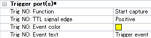

# 3.3 プロトコールファイルを使用したLED点灯制御　技術説明

**作成日**: 2026-04-30
**作成者**: mshinyalab (AI支援)
**動作確認済み**: 2026-04-30

本ドキュメントは、反応時間課題バットスイング実験における、NI DAQを用いたLED点灯制御とQualisysトリガー出力の実装をまとめたものです。

---

## 1. ハードウェア構成

### 電圧出力チャンネル

**AO0**（Qualisysトリガー兼 白色LED）

| 電圧 | 機能 |
|------|------|
| +5V  | Qualisysへのトリガー（TTL, positive） |
| -5V  | 白色LED点灯（ready cue） |
| 0V   | 消灯 |

**AO1**（緑/赤 LED）

AO1 チャンネルに、緑と赤のLEDを**正負逆向きに**接続することで、電圧の正負によって点灯色を切り替える。

| 電圧 | 機能 |
|------|------|
| +5V  | 緑色LED点灯（go cue） |
| -5V  | 赤色LED点灯（nogo cue） |
| 0V   | 消灯 |

---

## 2. Qualisys トリガー設定

Qualisys側の設定：

| 項目 | 設定値 |
|------|--------|
| Trig NO: Function | Start capture |
| Trig NO: TTL signal edge | Positive |

NI DAQ の AO0 ch を、トリガーボックスの Trig NO ch に配線する。
MATLABから AO0 ch に 0 → +5 → 0 (V) の波形を出力することで、Qualisysのキャプチャーを開始できる。



---

## 3. 1試行分のタイミング設計

```
AO0  |____|TTTTT|___________|RRRRR|___________________________|_____|
AO1  |___________________________________________________|GGGGG|_____|

     0   0.1  0.2          1.2   1.7      （1.7 + Foreperiod）
                                                          ↑go/nogo開始

凡例:
  T: +5V トリガー（Qualisys起動）
  R: -5V 白色LED（ready cue）
  G: ±5V 緑/赤LED（go/nogo cue）
  _: 0V 消灯
```

### タイミングパラメータ（デフォルト値）

| パラメータ | 変数名 | 値 |
|-----------|--------|-----|
| 最初の消灯時間 | `ini_duration` | 0.1 s |
| トリガー信号幅 | `trig_signal_duration` | 0.1 s |
| トリガー→ready 間隔 | `trig_to_ready_interval` | 1.0 s |
| ready cue 提示時間 | `ready_signal_duration` | 0.5 s |
| フォアピリオド（ready→go/nogo） | `Foreperiod` | 試行ごとに可変 |
| go/nogo cue 提示時間 | `gonogo_signal_duration` | 0.5 s |
| 最後の消灯時間 | `off_duration` | 0.1 s |

---

## 4. デモスクリプト一覧

| スクリプト | 内容 |
|-----------|------|
| `demo3_3_1_gen_voltage_for_green_and_red_LEDs.m` | AO1のみ使用。緑/赤LEDの点灯確認 |
| `demo3_3_2_gen_voltage_trig_and_LEDs.m` | AO0 + AO1。1試行分の制御（ハードコーディング） |
| `demo3_3_3_gen_voltage_for_multiple_trials.m` | 複数試行の制御（ハードコーディング）。ループ処理・キー入力待ちを実装 |
| `demo3_3_4_gen_voltage_using_csv.m` | 複数試行の制御（CSVファイル読み込み）。`uigetfile` でファイルをダイアログ指定 |

---

## 5. プロトコールCSVのフォーマット

`demo3_3_4` で読み込むCSVファイルの形式。

```csv
TrialNum,Foreperiod,CueText
1,2.0,go
2,1.0,nogo
3,1.5,go
```

| 列名 | 型 | 内容 |
|------|----|------|
| `TrialNum` | 数値 | 試行番号（コードでは使用しないが管理用に記載） |
| `Foreperiod` | 数値 | ready cue から go/nogo cue までの時間 [秒] |
| `CueText` | 文字列 | `go` または `nogo` |

---

## 6. トラブルシューティング記録

### [2026-04-30] demo3_3_2: voltage_go の符号ミス

**原因**  
`voltage_go = -5.0` と設定されており、go cue 時に赤色LED（-5V）が点灯してしまっていた。

**修正**  
```matlab
% 修正前
voltage_go = -5.0;

% 修正後
voltage_go = 5.0;  % +5V → 緑色LED（go cue）
```

**経緯**  
demo3_3_1 の `voltage_on = 5.0`（緑点灯）から demo3_3_2 に拡張する際に、nogo 用の `-5.0` をそのままコピーしたことによるミス。AO1 の仕様（正負で点灯色が変わる）を意識して電圧値を設定すること。
