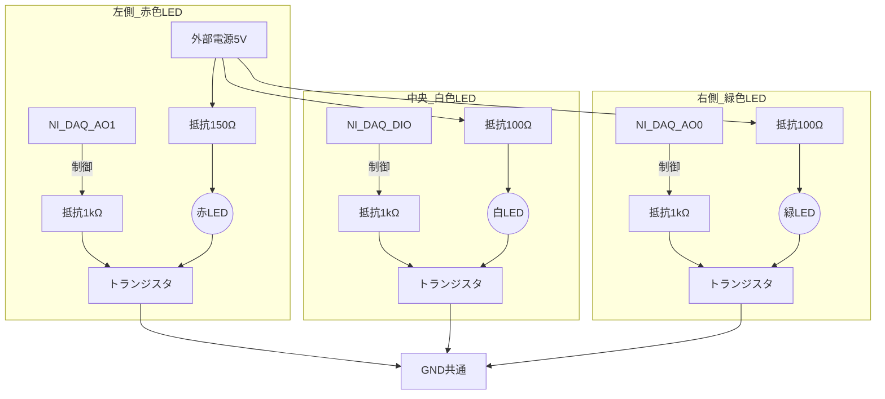

# 本実験用LED基盤 設計および作成マニュアル

## 概要
NI DAQの**アナログ出力（AO）**もデジタル出力同様に電流出力能力が低く（通常 2〜5 mA 程度）、直接LED（約20mA）を駆動すると故障や電流不足の原因となります。
そのため、アナログ出力からON/OFF（5V/0V）の制御信号を送り、外部電源（5V）とNPNトランジスタを用いたスイッチング回路を使用することで、安全かつ安定してLEDを点灯させる基盤を作成します。

## 物理レイアウト（配置案）
被験者から見て、LEDは以下のように**横一列**に配置する設計とします。
- **左側**：赤色LED（No-Go / ボール）
- **中央**：白色LED（投球モーション開始。約1.5秒点灯）
- **右側**：緑色LED（Go / ストライク）
※ 中央の白を注視点（投手のリリースポイント）とします。左右に配置することで、空間的な区別がつきやすくなります。

## 💡 回路の専門用語のやさしい解説

電子工作が初めての方でも配線がイメージしやすいよう、用語を「水」に例えて解説します。

- **GND（グラウンド / マイナス極）**
  - **役割**：電気の「帰り道（排水溝）」です。
  - **説明**：電気はプラス（5V）から出発して、マイナス（GND）に帰ることで初めて流れます。回路図の下にある `GND:共通` というのは、「NI DAQのマイナス極」も「外部電源のマイナス極」も、すべて1本の線に繋いで同じ排水溝に流すという意味です。
- **外部電源 5V**
  - **役割**：LEDを光らせるための「メインの水源」です。
  - **説明**：NI DAQからの信号だけではパワー（水圧）が弱すぎてLEDが十分に光りません。そのため、コンセントやUSB等から引っ張ってきた強い電気をメイン動力として使います。
- **トランジスタ（NPN型）**
  - **役割**：電気の流れをON/OFFする「自動の蛇口」です。
  - **説明**：トランジスタには3本の足（配線を繋ぐピン）があります。
    1. **ベース（B）**：「蛇口のひねり手」です。NI DAQからここに指令（5Vの信号）が来ると、蛇口がパカッと開きます。
    2. **コレクタ（C）**：「水の入り口」です。外部電源からLEDを通ってきた強い電気が、蛇口が開くのをここで待機しています。
    3. **エミッタ（E）**：「水の出口」です。蛇口が開くと、ここを通って電気がGND（排水溝）へと一気に流れ抜け、その瞬間にLEDが光ります。
- **抵抗（Ω：オーム）**
  - **役割**：電気が流れすぎないように絞る「ホースのバルブ」です。
  - **説明**：これがないと、強い電気が一気に流れ込みすぎてLEDやトランジスタが破裂（焼き切れ）してしまいます。LEDは色ごとに耐えられる電気の量が違うため、赤は「150Ω」、白や緑は「100Ω」というようにストッパーの強さを変えています。

## 必要物品（買い物リスト）
白・赤・緑の3色のLEDを制御するシステム全体として必要な物品のリストです。BNCインターフェースへの対応を含めています。

| 部品カテゴリ | 品名・スペック | 数量 | 備考 |
| --- | --- | --- | --- |
| **LED** | 高輝度LED（白・赤・緑） | 各色1〜数個 | 予備を含めて多めに購入推奨。 赤: Vf約2.0V, 白/緑: Vf約3.2V (共に20mA想定) |
| **トランジスタ** | NPNトランジスタ（2SC1815等） | 3個以上 | スイッチング用 |
| **抵抗** | 150 Ω （1/4W） | 1個以上 | 赤LED用電流制限 |
| **抵抗** | 100 Ω （1/4W） | 2個以上 | 白・緑LED用電流制限 |
| **抵抗** | 1 kΩ （1/4W） | 3個以上 | トランジスタベース用電流制限 |
| **BNC接続部品** (A/Bどちらか) | **A:** 片側BNC(オス)-片側バラ線ケーブル **B:** BNCケーブル(オス-オス) + BNCメス-端子台変換アダプタ（または基板用BNCコネクタ） | 3セット | DAQから基板へ信号を送るため。 **Aのバラ線ケーブル**を基板に直接はんだ付けするのが一番簡単です。 |
| **外部電源** | 5V ACアダプター（またはUSB充電器＋USB電源取り出し用バラ線ケーブル） | 1個 | LEDを光らせるメイン電源 |
| **電源ジャック** | DCジャック（基板取付用） | 1個 | ACアダプターと基板を接続するため |
| **基盤・その他** | ユニバーサル基板、はんだ、配線材 | 適量 | 部品を実装するため |

## 回路図（3色並列・横一列配置）

以下は、左から「赤・白・緑」の順に並べた場合の結線図です。

## 実装時の注意点
1. **GNDの共通化**: NI DAQのGNDと外部電源のGNDは必ず接続（共通化）してください。これが無いとトランジスタが正しくスイッチングされません。
2. **配線長**: DAQから基盤までの配線が長くなる場合は、ノイズの影響を受けやすくなるため、ツイストペア線やシールド線の使用を推奨します。
