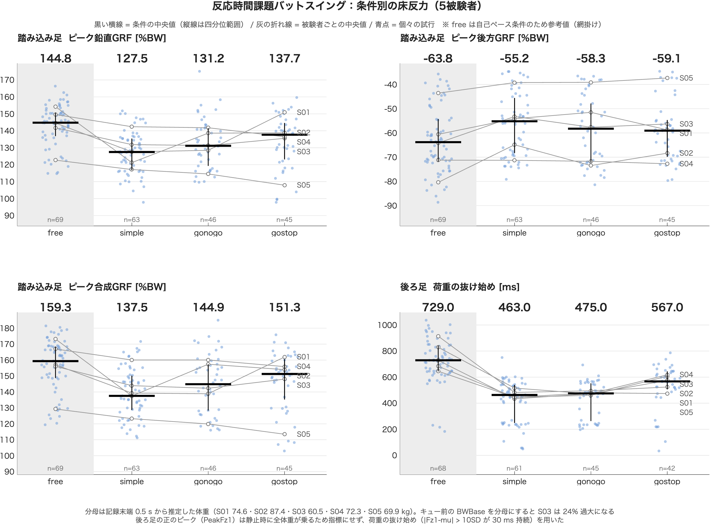

# 5.7 床反力分析 — 技術説明

作成：2026-08-31 ／ 加藤 和太郎（student）

床反力（GRF: Ground Reaction Force）の分析を、擬似データから段階的に組み立てる練習のフォルダ。

**ゴール：自己データ（本実験データ S01〜S05）で Fz のピーク値を算出し、Fz の時系列をプロットする。**

既存パイプライン（`03_Analysis/m3_analyze_single_trial.m` と `x7_3_visualize_grf.m`）が同じ処理を済ませているが、
ここでは仕組みを理解するために自分で組み直す。5.6 が実データを直接扱ったのに対し、
本フォルダは **擬似データで正解が分かっている状態からアルゴリズムを検証し、最後に実データへ差し替える** 方針をとる。

---

## 1. 進め方（段階学習）

一度に書くと切り分けができなくなるため、1本ずつ図を出して確認しながら進める。

| ファイル           | やること                                           | 確認するポイント                             | 状況                                 |
| ------------------ | -------------------------------------------------- | -------------------------------------------- | ------------------------------------ |
| `f1_fake_grf.m`  | 実データと同じ構造の擬似データを作る               | `Fz1+Fz2` の静止値が体重になるか           | **実装済み（2026-08-31）**     |
| `f2_filter.m`    | 30 Hz ローパスを掛ける                             | 生波形とフィルタ後が重なるか、山が鈍らないか | **実装済み（2026-08-31）**     |
| `f3_time_axis.m` | LED からキュー時刻を求め、時間軸をキュー基準に直す | キューが 0 s に来るか                        | **実装済み（2026-08-31）**     |
| `f4_baseline.m`  | 静止区間から体重`BWBase` を推定                  | 716 N（≒73 kg）付近になるか                 | **実装済み（2026-09-07）**     |
| `f5_peak.m`      | 探索窓の中でピーク Fz を取る                       | 値と時刻が正解付近か                         | **実装済み（2026-09-07）**     |
| `f6_plot.m`      | 体重正規化して時系列＋ピーク印を描く               | 図が読めるか                                 | **実装済み（2026-09-07）**     |
| `f7_real_grf.m`  | 読み込みを実データに差し替える                     | 同じ処理が通るか                             | **実装済み（2026-09-07）**     |

f1〜f7 で処理が実データで通ることを確認したのち、**指標そのものの妥当性の検討**に移った。
その結果を反映した集計・可視化スクリプトを `g` シリーズとして分けている。

| ファイル                       | やること                                             | 状況                             |
| ------------------------------ | ---------------------------------------------------- | -------------------------------- |
| `g0_calc_grf_metrics.m`      | 全被験者（S01〜S05）の推奨GRF指標を試行ごとに算出    | **実装済み（2026-09-07）** |
| `g1_plot_grf_by_condition.m` | `g0` の結果を条件別・被験者別に1枚の図にして PNG 出力 | **実装済み（2026-09-07）** |

`g` シリーズは f7 とは分母と指標が違う（§3-6・§3-7）。**f7 は「f1〜f6 が実データで通ること」の
確認用として残し、集計に使うのは `g` シリーズ**とする。

### 設計方針：擬似データを実データと同じ構造にする

`f1_fake_grf.m` が作る `Data` は、実データ（`x3_DataChecked/Data0x.mat` の `DataArray` 要素）と
同じフィールド名・同じ単位・同じサンプリング周波数にする。

```matlab
Data.AnalogFs = 1000 ;
Data.Force1   = [Fx1, Fy1, Fz1] ;   % 後ろ足   [N]（3列目が Fz）
Data.Force2   = [Fx2, Fy2, Fz2] ;   % 踏み込み足 [N]
Data.LEDData  = led ;               % ch2 が cue（Go = 正電圧）
```

こうすると、`f2`〜`f6` の処理を一切書き換えずに、`f7` で読み込み部分だけ差し替えれば実データに適用できる。
擬似データ側に独自のフィールド名を付けると、実データへ移す段階で全スクリプトを書き直すことになる。

### `f1_fake_grf.m`（2026-08-31 実装）

出力は `Data`（実データと同じ構造）と `True`（検証用の正解値：`BW` / `tCue` / `rtTrue` / `tOnset`）。

**実データに揃えた値**

| 項目          | 値                        | 根拠                                     |
| ------------- | ------------------------- | ---------------------------------------- |
| `AnalogFs`  | 1000 Hz                   | 床反力・LED のサンプリング周波数         |
| `FrameRate` | 250 Hz                    | マーカー系のサンプリング周波数           |
| `dur`       | 5 s（5000 サンプル）      | 実データの記録長                         |
| `tCue`      | 2.581 s                   | 実データのキュー時刻                     |
| `mass`      | 73 kg（`BW` = 716.1 N） | S01 相当                                 |
| 符号          | 上向き正                  | `load_qualisys_mat.m` 通過後と同じ状態 |

**静止時の荷重配分：`Fz1` = 全体重、`Fz2` = ゼロ**

キュー前は後ろ足プレート1に全体重が乗り、踏み込み足プレート2は実質ゼロ（実データで約 3 N）。
踏み込み足はステップ後に初めてプレート2へ着地する。静止時に両足へ配分する擬似データを作ると、
`BWBase` の意味と `Fz2` のベースライン SD が実データと食い違い、後段の閾値が実データで通用しない。

**波形の構成**

```matlab
% 後ろ足 Fz1：静止（全体重）→ 一時的な荷重増 → 前足への荷重移動で抜ける
load1 = 0.20 * BW * exp( -(t - (tOnset + 0.20)).^2 / (2*0.10^2) ) ;
shift = 0.85 * BW ./ ( 1 + exp( -(t - (tOnset + 0.50)) / 0.06 ) ) ;
Fz1   = BW + load1 - shift ;

% 踏み込み足 Fz2：静止（ゼロ）→ 接地で急増（このピークが解析対象）
land  = 0.85 * BW ./ ( 1 + exp( -(t - (tOnset + 0.30)) / 0.04 ) ) ;
imp   = 0.70 * BW * exp( -(t - (tOnset + 0.35)).^2 / (2*0.06^2) ) ;
Fz2   = land + imp ;
```

- ガウス関数（山）とシグモイド関数（段差）の重ね合わせで表現している。
  山＝一時的な力の増減、段差＝荷重が移って戻らない変化。
- `shift` の振幅 0.85 は、**動作後に `Fz1 + Fz2` が体重に戻るよう**に決めた
  （`Fz1` 末端 0.15 BW ＋ `Fz2` 末端 0.85 BW ＝ 1.00 BW）。
  ここを合わせないと、静止立位に戻ったあとの合計が体重を超える非物理的なデータになる。
- `t < tCue` は強制的に静止させている。ベースライン区間の SD をノイズだけで決めたいため。
  これがないと閾値 `baseMean + k*baseSD` が不当に大きくなる。
- ノイズは SD 3 N（実データの静止区間と同程度）。

**検算した値**（MATLAB R2026a、30 Hz フィルタ後・キュー起点2秒窓）

| 項目                | 擬似データ             | 実データ（S01） |
| ------------------- | ---------------------- | --------------- |
| `BWBase`          | 716.1 N（正解と一致）  | 716〜720 N      |
| `PeakFz1`         | 1.19 BW（t = 0.443 s） | 1.06〜1.20 BW   |
| `PeakFz2`         | 1.39 BW（t = 0.616 s） | 1.41〜1.60 BW   |
| 末端の`Fz1 + Fz2` | 1.00 BW（0.15 + 0.85） | —              |

### `f2_filter.m`（2026-08-31 実装）

Fz に 30 Hz ローパス（4次 Butterworth・双方向）を掛け、生波形と比較する。
ピーク Fz を取る前にフィルタが必須である理由を数値で確認するのが目的。

以下は**実装後に説明コメントを入れて清書した版**（2026-08-31）。清書前後で出力は同一。

```matlab
% f2_filter.m
%
% 目的:
%   Fz に 30 Hz ローパス（4次 Butterworth・双方向）を掛け、生波形と比較する。
%   ピーク Fz を取る前にフィルタが必須である理由を数値で確認する。
%
% 入力:
%   f1_fake_grf.m が作る Data（先頭で呼び出す）
%
% 出力:
%   figure 1 ... 生波形とフィルタ後を重ねた図
%   コマンドウィンドウ ... 静止区間の SD と max の変化
%
% 備考:
%   - フィルタは max を取る前に必ず掛ける。生波形の max はノイズの一番高い1点を
%     拾うので、フィルタの有無でピーク値が変わり、x8_StatTable の統計値と食い違う。
%   - rng(0) の乱数列は処理系ごとに違うため、ノイズを含む値は MATLAB 以外の
%     処理系と厳密一致しない。判定は乱数に依存しない量で行う（技術説明 §1 f2 の節）。

clear ;
close all

% f1 を先頭で呼ぶ。f1 の中に clear ; close all があるので、
% 先に自分で変数を作っても消される。
f1_fake_grf


%% ---- 1. 必要なものを取り出す ----

fsA     = Data.AnalogFs ;        % アナログ系のサンプリング周波数 [Hz]
Fz1_raw = Data.Force1(:, 3) ;    % 後ろ足の鉛直分力 [N]（3列目が Fz、上向き正）
Fz2_raw = Data.Force2(:, 3) ;    % 踏み込み足の鉛直分力 [N]

% 要素数は dur*fsA と決め打ちせず numel で数える。
% 実データは試行ごとに記録長が違うので、配列から数えれば f7 でもそのまま動く。
nSample = numel(Fz1_raw) ;

% サンプル番号を秒に直す。
%   (1:nSample)  → 1 2 3 ... 5000        行ベクトル
%   ...'         → 転置して列ベクトル（Fz1_raw と向きを揃える）
%   ... - 1      → 0 1 2 ... 4999        配列は1から、時刻は0から始まるずれを吸収
%   ... / fsA    → 0 0.001 ... 4.999 [s]
% 0 : 1/fsA : dur と書くと 5001 点になり、Fz1_raw と長さが合わずエラーになる。
t = ((1:nSample)' - 1) / fsA ;


%% ---- 2. フィルタ係数をつくる ----

fCut = 30 ;               % 遮断周波数 [Hz]
nOrd = 4 ;                % 次数。1次あたり -6 dB/oct で落ちる。
                          % 高次はリンギングと数値不安定の代償があり、4次が慣例。
                          % m3_analyze_single_trial.m も4次を使っている。

% butter は Hz を受け取らない。ナイキスト周波数（fsA/2）を 1 とした比を渡す。
%   fsA/2 = 500 Hz  →  wn = 30/500 = 0.06
% ★ /2 を忘れると wn = 0.03 となり、エラーを出さずに 15 Hz のフィルタになる。
wn = fCut / (fsA/2) ;

% butter はフィルタを掛けない。係数（設計値）を計算するだけ。
%   bF ... 入力の過去の値への重み（要素数 = 次数+1 = 5）
%   aF ... 出力の過去の値への重み。aF(1) は常に 1.0 に正規化される。
% sum(bF)/sum(aF) = 1.000 になり、直流成分（= 体重）をそのまま通す。
[bF, aF] = butter(nOrd, wn, 'low') ;

% wn を間違えていないか目で確かめるための表示。
% /2 忘れはエラーを出さない事故なので、値を出しておくのが唯一の防御。
fprintf('fsA = %d Hz, ナイキスト = %d Hz, wn = %.3f\n', fsA, fsA/2, wn) ;


%% ---- 3. 双方向に掛ける ----

% filtfilt は前向き・後ろ向きに2回掛けるので位相遅れがゼロ。
% ピークの「時刻」を議論するので filter は使わない。
% 代償として実効的な次数が2倍（4次指定で8次相当）になり、
% 30 Hz での振幅が -6 dB（0.500）、実質 -3 dB 点が 26.87 Hz になる。
Fz1 = filtfilt(bF, aF, Fz1_raw) ;
Fz2 = filtfilt(bF, aF, Fz2_raw) ;


%% ---- 4. 生波形と重ねて確認 ----

figure
ax = axes ;

% 生は薄い色・細線で先に描き、フィルタ後を濃い色・太線で後に描く。
% plot は後から描いたものが上に重なるので、この順番でないと濃い線が隠れる。
% RGB は 0〜1 の3要素（0〜255 ではない）。8色の短縮記号では薄い色が出せないので
% 'Color' と名前を付けて数値で渡す。
plot(t, Fz1_raw, 'Color', [0.7 0.7 1.0], 'DisplayName', 'Fz1 生') ;
hold on
plot(t, Fz2_raw, 'Color', [1.0 0.7 0.7], 'DisplayName', 'Fz2 生') ;
plot(t, Fz1, 'b', 'LineWidth', 1.2, 'DisplayName', 'Fz1 フィルタ後') ;
plot(t, Fz2, 'r', 'LineWidth', 1.2, 'DisplayName', 'Fz2 フィルタ後') ;

xline(True.tCue, 'k--', 'Cue') ;

xlabel('Time [s]')
ylabel('Fz [N]')
legend('Location', 'northwest')     % DisplayName で付けた名前が凡例に出る
title('30 Hz ローパスの効果')

% 図で確認すること
%   1. フィルタ後（濃い線）が生波形（薄い線）の中心を通っているか。
%      系統的に右へずれていたら filter を使っている疑い（位相遅れ）。
%   2. Fz2 の着地衝撃のピークが鈍りすぎていないか。最も高周波成分を含む部分。


%% ---- 5. フィルタの効果を数値で見る ----

% 静止区間の終わり。f3 以降は LED から求めるが、ここでは正解値をそのまま使う。
iCue = round(True.tCue * fsA) ;

% SD ... 高周波ノイズが落ちた量。白色ノイズの理論的な減衰比は 0.2328 なので、
%        生 3.00 N なら フィルタ後は 0.70 N 前後になる。
fprintf('静止区間の SD : 生 %.2f N → フィルタ後 %.2f N\n', ...
    std(Fz1_raw(1:iCue-1)), std(Fz1(1:iCue-1))) ;

% max ... 生とフィルタ後の差がそのままノイズの寄与分。
%         ノイズなし理想波形のピークは Fz1 = 855.4 N、Fz2 = 994.4 N。
%         フィルタ後がこれと一致すれば、ノイズだけを落として信号を保持できている。
fprintf('Fz1 の最大値  : 生 %.1f N, フィルタ後 %.1f N（差 %.1f N）\n', ...
    max(Fz1_raw), max(Fz1), max(Fz1_raw) - max(Fz1)) ;
fprintf('Fz2 の最大値  : 生 %.1f N, フィルタ後 %.1f N（差 %.1f N）\n', ...
    max(Fz2_raw), max(Fz2), max(Fz2_raw) - max(Fz2)) ;
```

**書くときの注意**

- **`f1_fake_grf` は必ず先頭で呼ぶ。** f1 の中に `clear ; close all` があるので、
  先に自分で変数を作っても消される。
- **`butter` の第2引数は Hz ではなく正規化周波数**（`fCut/(fsA/2)`）。
  30 をそのまま入れると 1 を超えてエラーになる。1000 Hz なら `wn = 0.06`。
- **`filtfilt` を使う（`filter` ではない）。** 前向き・後ろ向きに2回掛けるので位相遅れがゼロ。
  ピークの時刻を議論するので必須。代償として実効的な次数が2倍（4次指定で8次相当）になる。

**期待される出力**

```
fsA = 1000 Hz, ナイキスト = 500 Hz, wn = 0.060
静止区間の SD : 生 2.92 N → フィルタ後 0.71 N
Fz1 の最大値  : 生 860.9 N, フィルタ後 855.6 N（差 5.3 N）
Fz2 の最大値  : 生 997.3 N, フィルタ後 994.9 N（差 2.4 N）
```

静止区間の SD が約4分の1になる（高周波ノイズが落ちた証拠）。同時に `max` が数 N 下がる。
この差が「生波形の `max` はノイズの一番高い1点を拾っている」ということで、
フィルタの有無で結果が変わる理由（§3-1）。

**実行結果（2026-08-31）**

```
擬似データ作成: BW = 716.1 N（73.0 kg）, tCue = 2.581 s, rtTrue = 0.250 s
fsA = 1000 Hz, ナイキスト = 500 Hz, wn = 0.060
静止区間の SD : 生 3.00 N → フィルタ後 0.77 N
Fz1 の最大値  : 生 862.9 N, フィルタ後 855.7 N（差 7.2 N）
Fz2 の最大値  : 生 995.8 N, フィルタ後 993.1 N（差 2.7 N）
```

**★ 乱数列は処理系ごとに違うので、ノイズを含む値の厳密一致は起こらない。**
判定は乱数に依存しない量で行う。

| 確認項目                 | 実行結果 | 理論値・基準                  | 判定 |
| ------------------------ | -------- | ----------------------------- | ---- |
| 静止区間の生 SD          | 3.00 N   | `sdNoise = 3` N             | 一致 |
| 静止区間のフィルタ後 SD  | 0.77 N   | 0.70 N（理論）                | 妥当 |
| `Fz1` フィルタ後の max | 855.7 N  | 855.4 N（ノイズなし理想波形） | 一致 |
| `Fz2` フィルタ後の max | 993.1 N  | 994.4 N（同上）               | 一致 |

**下2行が最も重要。** ノイズを足さない理想波形にフィルタを掛けたときのピークは
`Fz1` = 855.4 N、`Fz2` = 994.4 N。フィルタ後の実測値はこれと 1 N 程度しか違わない。
つまり**フィルタはノイズだけを落とし、信号本体を保持している**。

一方、生波形の max（862.9 / 995.8）は理想値より 7.5 N / 1.4 N 高い。
**この差はすべてノイズ**で、乱数列が違えば毎回変わる。
生波形の max を解析値に採用してはいけない理由がここに現れている。

**SD の減衰比の理論値**

白色ノイズに `filtfilt` を掛けたときの SD の比は、周波数応答の4乗を全帯域で積分した値の
平方根で決まる（`filtfilt` は振幅が `|H|²` になるので、パワーは `|H|⁴`）。

```
減衰比 = 0.2328  →  3.00 N × 0.2328 = 0.70 N
```

MATLAB で 200 万点の白色ノイズに `filtfilt` を掛けて実測した値。

実測 0.77 N が理論値より1割ほど大きいのは、有限長データでの SD 推定のばらつき。
フィルタ後は隣接サンプルが強く相関しており（30 Hz より上を落としたため実効的な
独立サンプル数が減る）、SD 推定の分散が単純な `1/√N` より大きくなる。1割程度の差は正常。

**図で確認すること**

1. **薄い線と濃い線が重なっているか。** フィルタ後（濃い線）が生波形（薄い線）の中心を通れば正常。
   濃い線が系統的に右へずれていたら `filter` を使っている疑い（位相遅れ）。
2. **`Fz2` の着地衝撃のピークが鈍っていないか。** 最も高周波成分を含む部分なので、
   フィルタで角が丸まりすぎていないかを見る。

### `f3_time_axis.m`（2026-08-31 実装）

`Data.LEDData` の ch2 からキュー時刻をサンプル番号として求め、時間軸をキュー基準（キュー = 0 s）に直す。
以降のすべての処理がこの時間軸の上に乗る。

以下は**実装後に説明コメントを入れて清書した版**（2026-08-31）。清書前後で出力は同一。
清書の際に `cueTheresholdV` のつづりを `cueThresholdV` に修正した。

```matlab
% f3_time_axis.m
%
% 目的:
%   LED（cue）チャンネルからキュー時刻をサンプル番号として求め、
%   時間軸をキュー基準（キュー = 0 s）に直す。
%   以降のすべての処理がこの時間軸の上に乗る。
%
% 入力:
%   f1_fake_grf.m が作る Data, True
%
% 出力:
%   tCueAnalog ... キュー提示のサンプル番号（アナログ系）
%   tRel       ... [nSample × 1] キューを 0 とした時刻 [s]
%   figure 1   ... キュー基準で描いた Fz の時系列
%
% 備考:
%   - キュー時刻は「時刻[s]」ではなく「サンプル番号」で持つ。
%     配列の添字にそのまま使えるので、以降の区間指定が単純になる。
%   - 擬似データの cue は正のパルス1本だけ。実データは gonogo の負電圧と
%     gostop の「正の後に負」判定が必要になる（技術説明 §1 f3 の節、f7 で対応）。

clear ;
close all

% f1 を先頭で呼ぶ。f1 の中に clear ; close all があるので、
% 先に自分で変数を作っても消される。
f1_fake_grf


%% ---- 1. 必要なものを取り出す ----

fsA     = Data.AnalogFs ;        % アナログ系のサンプリング周波数 [Hz]
Fz1_raw = Data.Force1(:, 3) ;    % 後ろ足の鉛直分力 [N]（3列目が Fz、上向き正）
Fz2_raw = Data.Force2(:, 3) ;    % 踏み込み足の鉛直分力 [N]

% 要素数は dur*fsA と決め打ちせず numel で数える。
% 実データは試行ごとに記録長が違うので、配列から数えれば f7 でもそのまま動く。
nSample = numel(Fz1_raw) ;


%% ---- 2. フィルタ（f2 と同じ）----

% butter の第2引数は Hz ではなく、ナイキスト周波数（fsA/2）を 1 とした比。
% ★ /2 を忘れると エラーを出さずに 15 Hz のフィルタになる。
fCut = 30 ;
nOrd = 4 ;
wn   = fCut / (fsA/2) ;

[bF, aF] = butter(nOrd, wn, 'low') ;

% filtfilt は双方向なので位相遅れがゼロ。ピークの「時刻」を議論するので filter は使わない。
Fz1 = filtfilt(bF, aF, Fz1_raw) ;
Fz2 = filtfilt(bF, aF, Fz2_raw) ;


%% ---- 3. LED からキュー時刻を求める ----

% LED の出力は 0 V か 5 V なので、中間の 2.5 V を閾値にする。
% 立ち上がりの途中で確実に一度だけ交差するので、ノイズや立ち上がり時間に対して頑健。
% 0.1 V のような低い閾値では暗電流やノイズを拾う危険がある。
cueThresholdV = 2.5 ;                                              % [V]

% ch2 が cue チャンネル。Go では正のパルスが立つ。
%   Data.LEDData(:,2) > cueThresholdV  → 論理配列（5000×1）
%   find(..., 1, 'first')              → 最初に true になった番号だけを返す
% ★ 第2引数の 1 がないと、パルスが立っている 100 サンプル分すべての番号が返る。
%   それを添字に使うと エラーを出さずに 100 本の波形が描かれる。
tCueAnalog = find( Data.LEDData(:,2) > cueThresholdV, 1, 'first' ) ;

% find は該当なしのときエラーを出さず空配列 [] を返す。
% そのまま進めると tRel が空になり、何も描かれない図が出るだけで原因が分からない。
% 実データにはキューが記録されていない試行が実在する
% （x2_import_data.m に Analog data missing の分岐がある）ので、ここで止める。
if isempty(tCueAnalog)
    error('f3_time_axis:NoCue', 'cue パルスが見つかりません')
end


%% ---- 4. キュー基準の時間軸をつくる ----

% f2 の t = ((1:nSample)' - 1)/fsA の「1」を「tCueAnalog」に替えただけ。
% 引く数が原点になるので、キューのサンプル番号を引けばキューが 0 s になる。
tRel = ( (1:nSample)' - tCueAnalog ) / fsA ;


%% ---- 5. 検算 ----

% 誤差 0.0 ms は自動的に出る値ではない。t = (idx-1)/fsA と led(t >= tCue) の
% 関係を正しく扱えていることの確認になる。
fprintf('キュー検出: サンプル番号 %d → 時刻 %.3f s（正解 %.3f s, 誤差 %.1f ms）\n', ...
    tCueAnalog, (tCueAnalog-1)/fsA, True.tCue, ((tCueAnalog-1)/fsA - True.tCue)*1000) ;

% 定義どおりキューが 0 になっているかの直接確認。
fprintf('tRel(tCueAnalog) = %.3f s（0 になるはず）\n', tRel(tCueAnalog)) ;

% 記録長 5 s のうち 2.581 s がキュー前、残りがキュー後。左右非対称が正常。
fprintf('tRel の範囲: %.3f 〜 %.3f s\n', tRel(1), tRel(end)) ;

% 食い違うと plot でエラーになる。
fprintf('tRel の要素数 = %d, Fz1 の要素数 = %d\n', numel(tRel), numel(Fz1)) ;


%% ---- 6. 描画（キュー基準）----

figure
ax = axes ;

plot(tRel, Fz1, 'b', 'LineWidth', 1.2, 'DisplayName', 'Fz1 後ろ足') ;
hold on
plot(tRel, Fz2, 'r', 'LineWidth', 1.2, 'DisplayName', 'Fz2 踏み込み足') ;

xline(0, 'k--', 'Cue') ;                    % 時間軸の原点
xline(True.rtTrue, 'k:', 'Onset (true)') ;  % 正解の動作開始時刻

% 表示範囲は XLim で決める。固定長で切り出すと、データ長が足りない試行が
% すべて除外されて図が空になる（技術説明 §3-4）。
set(ax, 'Xlim', [-1 2])

xlabel('Time from cue [s]')
ylabel('Fz [N]')
legend('Location', 'northwest')
title('キュー基準の時間軸')

% 図で確認すること
%   Fz2 の立ち上がりが Onset (true)（0.25 s）の少し後から始まっているか。
%   Fz1 は 0 s より前は体重で平坦、その後に一度増えて前足へ抜けていく形になる。
```

**キュー時刻は「サンプル番号」で持つ**

`tCueAnalog` は秒ではなくサンプル番号（整数）。これが後の処理を単純にする。

```matlab
Fz1(1:tCueAnalog-1)              % 静止区間（f4 で使う）
tCueAnalog : tCueAnalog+2*fsA    % 探索窓（f5 で使う）
```

秒で持つと毎回 `round(t*fsA)` が必要になり、丸め方の違いで 1 サンプルずれる余地が生まれる。
既存の `m3_analyze_single_trial.m` も `tCueAnalog` という名前でサンプル番号を持っている。

**`find(..., 1, 'first')` の意味**

```matlab
find( Data.LEDData(:,2) > cueThresholdV, 1, 'first' )
%     ~~~~~~~~~~~~~~~~~~~~~~~~~~~~~~~~  ~  ~~~~~~~
%     ① 論理配列（5000×1）              ②  ③
```

① 各サンプルで「2.5 V を超えたか」の true/false を作り、② そのうち ③ 最初の1個の番号だけを返す。
第2引数の `1` がないと、パルスが立っている 100 サンプル分すべての番号が返り、
`tCueAnalog` が 100 要素のベクトルになる。それを添字に使うと
**エラーを出さずに 100 本の波形が描かれる**という分かりにくい壊れ方をする。

**閾値を 2.5 V にする理由**

LED の出力は 0 V か 5 V なので、中間の 2.5 V を閾値にする。立ち上がりの途中で確実に一度だけ
交差するので、ノイズや立ち上がり時間に対して頑健。0.1 V のような低い閾値では暗電流やノイズを拾う。

**`isempty` のチェックを入れる理由**

`find` は該当なしのとき**エラーを出さず空配列 `[]` を返す**。そのまま `tRel` を計算すると
`tRel` が空になり、`plot` が何も描かない図が出るだけで原因が分からない。
実データにはキューが記録されていない試行が実在する（`x2_import_data.m` に
`Analog data missing` の分岐がある）ので、ここで止めるのが正解。

**期待される出力**（MATLAB R2026a で参照実装を実行）

```
擬似データ作成: BW = 716.1 N（73.0 kg）, tCue = 2.581 s, rtTrue = 0.250 s
キュー検出: サンプル番号 2582 → 時刻 2.581 s（正解 2.581 s, 誤差 0.0 ms）
tRel(tCueAnalog) = 0.000 s（0 になるはず）
tRel の範囲: -2.581 〜 2.418 s
tRel の要素数 = 5000, Fz1 の要素数 = 5000
```

乱数に依存しない値なので、今回は全桁一致するはず。確認する4点：

| # | 確認項目                             | 意味                                                                                              |
| - | ------------------------------------ | ------------------------------------------------------------------------------------------------- |
| 1 | サンプル番号 2582、誤差 0.0 ms       | `t = (idx-1)/fsA` なので `t = 2.581` は `idx = 2582`。2581 なら `-1` の扱いを間違えている |
| 2 | `tRel(tCueAnalog) = 0.000`         | 定義どおりキューが 0 になっているかの直接確認                                                     |
| 3 | `tRel` の範囲が −2.581 〜 2.418 s | 記録長 5 s のうち 2.581 s がキュー前、残り 2.419 s がキュー後。左右非対称が正常                   |
| 4 | 要素数が両方 5000                    | 食い違うと`plot` でエラーになる                                                                 |

図では `Fz2` の立ち上がりが `Onset (true)`（0.25 s）の少し後から始まっていれば正しい。

**実行結果（2026-08-31）** — 期待値と全桁一致。4点すべて合格。

```
擬似データ作成: BW = 716.1 N（73.0 kg）, tCue = 2.581 s, rtTrue = 0.250 s
キュー検出: サンプル番号 2582 → 時刻 2.581 s（正解 2.581 s, 誤差 0.0 ms）
tRel(tCueAnalog) = 0.000 s（0 になるはず）
tRel の範囲: -2.581 〜 2.418 s
tRel の要素数 = 5000, Fz1 の要素数 = 5000
```

誤差 0.0 ms は自動的に出る値ではない。`t = (idx-1)/fsA` と `led(t >= tCue)` の
関係を正しく扱えていることの確認になる。

**変数名のつづり（清書時に修正済み）**

初回の実装では閾値の変数名が `cueTheresholdV`（`e` が1つ多い）になっていた。
定義と使用箇所で同じつづりなので**動作には影響しない**が、2つのリスクがある。

1. 後から `cueThresholdV`（正しいつづり）で書いて `Undefined function or variable` になる
2. `m3_analyze_single_trial.m` は `Prm.Cue.GoThresholdV` という名前を使うので、
   f7 で既存コードと突き合わせるときに検索が効かない

§4-1 の `DiplayName` と同じ種類の間違いだが、**あちらはエラーで止まり、こちらは止まらない。**
止まらないほうが後で厄介という例。

**実データへ移すときの差分（f7 で対応）**

擬似データの cue は正のパルス1本だけだが、実データはこれでは足りない。

- `gonogo` 課題：Go（緑）は正電圧、NoGo（赤）は**負電圧**。負のパルスしか出ない試行がある。
- `gostop` 課題：Stop 試行でも必ず先に Go（正）が出て、0.35 s 後に Stop（負）が出る。
  正のパルスの後に負のパルスが続く試行を Stop と判定する必要がある。

`m3_analyze_single_trial.m` がこの判定を実装済み（`Prm.Cue.GoThresholdV` /
`Prm.Cue.NegThresholdV` / `Prm.Cue.StopWinSec`）。f7 ではそちらに合わせる。
なお NoGo・Stop 試行はスイング抑制自体が課題なのでピーク Fz の集計には含めない（§3-5）。

### `f4_baseline.m`（2026-09-07 実装）

キュー前の静止区間から体重 `BWBase` [N] を推定し、被験者中央値から ±20% 外れる試行を
計測不良として除外する判定をつくる。`BWBase` は f6 で Fz を体重正規化する（[BW] 単位にする）ときの分母になる。

**ベースライン窓は目的別に2通り取る**

| 方式 | 区間                                   | 用途                                 | 根拠                                     |
| ---- | -------------------------------------- | ------------------------------------ | ---------------------------------------- |
| A    | `1 : tCueAnalog-1`（キュー前全区間） | `BWBase` の推定                    | `m3_analyze_single_trial.m:219` と同じ |
| B    | キュー直前 0.5 s                       | ベースライン SD（f5 以降の RT 閾値） | `Prm.RT.BaseSec = 0.5`                 |

擬似データではどちらも 716.1 N になる。**両方出して一致を確認することが目的**で、
実データでこの2つが食い違う試行は、キュー前に動いている（構え直し・体重移動）ことを意味する。

`tCueAnalog` そのものを含めない（`-1` する）のは、キュー提示の瞬間はもう静止区間ではないため。
`tCueAnalog = 1` だと `1:0` で空配列になるので、`m3` は `tCueAnalog >= 2` を実行条件にしている。

以下は**実装後に説明コメントを入れて清書した版**（2026-09-07）。清書前後で出力は同一。
番号なしだったセクション見出しを 4〜8 に振り直した。

```matlab
% f4_baseline.m
%
% 目的:
%   キュー前の静止区間から体重 BWBase [N] を推定し、
%   被験者中央値から ±20%（Prm.GRF.BWTolerance）外れる試行を
%   計測不良として除外する判定をつくる。
%   BWBase は f6 で Fz を体重正規化する（[BW] 単位にする）ときの分母になる。
%
% 入力:
%   f1_fake_grf.m が作る Data, True
%
% 出力:
%   BWBase   ... 静止時の Fz1 + Fz2 [N]（方式A：キュー前全区間の平均）
%   BWWin    ... 同じものを方式B（キュー直前 0.5 s）で求めた値 [N]。A との一致を見る
%   sdBase1  ... キュー直前 0.5 s の Fz1 の SD [N]（f5 以降で RT 閾値に使う）
%   sdBase2  ... 同じく Fz2 の SD [N]
%   isBad    ... 論理配列。中央値から ±20% 外れた試行が true
%   figure 1 ... ベースライン区間を塗った Fz の時系列
%
% 備考:
%   - ベースライン窓を目的別に2通り取る。方式A（キュー前全区間）を BWBase に、
%     方式B（キュー直前 0.5 s、Prm.RT.BaseSec）をベースライン SD に使う。
%     前者は m3_analyze_single_trial.m:219 と同じ切り出し方。
%   - 除外判定の基準は被験者内の中央値。1試行だけでは妥当性を判定できないので、
%     このスクリプトでは他試行の値を直書きして判定ロジックだけを確かめる。
%   - mean は NaN が1つでもあると全体が NaN になる。実データでは要チェック（f7）。

clear ;
close all

% f1 を先頭で呼ぶ。f1 の中に clear ; close all があるので、
% 先に自分で変数を作っても消される。
f1_fake_grf


%% ---- 1. 必要なものを取り出す（f3 と同じ）----

fsA     = Data.AnalogFs ;        % アナログ系のサンプリング周波数 [Hz]
Fz1_raw = Data.Force1(:, 3) ;    % 後ろ足の鉛直分力 [N]（3列目が Fz、上向き正）
Fz2_raw = Data.Force2(:, 3) ;    % 踏み込み足の鉛直分力 [N]
nSample = numel(Fz1_raw) ;       % 実データは記録長が違うので numel で数える


%% ---- 2. フィルタ（f2 と同じ）----

% butter の第2引数は Hz ではなく、ナイキスト周波数（fsA/2）を 1 とした比。
% ★ /2 を忘れると エラーを出さずに 15 Hz のフィルタになる。
fCut = 30 ;
nOrd = 4 ;
wn   = fCut / (fsA/2) ;

[bF, aF] = butter(nOrd, wn, 'low') ;

% filtfilt は双方向なので位相遅れがゼロ。
Fz1 = filtfilt(bF, aF, Fz1_raw) ;
Fz2 = filtfilt(bF, aF, Fz2_raw) ;


%% ---- 3. キュー時刻と時間軸（f3 と同じ）----

cueThresholdV = 2.5 ;                                              % [V]
tCueAnalog = find( Data.LEDData(:,2) > cueThresholdV, 1, 'first' ) ;

% find は該当なしのときエラーを出さず空配列 [] を返す。
% そのまま進めると何も描かれない図が出るだけで原因が分からないので、ここで止める。
if isempty(tCueAnalog)
    error('f4_baseline:NoCue', 'cue パルスが見つかりません')
end

tRel = ( (1:nSample)' - tCueAnalog ) / fsA ;


%% ---- 4. ベースライン区間を2通り決める ----

% 方式A：キュー前の全区間。体重の推定に使う。
% 点数が多いほどノイズが平均で消えるので、体重のような直流成分の推定に向く。
% m3_analyze_single_trial.m:219 と同じ切り出し方。
baseAll = 1 : tCueAnalog-1 ;

% 方式B：キュー直前 0.5 s。ベースライン SD に使う。
% SD は「動作開始と言える変化量」の基準なので、動作直前の状態だけを見たい。
% 全区間で取ると構え直しの動きまで混ざって SD が過大になる。
baseSec = 0.5 ;                        % Prm.RT.BaseSec に対応
nBase   = round(baseSec * fsA) ;

% ★ max(1, ...) はキューが 0.5 s より前に来る試行の保険。
%   これがないと添字が 0 以下になり Index exceeds ... で止まる。
baseWin = max(1, tCueAnalog - nBase) : tCueAnalog-1 ;


%% ---- 5. 体重推定とベースライン SD ----

% 体重は両足の合計。片足だけ見ると体重にならない。
BWBase = mean(Fz1(baseAll)) + mean(Fz2(baseAll)) ;
BWWin  = mean(Fz1(baseWin)) + mean(Fz2(baseWin)) ;

% SD は足ごとに取る。f5 で RT 閾値（Prm.RT.FzK 倍）の分母になる。
sdBase1 = std(Fz1(baseWin)) ;
sdBase2 = std(Fz2(baseWin)) ;


%% ---- 6. 検算 ----

fprintf('ベースライン区間: 全区間 %d 点 / 0.5 s 窓 %d 点\n', ...
    numel(baseAll), numel(baseWin)) ;

% 擬似データは正解（True.BW）が分かっているので、推定の誤差を直接見られる。
fprintf('BWBase（全区間）= %.1f N（%.2f kg）  正解 %.1f N, 誤差 %+.2f N\n', ...
    BWBase, BWBase/9.81, True.BW, BWBase - True.BW) ;

% 方式A と 方式B が一致することの確認。実データでここが食い違う試行は
% キュー前に動いている（構え直し・体重移動）ということ。
fprintf('BWBase（0.5 s） = %.1f N（%.2f kg）  全区間との差 %+.2f N\n', ...
    BWWin, BWWin/9.81, BWWin - BWBase) ;

% 静止時は後ろ足に全体重、踏み込み足はほぼ 0 N。
% Fz2 が 0 から大きく離れていたら、プレートの割り当てか符号を疑う。
fprintf('内訳: mean Fz1 = %.2f N, mean Fz2 = %.2f N（Fz2 は 0 付近が正常）\n', ...
    mean(Fz1(baseAll)), mean(Fz2(baseAll))) ;

% 10SD を %BW に直しておく。実データでは ≒15 %BW になる想定（parameters.m のコメント）。
% 擬似データはここが小さいので、f5 で閾値の妥当性を確認する必要がある。
fprintf('ベースライン SD: Fz1 = %.3f N, Fz2 = %.3f N（10SD = %.1f N ≒ %.1f %%BW）\n', ...
    sdBase1, sdBase2, 10*sdBase1, 10*sdBase1/BWBase*100) ;


%% ---- 7. 計測不良の除外判定 ----

% 1試行だけでは BWBase の妥当性は判定できない（比べる相手がないため）。
% 判定ロジックを試すために他試行の値を直書きする。
% 255.1 / 378.6 N は実データの実測値（S02_free0002 / S03_free0001）で、
% プレートから足が外れている試行。f7 では同一被験者の全試行から作る。
BWList = [BWBase, 716.1, 700.5, 255.1, 378.6, 730.0] ;

tol = 0.2 ;                            % Prm.GRF.BWTolerance に対応

% ★ 基準は mean ではなく median。
%   上の6試行だと mean 基準は 582.7 N まで引きずられ、許容上限 699.3 N が
%   正常試行（700.5〜730.0 N）を下回るので全6試行が除外される。
%   median 基準（708.3 N）なら不良の2試行だけが落ちる。
%   x7_3_visualize_grf.m:61 が median を使う理由がこれ。
bwRef = median(BWList, 'omitnan') ;

% ★ > tol * bwRef を忘れると エラーにならない。abs(...) は数値だが
%   | は非ゼロを true と扱うので、差がちょうど 0 の試行以外すべて「除外」になる。
isBad = isnan(BWList) | abs(BWList - bwRef) > tol * bwRef ;

fprintf('\n中央値 = %.1f N, 許容範囲 %.1f 〜 %.1f N（±%d%%）\n', ...
    bwRef, (1-tol)*bwRef, (1+tol)*bwRef, tol*100) ;

for k = 1:numel(BWList)
    if isBad(k)
        judge = '除外' ;
    else
        judge = 'OK' ;
    end
    fprintf('  試行 %d: %7.1f N（%5.1f kg） → %s\n', ...
        k, BWList(k), BWList(k)/9.81, judge) ;
end

fprintf('採用 %d / %d 試行\n', sum(~isBad), numel(isBad)) ;

% この判定は体重正規化より前に行う。順序を逆にすると PeakFz / BWBase の
% 割り算で異常な BWBase が分母に入り、比としては一見まともな数字になって
% 不良試行が隠れる。


%% ---- 8. 描画 ----

figure
ax = axes ;

% patch を先に描いて波形を上に重ねる。描画順で後のものが上になる。
% patch は縦方向に軸いっぱいまで塗りたいので、先に y 範囲を決めて使い回す。
yLo = -100 ; yHi = 1600 ;

% 方式A（全区間）を薄い灰色で塗る。
patch([tRel(baseAll(1)) tRel(baseAll(end)) tRel(baseAll(end)) tRel(baseAll(1))], ...
    [yLo yLo yHi yHi], [0.90 0.90 0.90], 'EdgeColor', 'none', ...
    'DisplayName', '全区間') ;
hold on

% 方式B（0.5 s 窓）を上から青みで塗る。全区間の一部であることが見える。
patch([tRel(baseWin(1)) tRel(baseWin(end)) tRel(baseWin(end)) tRel(baseWin(1))], ...
    [yLo yLo yHi yHi], [0.80 0.85 0.95], 'EdgeColor', 'none', ...
    'DisplayName', 'ベースライン（0.5 s）') ;

plot(tRel, Fz1, 'b', 'LineWidth', 1.2, 'DisplayName', 'Fz1 後ろ足') ;
plot(tRel, Fz2, 'r', 'LineWidth', 1.2, 'DisplayName', 'Fz2 踏み込み足') ;

% 合計は静止時に BWBase、動作後もほぼ BWBase に戻る（体重は変わらない）。
plot(tRel, Fz1 + Fz2, 'k:', 'LineWidth', 1.0, 'DisplayName', 'Fz1 + Fz2') ;

yline(BWBase, 'g--', 'BWBase', 'LineWidth', 1.2) ;   % 推定した体重
xline(0, 'k--', 'Cue') ;                             % 時間軸の原点

% 表示範囲は XLim で決める（f3 と同じ理由。技術説明 §3-4）。
set(ax, 'XLim', [-1 2], 'YLim', [yLo yHi])

xlabel('Time from cue [s]')
ylabel('Fz [N]')
legend('Location', 'northwest')
title('ベースライン区間と推定体重')

% 図で確認すること
%   キュー前で Fz1 が BWBase の線に重なり、Fz2 が 0 付近で平坦になっているか。
%   0.5 s 窓（青）が全区間（灰）のキュー直前側の端に収まっているか。
%   Fz1 + Fz2 が動作後に BWBase の線へ戻ってくるか。
```

**期待される出力**（`matlab -batch` で確認、§4-2）

```
ベースライン区間: 全区間 2581 点 / 0.5 s 窓 500 点
BWBase（全区間）= 716.1 N（73.00 kg）  正解 716.1 N, 誤差 -0.04 N
BWBase（0.5 s） = 716.1 N（72.99 kg）  全区間との差 -0.01 N
内訳: mean Fz1 = 716.16 N, mean Fz2 = -0.07 N（Fz2 は 0 付近が正常）
ベースライン SD: Fz1 = 0.624 N, Fz2 = 0.639 N（10SD = 6.2 N ≒ 0.9 %BW）

中央値 = 708.3 N, 許容範囲 566.6 〜 850.0 N（±20%）
  試行 1:   716.1 N（ 73.0 kg） → OK
  試行 2:   716.1 N（ 73.0 kg） → OK
  試行 3:   700.5 N（ 71.4 kg） → OK
  試行 4:   255.1 N（ 26.0 kg） → 除外
  試行 5:   378.6 N（ 38.6 kg） → 除外
  試行 6:   730.0 N（ 74.4 kg） → OK
採用 4 / 6 試行
```

SD と誤差の小数は `rng(0)` の乱数列が処理系ごとに違うため厳密一致しない（§4-2）。
`BWBase` = 716.1 N と除外判定の結果は一致するはず。確認する4点：

| # | 確認項目                                 | 意味                                                                                                 |
| - | ---------------------------------------- | ---------------------------------------------------------------------------------------------------- |
| 1 | `BWBase` ≒ 716.1 N、誤差が 0.1 N 未満 | 静止区間の平均が体重を正しく復元している。10 N 単位でずれるなら窓の取り方か符号を間違えている        |
| 2 | 全区間と 0.5 s 窓の差がほぼ 0            | キュー前が本当に静止しているかの確認。実データでここが数十 N ずれる試行は動いている                  |
| 3 | `mean Fz2` が 0 付近                   | キュー前は後ろ足プレートに全体重が乗る（f1 の節）。ここが体重の4割程度なら荷重配分の前提が崩れている |
| 4 | 255 N / 379 N の2試行だけが除外          | 中央値 708.3 N の ±20% は 566.6〜850.0 N。700.5 と 730.0 は範囲内なので弾かれてはいけない           |

**実行結果（2026-09-07）** — 期待値と全桁一致。4点すべて合格。

| # | 確認項目                | 出力                    | 判定 |
| - | ----------------------- | ----------------------- | ---- |
| 1 | `BWBase`              | 716.1 N（誤差 −0.04 N） | ○   |
| 2 | 全区間と 0.5 s 窓の差   | −0.01 N                | ○   |
| 3 | `mean Fz2`            | −0.07 N                | ○   |
| 4 | 除外される試行          | 255.1 / 378.6 N の2件（採用 4/6） | ○   |

`10SD = 0.9 %BW` は実データの想定（≒15 %BW、`parameters.m` のコメント）より
1桁小さい。擬似データのノイズ量が実データより少ないためで、f5 で `Prm.RT.FzK = 10` の
妥当性を実データ側と突き合わせて確認する。

実装の過程で止まった2点は §4-3 に記録した。

**なぜ平均ではなく中央値を基準にするか**

不良試行が数個混ざったとき、`mean` だと基準そのものが引きずられる。
上の6試行を実際に計算すると：

| 基準       | 値      | 許容範囲（±20%） | 除外される試行数                   |
| ---------- | ------- | ----------------- | ---------------------------------- |
| `median` | 708.3 N | 566.6 〜 850.0 N  | **2**（255.1 と 378.6 のみ） |
| `mean`   | 582.7 N | 466.2 〜 699.3 N  | **6（全部）**                |

`mean` は 255 N と 379 N の2試行に引きずられて 582.7 N まで下がり、
許容範囲の上限（699.3 N）が正常試行（700.5〜730.0 N）を下回ってしまう。
結果として**全試行が除外される**。`median` は上下から数えて中央の値を取るだけなので、
外れ値がいくつ混ざっても基準は正常試行の側に留まる。
`x7_3_visualize_grf.m:61` が `median` を使っているのはこのため。

**判定と正規化の順序**

除外判定は**体重正規化の前**に行う。順序を逆にすると、`PeakFz / BWBase` の割り算で
異常な `BWBase` が分母に入り、比の値としては一見まともな数字になって不良試行が隠れる（§3-2）。

**実データへ移すときの差分（f7 で対応）**

- `mean` は NaN が1つでもあると全体が NaN になる。`m3` は `filtfilt` の前に
  `~any(isnan(Fz1_raw))` で弾いている。`'omitnan'` で逃げるより、
  NaN を含む試行自体を計測不良として扱うほうが安全。
- `Force1` / `Force2` フィールドを持たない試行がある。`isfield` と `~isempty` の
  両方を確認する必要がある（`m3` の実行条件）。
- 中央値は**同一被験者内**で取る。被験者をまたいで median を取ると、
  体重差（実データで 60〜88 kg）が許容範囲に混ざって判定が機能しなくなる。

### `f5_peak.m`（2026-09-07 実装）

キュー起点の探索窓（2 s）の中で Fz のピーク値**と、その時刻**を求める。
f4 との差分は探索窓の切り出しとピークの取り方の2点だけで、セクション1〜4 は f4 と共通。

| 項目     | 内容                                                              | 根拠                                       |
| -------- | ----------------------------------------------------------------- | ------------------------------------------ |
| 探索窓   | `tCueAnalog : min(tCueAnalog + round(2.0*fsA), nSample)`        | `Prm.GRF.WinSec = 2.0`（キュー起点）     |
| ピーク   | `max` の**第2出力**で番号も取り、絶対サンプル番号に直す     | `m3_analyze_single_trial.m:222-226`      |

**`swingEnd` は「行きたい場所」と「行ける限界」の小さいほう**

```matlab
swingEnd = min( tCueAnalog + round(winSec*fsA), nSample ) ;
```

| 候補                              | 意味                                                                                | 今回の値 |
| --------------------------------- | ----------------------------------------------------------------------------------- | -------- |
| `tCueAnalog + round(winSec*fsA)` | 探したい終わり。1000 Hz なので「2 秒後」は「2000 サンプル先」                       | 4582     |
| `nSample`                       | 記録が存在する終わり。**ここより先はデータがない**                            | 5000     |

`min` は短い試行で**窓を自動的に切り詰める**ための安全弁。記録が 4 s しかない試行
（`nSample = 4000`）では `min(4582, 4000) = 4000` となり、窓が 1.42 s に短くなるだけで動く。
`min` がないと `Index exceeds the number of array elements` で停止する。

`round` があるのは、配列の添字が整数でなければならないため。`2.0 * 1000` は偶然ちょうど
2000 だが、`fsA = 1024` なら 358.4 のような小数になり、
`Subscript indices must be ... positive integers` で止まる。

窓の点数が 2001 点になるのは `2582 : 4582` が**両端を含む**ため（4582 − 2582 + 1）。
「2 s × 1000 Hz = 2000 点」ではない。キューそのもの（`tRel = 0.000 s`）と
2 秒後（`tRel = 2.000 s`）の両方が入っている。

また、窓の開始はキューそのもの（`tCueAnalog` を含む）。f4 の `baseAll` は
`tCueAnalog-1` までなので、2つの窓はちょうど隣り合って重ならない。

**`max` の第2出力はスライス内の番号（f5 の山場）**

```matlab
[PeakFz2, i2] = max( Fz2(swingRange) ) ;
iPeak2 = swingRange(1) + i2 - 1 ;   % 絶対サンプル番号に直す
tPeak2 = tRel(iPeak2) ;
```

`i2` は `Fz2(swingRange)` という**スライスの中での番号**で、元配列の番号ではない。
今回は `swingRange` が 2582 から始まるので両者は 2581 ずれる。
`- 1` が入るのは `swingRange(1)` 自身がスライスの1番目だから（`i2 = 1` のとき
`iPeak2 = swingRange(1)` になってほしい）。f3 の `t = ((1:nSample)' - 1)/fsA` と同じ、
1始まりの吸収。

**変換を忘れるとどう壊れるか。** エラーは出ない。`tRel(i2)` は `-1.965 s` を返す。
**キューより前**の時刻になるので、今回は符号で気づける。ただし窓がもっと後ろにあれば
「もっともらしい正の値」になって見逃す。ピーク時刻が負になったらまずここを疑う（§3-3）。

```matlab
% f5_peak.m
%
% 目的:
%   キュー起点の探索窓（2 s）の中で Fz のピーク値と、その時刻を求める。
%   max の第2出力は「スライス内の番号」なので、絶対サンプル番号に直すのが山場。
%
% 入力:
%   f1_fake_grf.m が作る Data, True
%
% 出力:
%   swingRange       ... ピークを探すサンプル番号の並び（キュー 〜 キュー+2 s）
%   PeakFz1/PeakFz2  ... 窓内の最大 Fz [N]（後ろ足／踏み込み足）
%   iPeak1/iPeak2    ... ピークの絶対サンプル番号
%   tPeak1/tPeak2    ... ピークの時刻 [s]（キュー基準）
%   figure 1         ... 探索窓を塗り、ピークに印を付けた Fz の時系列
%
% 備考:
%   - 探索窓は Prm.GRF.WinSec = 2.0（キュー起点）。m3_analyze_single_trial.m:222-226 と同じ。
%   - 窓の終わりは min で配列長に抑える。記録が 2 s に届かない試行で添字が範囲外になる。
%   - max の第2出力の変換を忘れると エラーを出さずにピーク時刻だけがずれる（技術説明 §3-3）。

clear ;
close all

% f1 を先頭で呼ぶ。f1 の中に clear ; close all があるので、
% 先に自分で変数を作っても消される。
f1_fake_grf


%% ---- 1. 必要なものを取り出す（f3 と同じ）----

fsA     = Data.AnalogFs ;        % アナログ系のサンプリング周波数 [Hz]
Fz1_raw = Data.Force1(:, 3) ;    % 後ろ足の鉛直分力 [N]（3列目が Fz、上向き正）
Fz2_raw = Data.Force2(:, 3) ;    % 踏み込み足の鉛直分力 [N]
nSample = numel(Fz1_raw) ;       % 実データは記録長が違うので numel で数える


%% ---- 2. フィルタ（f2 と同じ）----

% butter の第2引数は Hz ではなく、ナイキスト周波数（fsA/2）を 1 とした比。
% ★ /2 を忘れると エラーを出さずに 15 Hz のフィルタになる。
fCut = 30 ;
nOrd = 4 ;
wn   = fCut / (fsA/2) ;

[bF, aF] = butter(nOrd, wn, 'low') ;

% filtfilt は双方向なので位相遅れがゼロ。
Fz1 = filtfilt(bF, aF, Fz1_raw) ;
Fz2 = filtfilt(bF, aF, Fz2_raw) ;


%% ---- 3. キュー時刻と時間軸（f3 と同じ）----

cueThresholdV = 2.5 ;                                              % [V]
tCueAnalog = find( Data.LEDData(:,2) > cueThresholdV, 1, 'first' ) ;

% find は該当なしのときエラーを出さず空配列 [] を返す。
% そのまま進めると何も描かれない図が出るだけで原因が分からないので、ここで止める。
if isempty(tCueAnalog)
    error('f5_peak:NoCue', 'cue パルスが見つかりません')
end

tRel = ( (1:nSample)' - tCueAnalog ) / fsA ;

%% ---- 4. ベースライン（f4 の方式A のみ）----

% f6 で %BW に直すときの分母。f5 では検算の単位換算に使う。
baseAll = 1 : tCueAnalog-1 ;
BWBase  = mean(Fz1(baseAll)) + mean(Fz2(baseAll)) ;

%% ---- 5. ピークの探索窓 ----
winSec = 2.0 ;
swingEnd = min( tCueAnalog + round(winSec*fsA), nSample ) ;
swingRange = tCueAnalog : swingEnd ;

%% ---- 6. ピークを取る ----
[PeakFz1, i1] = max( Fz1(swingRange)) ;
iPeak1 = swingRange(1) + i1 -1 ;

[PeakFz2, i2] = max( Fz2(swingRange)) ;
iPeak2 = swingRange(1) + i2 -1 ;

tPeak1 = tRel(iPeak1) ;
tPeak2 = tRel(iPeak2) ;

%% ---- 7. 検算 ----
fprintf('探索窓: サンプル %d 〜 %d（%d 点, %.3f 〜 %.3f s）\n', ...
    swingRange(1), swingRange(end), numel(swingRange), ...
    tRel(swingRange(1)), tRel(swingRange(end))) ;

fprintf('PeakFz1 = %.1f N（%.3f BW）@ %.3f s\n', PeakFz1, PeakFz1/BWBase, tPeak1) ;
fprintf('PeakFz2 = %.1f N（%.3f BW）@ %.3f s\n', PeakFz2, PeakFz2/BWBase, tPeak2) ;

% 変換を忘れた場合との比較（学習用。時刻が負になるのが症状）
fprintf('（変換前の番号で読むと %.3f s。%.3f s 手前にずれる）\n', ...
    tRel(i1), tPeak1 - tRel(i1)) ;

% ピークが窓の端に来ていないかの確認。端なら窓が短すぎて本当の山を切っている。
fprintf('窓内の位置: Fz1 %.1f %%, Fz2 %.1f %%（0 %% や 100 %% は窓が不適切）\n', ...
    i1/numel(swingRange)*100, i2/numel(swingRange)*100) ;

%% ---- 8. 描画 ----

figure
ax = axes ;

% patch を先に描いて波形を上に重ねる。描画順で後のものが上になる。
% patch は縦方向に軸いっぱいまで塗りたいので、先に y 範囲を決めて使い回す。
yLo = -100 ; yHi = 1600 ;

% 探索窓を薄い黄色で塗る。ピークがこの中に収まっていることを目で見る。
% 窓の端に張り付いていたら、窓が短すぎて本当の山を切っている。
patch([tRel(swingRange(1)) tRel(swingRange(end)) tRel(swingRange(end)) tRel(swingRange(1))], ...
    [yLo yLo yHi yHi], [1.00 0.95 0.80], 'EdgeColor', 'none', ...
    'DisplayName', '探索窓（2 s）') ;
hold on

plot(tRel, Fz1, 'b', 'LineWidth', 1.2, 'DisplayName', 'Fz1 後ろ足') ;
plot(tRel, Fz2, 'r', 'LineWidth', 1.2, 'DisplayName', 'Fz2 踏み込み足') ;

% 合計は静止時に BWBase、動作後もほぼ BWBase に戻る（体重は変わらない）。
plot(tRel, Fz1 + Fz2, 'k:', 'LineWidth', 1.0, 'DisplayName', 'Fz1 + Fz2') ;

% ピークの印は波形より後に描く。先に描くと後から重なる線に隠れる。
% DisplayName を付けないと凡例に data1 のような自動名が入る。
plot(tPeak1, PeakFz1, 'bo', 'MarkerSize', 8, 'LineWidth', 1.5, 'DisplayName', 'PeakFz1') ;
plot(tPeak2, PeakFz2, 'ro', 'MarkerSize', 8, 'LineWidth', 1.5, 'DisplayName', 'PeakFz2') ;

yline(BWBase, 'g--', 'BWBase', 'LineWidth', 1.2) ;   % 推定した体重
xline(0, 'k--', 'Cue') ;                             % 時間軸の原点

% 表示範囲は XLim で決める（f3 と同じ理由。技術説明 §3-4）。
set(ax, 'XLim', [-1 2], 'YLim', [yLo yHi])

xlabel('Time from cue [s]')
ylabel('Fz [N]')
legend('Location', 'northwest')
title('ピーク Fz と探索窓')

% 図で確認すること
%   印が波形の頂点に乗っているか（ずれていたら第2出力の変換を間違えている）。
%   印が塗った窓の内側にあり、窓の端に張り付いていないか。
%   Fz2（踏み込み足）の印のほうが Fz1 より高く、かつ後の時刻にあるか。
```

**期待される出力**（`matlab -batch` で確認、§4-2）

```
探索窓: サンプル 2582 〜 4582（2001 点, 0.000 〜 2.000 s）
PeakFz1 = 855.7 N（1.195 BW）@ 0.443 s
PeakFz2 = 993.1 N（1.387 BW）@ 0.616 s
（変換前の番号で読むと -2.138 s。2.581 s 手前にずれる）
窓内の位置: Fz1 22.2 %, Fz2 30.8 %（0 % や 100 % は窓が不適切）
```

確認する5点：

| # | 確認項目                                        | 意味                                                                                                   |
| - | ----------------------------------------------- | ------------------------------------------------------------------------------------------------------ |
| 1 | 窓が 0.000〜2.000 s、2001 点                    | 端点を両方含むので`2*fsA + 1` 点。2000 点なら `min` か `:` の扱いが違う                            |
| 2 | `PeakFz2` ≒ 993 N（1.39 BW）                 | ノイズなし理想波形の 994.4 N とほぼ一致。実データの踏み込み足も 1.4〜1.6 BW                            |
| 3 | `PeakFz1` ≒ 856 N（1.20 BW）                 | 理想波形 855.4 N。実データの後ろ足は 1.1〜1.2 BW                                                       |
| 4 | `tPeak2` ≒ 0.616 s、`tPeak1` ≒ 0.443 s   | f1 の設計値（`tOnset+0.35` = 0.60 s、`tOnset+0.20` = 0.45 s）と整合。**負になったら変換忘れ** |
| 5 | 窓内の位置が 20〜30 %                           | 0 % / 100 % なら窓が山を切っている                                                                     |

**実行結果（2026-09-07）** — 期待値と全桁一致。5点すべて合格。
理想波形（ノイズなし）との差は `PeakFz1` +0.3 N、`PeakFz2` −1.3 N、時刻で 3 ms 以内。

**ピークが Fz1 より Fz2 のほうが高く、かつ後に来る理由**

`tPeak1` = 0.443 s、`tPeak2` = 0.616 s と、踏み込み足のほうが 0.17 s 遅い。
これは f1 の設計どおり（後ろ足の一時的な荷重増 → 踏み込み足の着地衝撃）で、
打撃動作の順序（後ろ足で押す → 前足に着地して回転を止める）に対応している。
実データでこの順序が逆になっていたら、プレート1と2の割り当てを疑う。

**実装の過程で止まった点（2026-09-07）**

f4 からセクションをコピーしたとき、**セクション4（ベースライン）を持ってこなかった**ため
`関数または変数 'BWBase' が認識されません` で停止した。探索窓の `fprintf` は
出力されていたので、セクション1〜6 までは通っていることが切り分けの手がかりになった。

このとき未定義だった変数は `BWBase`・`baseAll`・`baseWin` の3つだが、MATLAB は
最初の1つで止まるためまとめて見えない。**修正の前に「前のスクリプトから持ち込んだ変数を
全部拾う」**という見方をすると一度で済む（エディタは未定義変数に警告の下線を出す）。

`baseAll` / `baseWin` はベースライン区間を塗るためだけに使われていたので、
f5 では塗る対象を**探索窓に差し替え**た。これで `baseWin` は不要になり、
`BWBase` のための `baseAll` だけが残る。

あわせて、f4 からコピーしたまま残っていた次の3点を清書時に直した。いずれも動作には
影響しないが、後から読んだときに誤解を生む。

| 箇所                | 誤り                      | 直した内容                             |
| ------------------- | ------------------------- | -------------------------------------- |
| エラー識別子        | `'f4_baseline:NoCue'`   | `'f5_peak:NoCue'`（実際に止まったときどのスクリプトか分かるように） |
| タイトル・確認事項  | 「ベースライン区間と推定体重」 | 「ピーク Fz と探索窓」に差し替え     |
| ピークの印の描画順  | `patch` の直後         | 波形より後へ移動（先に描くと線に隠れる）。`DisplayName` も追加 |

**実データへ移すときの差分（f7 で対応）**

- **フィルタの次数が参照実装と違う。** f2〜f5 は `butter(4, ...)` の**4次**だが、
  `m3_analyze_single_trial.m:214` は **2次**（`butter(2, fc/(fsA/2))`）。
  擬似データでの差は `PeakFz1` で 0.2 N（855.7 vs 855.5 N）、`PeakFz2` で 0.0 N なので
  実質影響しないが、f7 で `m3` の出力と数値を突き合わせるなら次数を揃える必要がある。
- **`NoGo`・`Stop` 試行はピーク Fz の集計に含めない**（§3-5）。スイングの抑制自体が課題のため。
- 窓が短縮された試行（`swingEnd = nSample` になった試行）は、ピークが窓の端に来ていないか
  個別に確認する。`i2 / numel(swingRange)` が 100 % に近い試行が該当する。

### `f6_plot.m`（2026-09-07 実装）

Fz を体重 `BWBase` で割って `[BW]` 単位に直し、時系列とピークを図にする。
f5 との差分は**割り算1つ**で、セクション1〜6 は f5 と共通。

| 項目     | 内容                                                    | 根拠                                    |
| -------- | ------------------------------------------------------- | --------------------------------------- |
| 単位     | `Fz / BWBase` で `[BW]`（`%BW` ではない）         | `x7_3_visualize_grf.m:212-213`        |
| 図の構成 | 2段 subplot（上＝後ろ足、下＝踏み込み足）               | `x7_3_visualize_grf.m:225-231`        |
| 軸範囲   | `XLim = [-1 2]`、`YLim = [-0.1 1.6]`                | `x7_3_visualize_grf.m:41-42`          |

**なぜ正規化するのか**

実データの被験者の体重は **60〜88 kg** に散らばっている。同じ「1.4 BW の踏み込み」でも
N のままだと 824 N と 1209 N になり、**385 N も違う数字が同じ動作を指す**ことになる。
これでは条件間の比較も被験者間の比較もできない。

体重で割ると「自分の体重の何倍か」になり、体格の差が消える。
`1.0 BW` は「静止して立っているときの力」という誰にとっても同じ意味を持つ基準。

**割っても順序は変わらない（f6 の山場）**

`BWBase` は**正の定数**なので、全部の点を同じ数で割っても大小関係は変わらない。したがって：

- ピークの**サンプル番号は正規化の前後で同じ**
- `PeakFz1 / BWBase` と `max(Fz1n(swingRange))` は**完全に一致する**（実測で差 0.000e+00）

つまり f5 で取った `iPeak1` / `tPeak1` はそのまま使えて、ピークを取り直す必要がない。
参照実装 `x7_3` が `m3` の `PeakFz1` を割るだけで済ませているのは、これが理由。

これは検算にも使える。**正規化後に `max` を取り直して番号が変われば、どこかで間違えている。**

**2段 subplot にする理由と `gca`**

後ろ足は静止 1.0 → 1.2 → 0 と下がり、踏み込み足は 0 → 1.4 と上がる。形も向きも違うので
重ね描きすると読めない。参照実装が `subplot(2,1,1)` / `subplot(2,1,2)` にしているのと同じ理由。

f1〜f5 では `ax = axes` で軸を作ったが、`subplot` はすでに軸を作っているので
`axes` を呼ぶと**新しい軸が上に重なって subplot を潰す**。`subplot` の後は
`gca`（現在の軸）で受け取る。

また、2枚で描く中身は同じなので構造体配列 `Plate` にまとめてループで回している。
f5 で「f4 の図をコピーしてタイトルが残る」事故が起きたため、同じ描画を2回書かない方針にした。

```matlab
% f6_plot.m
%
% 目的:
%   Fz を体重 BWBase で割って [BW] 単位に直し、時系列とピークを図にする。
%   実データの被験者の体重は 60〜88 kg に散らばるので、N のままでは
%   被験者間・条件間の比較ができない。1.0 BW は「静止して立っている力」という
%   誰にとっても同じ意味を持つ基準になる。
%
% 入力:
%   f1_fake_grf.m が作る Data, True
%
% 出力:
%   Fz1n / Fz2n         ... 体重正規化した Fz の時系列 [BW]
%   PeakFz1n / PeakFz2n ... 正規化したピーク値 [BW]
%   figure 1            ... 2段 subplot（上＝後ろ足、下＝踏み込み足）
%
% 備考:
%   - 単位は [BW]（%BW ではない）。参照実装 x7_3_visualize_grf.m:212-213 に合わせる。
%   - BWBase は正の定数なので、割っても大小関係は変わらない。
%     → ピークのサンプル番号は f5 で取ったものがそのまま使える（取り直さない）。
%   - 実データでは BWBase が NaN や 0 に近い試行がある。0 で割ると
%     エラーを出さずに Inf になり、YLim の外へ飛んで「線が消えた図」になる。
%     f4 の isBad で割る前に落とすのが正しい順序（f7 で対応）。

clear ;
close all

% f1 を先頭で呼ぶ。f1 の中に clear ; close all があるので、
% 先に自分で変数を作っても消される。
f1_fake_grf


%% ---- 1. 必要なものを取り出す（f3 と同じ）----

fsA     = Data.AnalogFs ;        % アナログ系のサンプリング周波数 [Hz]
Fz1_raw = Data.Force1(:, 3) ;    % 後ろ足の鉛直分力 [N]（3列目が Fz、上向き正）
Fz2_raw = Data.Force2(:, 3) ;    % 踏み込み足の鉛直分力 [N]
nSample = numel(Fz1_raw) ;       % 実データは記録長が違うので numel で数える


%% ---- 2. フィルタ（f2 と同じ）----

% butter の第2引数は Hz ではなく、ナイキスト周波数（fsA/2）を 1 とした比。
% ★ /2 を忘れると エラーを出さずに 15 Hz のフィルタになる。
fCut = 30 ;
nOrd = 4 ;
wn   = fCut / (fsA/2) ;

[bF, aF] = butter(nOrd, wn, 'low') ;

% filtfilt は双方向なので位相遅れがゼロ。
Fz1 = filtfilt(bF, aF, Fz1_raw) ;
Fz2 = filtfilt(bF, aF, Fz2_raw) ;


%% ---- 3. キュー時刻と時間軸（f3 と同じ）----

cueThresholdV = 2.5 ;                                              % [V]
tCueAnalog = find( Data.LEDData(:,2) > cueThresholdV, 1, 'first' ) ;

% find は該当なしのときエラーを出さず空配列 [] を返す。
% そのまま進めると何も描かれない図が出るだけで原因が分からないので、ここで止める。
if isempty(tCueAnalog)
    error('f6_plot:NoCue', 'cue パルスが見つかりません')
end

tRel = ( (1:nSample)' - tCueAnalog ) / fsA ;


%% ---- 4. ベースライン（f4 の方式A のみ）----

% ここで [BW] に直すときの分母になる。
baseAll = 1 : tCueAnalog-1 ;
BWBase  = mean(Fz1(baseAll)) + mean(Fz2(baseAll)) ;


%% ---- 5. ピークの探索窓（f5 と同じ）----

winSec = 2.0 ;                         % Prm.GRF.WinSec

% ★ min で配列長に抑えるのが必須（技術説明 §3-4）。
swingEnd   = min( tCueAnalog + round(winSec*fsA), nSample ) ;
swingRange = tCueAnalog : swingEnd ;


%% ---- 6. ピークを取る（f5 と同じ）----

% max の第2出力は「スライス内の番号」。絶対サンプル番号に直す（技術説明 §3-3）。
[PeakFz1, i1] = max( Fz1(swingRange) ) ;
iPeak1 = swingRange(1) + i1 - 1 ;

[PeakFz2, i2] = max( Fz2(swingRange) ) ;
iPeak2 = swingRange(1) + i2 - 1 ;

tPeak1 = tRel(iPeak1) ;
tPeak2 = tRel(iPeak2) ;


%% ---- 7. 体重正規化 ----

% BWBase は正の定数なので、全部の点を同じ数で割っても大小関係は変わらない。
% → ピークの番号・時刻は f5 で取ったものがそのまま使える。取り直す必要はない。
%   参照実装 x7_3_visualize_grf.m が m3 の PeakFz1 を割るだけで済ませているのも同じ理由。
Fz1n = Fz1 / BWBase ;                  % [BW]
Fz2n = Fz2 / BWBase ;

PeakFz1n = PeakFz1 / BWBase ;
PeakFz2n = PeakFz2 / BWBase ;


%% ---- 8. 検算 ----

fprintf('BWBase = %.1f N（%.2f kg）→ 1.000 BW\n', BWBase, BWBase/9.81) ;
fprintf('PeakFz1 = %.1f N → %.3f BW\n', PeakFz1, PeakFz1n) ;
fprintf('PeakFz2 = %.1f N → %.3f BW\n', PeakFz2, PeakFz2n) ;

% 正規化後に max を取り直しても同じ番号になるはず（定数で割っただけなので）。
% 番号が変わったらどこかで間違えている。
[chk1, j1] = max(Fz1n(swingRange)) ;
[chk2, j2] = max(Fz2n(swingRange)) ;
fprintf('順序不変の確認: 番号 Fz1 %d/%d, Fz2 %d/%d, 値の差 %.1e / %.1e BW\n', ...
    j1, i1, j2, i2, chk1 - PeakFz1n, chk2 - PeakFz2n) ;

% 正規化の定義そのものの確認。静止区間の合計は必ず 1.000 BW になる。
% ここがずれたら分母（BWBase）か窓（baseAll）を間違えている。
fprintf('静止区間の合計 = %.6f BW（1.000000 になるはず）\n', ...
    mean(Fz1n(baseAll)) + mean(Fz2n(baseAll))) ;

% キュー前は後ろ足に全体重、踏み込み足はほぼ 0（f1 の設計）。
fprintf('  内訳: Fz1n = %.4f BW, Fz2n = %.4f BW\n', ...
    mean(Fz1n(baseAll)), mean(Fz2n(baseAll))) ;

% 動作後も体重は変わらないので、合計は 1 BW 付近へ戻る。
% 1.0 から離れるなら f1 の shift 振幅が合っていない。
fprintf('末端 100 点の合計 = %.4f BW\n', ...
    mean(Fz1n(end-99:end) + Fz2n(end-99:end))) ;


%% ---- 9. 描画（2段 subplot）----

% 参照実装 x7_3_visualize_grf.m:41-42 と同じ軸範囲にする。
plotRange = [-1 2] ;                   % 表示範囲 [s]（f3 と同じ理由で XLim で決める）
YLimBW    = [-0.1 1.6] ;               % 縦軸 [BW]（上下段で共通）

% 後ろ足は 1.0 → 1.2 → 0 と下がり、踏み込み足は 0 → 1.4 と上がる。
% 形も向きも違うので重ね描きすると読めない。参照実装と同じく上下2段に分ける。
%
% 2枚で描く中身は同じなので、構造体配列にまとめてループで回す。
% f5 では f4 の図をコピーしてタイトルが残る事故が起きた。同じ描画は2回書かない。
Plate(1).Fz = Fz1n ; Plate(1).Peak = PeakFz1n ; Plate(1).tPeak = tPeak1 ;
Plate(1).Name = 'プレート1（後ろ足）' ;      Plate(1).Color = 'b' ;

Plate(2).Fz = Fz2n ; Plate(2).Peak = PeakFz2n ; Plate(2).tPeak = tPeak2 ;
Plate(2).Name = 'プレート2（踏み込み足）' ;  Plate(2).Color = 'r' ;

figure
for k = 1:2

    subplot(2, 1, k)

    % ★ subplot はすでに軸を作っているので gca で受け取る。
    %   ここで ax = axes と書くと新しい軸が上に重なって subplot を潰す。
    ax = gca ;

    % 探索窓。patch は縦方向に軸いっぱいまで塗るので YLimBW を使い回す。
    patch([tRel(swingRange(1)) tRel(swingRange(end)) tRel(swingRange(end)) tRel(swingRange(1))], ...
        [YLimBW(1) YLimBW(1) YLimBW(2) YLimBW(2)], [1.00 0.95 0.80], ...
        'EdgeColor', 'none', 'DisplayName', '探索窓（2 s）') ;
    hold on

    plot(tRel, Plate(k).Fz, Plate(k).Color, 'LineWidth', 1.2, ...
        'DisplayName', Plate(k).Name) ;

    % 印は波形より後に描く（先に描くと線に隠れる）。
    plot(Plate(k).tPeak, Plate(k).Peak, 'ko', 'MarkerSize', 8, 'LineWidth', 1.5, ...
        'DisplayName', 'Peak') ;

    % 数値を図に書き込む。先頭の空白2つは印との間隔。
    text(Plate(k).tPeak, Plate(k).Peak, ...
        sprintf('  %.3f BW @ %.3f s', Plate(k).Peak, Plate(k).tPeak), ...
        'VerticalAlignment', 'bottom') ;

    % 正規化したので体重は必ず 1.0。この線に静止区間が乗るのが正しい。
    yline(1, 'g--', '1 BW', 'LineWidth', 1.2) ;
    xline(0, 'k--', 'Cue') ;

    set(ax, 'XLim', plotRange, 'YLim', YLimBW)
    xlabel('Time from cue [s]')
    ylabel('Fz [BW]')
    legend('Location', 'northwest')
    title(Plate(k).Name)
    grid on

end

sgtitle('体重正規化した Fz の時系列とピーク')

% 図で確認すること
%   上段の静止区間（キューより左）が緑の 1 BW 線にぴったり乗っているか。
%     これが正規化ができている一番分かりやすい証拠。
%   下段の静止区間が 0 付近で平坦か（踏み込み足はまだプレートに乗っていない）。
%   印とラベルの数値が波形の頂点に一致しているか。
%   両段のピークが探索窓（黄）の内側にあり、窓の端に張り付いていないか。
```

**期待される出力**（`matlab -batch` で確認、§4-2）

```
BWBase = 716.1 N（73.00 kg）→ 1.000 BW
PeakFz1 = 855.7 N → 1.195 BW
PeakFz2 = 993.1 N → 1.387 BW
順序不変の確認: 番号 Fz1 444/444, Fz2 617/617, 値の差 0.0e+00 / 0.0e+00 BW
静止区間の合計 = 1.000000 BW（1.000000 になるはず）
  内訳: Fz1n = 1.0001 BW, Fz2n = -0.0001 BW
末端 100 点の合計 = 1.0004 BW
```

確認する5点：

| # | 確認項目                                      | 意味                                                                                  |
| - | --------------------------------------------- | ------------------------------------------------------------------------------------- |
| 1 | 静止区間の合計が **1.000000 BW**        | 正規化の定義そのもの。ここがずれたら分母（`BWBase`）か窓（`baseAll`）を間違えている |
| 2 | 番号が`444/444`、`617/617` で一致         | 定数で割っても順序が変わらないことの確認。**食い違ったら間違い**                |
| 3 | `PeakFz2n` ≒ 1.387 BW                      | 実データの踏み込み足 1.4〜1.6 BW と整合                                               |
| 4 | 内訳が`Fz1n ≒ 1.0`、`Fz2n ≒ 0.0`     | キュー前は後ろ足に全体重（f1 の節）                                                   |
| 5 | 末端の合計が 1.0 付近                         | 動作後も体重は変わらない。1.0 から離れるなら f1 の`shift` 振幅がおかしい            |

**実行結果（2026-09-07）** — 期待値と全桁一致。5点すべて合格。

図では、**静止区間が緑の `1 BW` 線にぴったり乗っているか**を見る。
これが正規化ができている一番分かりやすい証拠。

**実装の過程で止まった点（2026-09-07）** — 構造体フィールドへの代入で `=` が抜けた

```matlab
Plate(1).Fz = Fz1n ; Plate(1).Peak ; Plate(1).tPeak = tPeak1 ;              % 誤り
Plate(1).Fz = Fz1n ; Plate(1).Peak = PeakFz1n ; Plate(1).tPeak = tPeak1 ;   % 正しい
```

`=` がないので `Plate(1).Peak` は**代入ではなく「読み出し」の文**になる。`;` は表示を
抑えるだけで、読み出しであること自体は変わらない。この時点で `Plate(1)` には `Fz` しか
ないため `フィールド名 "Peak" が認識されません` で停止した。

**ここは「止まってくれて助かった」ケース。** MATLAB の構造体配列は**全要素が同じ
フィールドを持つ**という制約があるため、`Plate(2).Peak` を先に代入していたら
`Plate(1).Peak` は空配列 `[]` として**すでに存在している**ことになり、読み出しは成功する。
実際に順序を逆にして試した結果：

| 起きること                    | 結果                                                     |
| ----------------------------- | -------------------------------------------------------- |
| `Plate(1).Peak` の読み出し  | **エラーにならない**（`[]` が返る、`isempty = 1`） |
| `text` のラベル             | `"   BW @ 0.443 s"` ← **値が消えて時刻だけが残る** |
| `plot(tPeak, [], 'ko')`     | ここで初めて別のエラーで停止（座標のサイズ不一致）       |

今回は 102 行が `Plate(2)` より前にあったおかげでその場で止まった。書く順序が逆なら
ラベルだけが静かに壊れた状態で `plot` まで進み、原因が2つ先の行に見えることになる。
§4-3 の「止まらない間違い」の親戚。

なお、清書時に f5 から残っていた次の2点も直した（動作には影響しない）。
**エラー識別子の付け替え忘れは f4 → f5 → f6 で3回連続して起きている。**

| 箇所         | 誤り                                              | 直した内容                                    |
| ------------ | ------------------------------------------------- | --------------------------------------------- |
| エラー識別子 | `'f5_peak:NoCue'`                               | `'f6_plot:NoCue'`                           |
| 47 行コメント | 「f6 で`%BW` に直すときの分母。f5 では…」     | 「ここで`[BW]` に直すときの分母」（自分が f6 なので前置きが不要。単位も `[BW]`） |

**実データへ移すときの差分（f7 で対応）**

- **`BWBase` が NaN や 0 に近い試行がある。** 0 で割るとエラーは出ず `Inf` になり、
  `YLim` の外へ飛んで「線が消えた図」になる。f4 で作った `isBad` で**割る前に落とす**のが
  正しい順序（`x7_3_visualize_grf.m:205` が `isBadBW` で `continue` しているのがこれ）。
- 参照実装は条件別に figure を分け、Go 試行を重ね描きする（`x7_3` の figure 3〜6）。
  f6 は1試行だけなので `Plate` のループで済んでいるが、実データでは
  「試行ループ × プレート」の二重構造になる。

### `f7_real_grf.m`（2026-09-07 実装）

f1〜f6 で組み立てた処理を、実データ（`x3_DataChecked/Data0x.mat`）の全試行に適用する。
擬似データ1試行から **15 試行 × 4 条件 = 60 試行**へ広げる最後の段。

| 項目         | 擬似データ（f1〜f6）              | 実データ（f7）                                                 |
| ------------ | --------------------------------- | -------------------------------------------------------------- |
| 入力         | `f1_fake_grf` を呼ぶ            | `load(...Data01.mat)` → `Data = DataArray(iTrial, iCondition)` |
| 試行数       | 1                                 | **15 × 4 = 60**                                          |
| フィルタ     | `butter(4, ...)`                | **`butter(2, ...)`**（`m3_analyze_single_trial.m:214`） |
| cue 判定     | 正のパルス1本                     | **Go / NoGo / Stop の3種**                               |
| 除外判定     | 他試行の値を直書き                | **60 試行の実測値から中央値を取る**                      |
| パラメータ   | スクリプト内に直書き              | `Prm = parameters`                                           |

`DataArray` は `[15 × 4]` の構造体配列で、`Force1` は 5000×3、`LEDData` は 5000×2、
`AnalogFs = 1000`、`FrameRate = 250`。**f1 のフィールド構成そのもの**なので
セクション3 の中身は f1〜f6 をほぼ無修正で回せる。

**パスの解決（f7 で新しく必要になったこと）**

MATLAB が関数やファイルを探すのは**「現在のフォルダ」＋「MATLAB 検索パス」**だけ。
実行しているのは `sandbox/5.7_床反力分析/`、`parameters.m` は
`Experiments/Main experiments/03_Analysis/` なので互いに見えない。

```matlab
thisDir     = fileparts( mfilename('fullpath') ) ;   % .../sandbox/5.7_床反力分析
projectRoot = fileparts( fileparts(thisDir) ) ;      % 5.7 を1つ、sandbox を1つ上る
analysisDir = fullfile(projectRoot, 'Experiments', 'Main experiments', '03_Analysis') ;
dataDir     = fullfile(analysisDir, 'x3_DataChecked') ;
addpath(analysisDir)
load( fullfile(dataDir, sprintf('Data%02d.mat', iSubject)) )
```

| 書き方                             | 理由                                                                                              |
| ---------------------------------- | ------------------------------------------------------------------------------------------------- |
| `mfilename('fullpath')` を起点   | 絶対パスを直書きすると GitHub で共有している他の人の環境で動かない。スクリプト自身からの相対関係はクローン先が変わっても同じ |
| `fileparts` を2回                | `fileparts` はパスの末尾を1つ削る。`5.7_床反力分析` → `sandbox` → プロジェクトルート        |
| `fullfile` を使う                | 区切り文字（Mac は `/`、Windows は `\`）を OS に合わせて入れてくれる                         |
| `load` に絶対パスを渡す          | 相対パスは現在のフォルダ基準なので、どこから実行したかで結果が変わる                              |

`mfilename('fullpath')` は**スクリプトとして実行したとき**に値を返す。コマンドウィンドウに
コピペしたり一部だけ選択して実行すると空文字になるので、その場合は `pwd` を使う。

**★ `addpath` は `parameters` を呼ぶ前に済ませる。** 順序を逆にすると
「`parameters` が見つかりません」で止まる（§4-4）。

**同名ファイルの衝突**

`parameters.m` は予備実験フォルダにも存在する。

```
.../Experiments/Main experiments/03_Analysis/parameters.m              ← 使いたい
.../Experiments/Preliminary experiments/2026-0604/MATLAB/parameters.m
```

両方がパス上にあると**先に見つかったほうが使われる**。予備実験側は値が違う可能性があり、
意図せずそちらを読むと**エラーは出ないまま結果が変わる**。§4-3 と同じ「止まらない間違い」。
`addpath` は先頭に追加されるのでこちらが優先されるが、確認のため毎回表示する。

```matlab
fprintf('parameters.m の場所: %s\n', which('parameters')) ;
```

**「Go である」を肯定形で選ぶ**

```matlab
isGo  = strcmp(CueTextA, 'Go') ;                            % 肯定形（採用）
% isGo = ~ismember(CueTextA, {'NoGo','Stop'}) ;             % 否定形（危険）
isUse = isGo & ~isBadBW ;
```

否定形だと **cue が検出できなかった試行（`CueText = ''`）が Go 扱いで通ってしまう**。
実データには `判定なし` が 5 件あるので、これは実際に起きる。
参照実装も時系列側は `strcmp(..., 'Go')` を使っている（`x7_3_visualize_grf.m:204`）。

```matlab
% f7_real_grf.m
%
% 目的:
%   f1〜f6 で組み立てた処理を、実データ（x3_DataChecked/Data0x.mat）の
%   全試行に適用する。擬似データ1試行から 15 試行 × 4 条件へ広げる段。
%
% 入力:
%   Experiments/Main experiments/03_Analysis/x3_DataChecked/Data0x.mat
%       → DataArray [15試行 × 4条件]（Force1/Force2/LEDData/AnalogFs を持つ）
%
% 出力:
%   BWArray / Peak1 / Peak2 / tPeak1A / tPeak2A / SD1  ... [15 × 4] の集計行列
%   CueTextA  ... 各試行の cue 種別（'Go' / 'NoGo' / 'Stop' / ''）
%   isBadBW   ... 中央値から ±20% 外れた試行が true
%   figure 1  ... 条件色で重ね描きした Fz の時系列（Go 試行のみ）
%
% 備考:
%   - フィルタは 2 次（m3_analyze_single_trial.m:214 に合わせる）。f2〜f6 は 4 次だった。
%   - 中央値は同一被験者内で取る。被験者をまたぐと体重差が許容範囲に混ざる。
%   - ★ addpath は parameters を呼ぶ前に済ませる。順序を逆にすると
%     「parameters が見つかりません」で止まる。
%   - ★ 後ろ足の PeakFz1 は指標として弱い（2026-09-07 の実測）。
%     静止時にすでに全体重が乗っているため「増える」余地が小さく、
%     Peak1 は 0.992〜1.204 BW で静止レベル 1.0 とほとんど差がない。
%     44 試行のうち 7 試行はピーク時刻が反応時間の生理的下限（150 ms）より早く、
%     動作ではなく静止レベルのゆらぎを拾っている。踏み込み足は 0/44 で健全。
%     m3_analyze_single_trial.m / x7_3_visualize_grf.m も同じ max を使うので、
%     既存パイプラインの PeakFz1 にも同じ性質がある（コードの誤りではない）。

clear ;
close all


%% ---- 1. パスの解決（parameters を呼ぶ前に済ませる）----

% このスクリプトが置かれているフォルダを起点にする。
%   thisDir     = .../sandbox/5.7_床反力分析
%   projectRoot = .../Project002_反応時間課題バットスイング（加藤）
% 絶対パスを直書きしないのは、GitHub で共有している他の人の環境でも動くようにするため。
thisDir     = fileparts( mfilename('fullpath') ) ;
projectRoot = fileparts( fileparts(thisDir) ) ;      % 5.7 を1つ、sandbox を1つ上る

analysisDir = fullfile(projectRoot, 'Experiments', 'Main experiments', '03_Analysis') ;
dataDir     = fullfile(analysisDir, 'x3_DataChecked') ;

% parameters.m を呼べるようにする。addpath は「先頭に」追加されるので、
% 予備実験フォルダにある同名の parameters.m よりこちらが優先される。
addpath(analysisDir)

% どちらの parameters.m を読んだかを毎回表示する。値が違う可能性があるので、
% 意図しないほうを読むと エラーは出ないまま結果が変わる。
fprintf('parameters.m の場所: %s\n', which('parameters')) ;


%% ---- 2. 設定と読み込み ----

iSubject = 1 ;

Prm = parameters ;                     % 直書きをやめて参照実装と同じ値を使う

ConditionNameArray = {'free', 'simple', 'gonogo', 'gostop'} ;
ConditionColor     = {'g', 'b', 'r', 'm'} ;

fCut    = Prm.Fc ;                     % 30 Hz
nOrd    = 2 ;                          % ★ m3_analyze_single_trial.m:214 と同じ 2 次
winSec  = Prm.GRF.WinSec ;             % 2.0 s
baseSec = Prm.RT.BaseSec ;             % 0.5 s

% load には fullfile で組んだ絶対パスを渡す。相対パスは現在のフォルダ基準に
% なるので、どこから実行したかで結果が変わってしまう。
load( fullfile(dataDir, sprintf('Data%02d.mat', iSubject)) )

[nTrial, nCondition] = size(DataArray) ;

fprintf('=== Subject %02d: %d 試行 × %d 条件 ===\n', iSubject, nTrial, nCondition) ;


%% ---- 3. 試行ループ（f1〜f6 の処理をそのまま回す）----

BWArray  = nan(nTrial, nCondition) ;
Peak1    = nan(nTrial, nCondition) ;   Peak2   = nan(nTrial, nCondition) ;
tPeak1A  = nan(nTrial, nCondition) ;   tPeak2A = nan(nTrial, nCondition) ;
SD1      = nan(nTrial, nCondition) ;
CueTextA = repmat({''}, nTrial, nCondition) ;
SkipText = repmat({''}, nTrial, nCondition) ;
Fz1nCell = cell(nTrial, nCondition) ;  Fz2nCell = cell(nTrial, nCondition) ;
tRelCell = cell(nTrial, nCondition) ;

for iCondition = 1:nCondition
for iTrial = 1:nTrial

    Data = DataArray(iTrial, iCondition) ;

    % ---- 3-1. 使える試行かの確認（f4/f6 の申し送り）----
    % isfield と ~isempty の両方が必要。条件間で試行数が違うと
    % DataArray の余りが埋め要素（ErrorCode 3）になり Force1 が空になる。
    if ~isfield(Data, 'Force1') || isempty(Data.Force1) || ...
       ~isfield(Data, 'Force2') || isempty(Data.Force2)
        SkipText{iTrial, iCondition} = 'Force なし' ; continue
    end
    if isempty(Data.LEDData)
        SkipText{iTrial, iCondition} = 'LED なし' ; continue
    end

    fsA     = Data.AnalogFs ;
    Fz1_raw = Data.Force1(:, 3) ;
    Fz2_raw = Data.Force2(:, 3) ;

    % ★ filtfilt は NaN が1つでもあると全体を NaN にする。フィルタの前に弾く。
    %   'omitnan' で逃げず、試行自体を計測不良として扱う（m3:213 と同じ方針）。
    if any(isnan(Fz1_raw)) || any(isnan(Fz2_raw))
        SkipText{iTrial, iCondition} = 'Fz に NaN' ; continue
    end

    % ---- 3-2. cue 判定（f3 の申し送り）----
    % 擬似データは正のパルス1本だけだったが、実データは3種類ある。
    %   gonogo: 正か負のどちらか一方だけ出る
    %   gostop: stop 試行でも必ず先に正が出て、その後に負が出る
    %           → 正の後に負が続く試行を Stop と判定する。
    %             これを入れないと stop 試行が全部 Go に混ざる。
    led  = Data.LEDData(:, 2) ;
    tGo  = find(led > Prm.Cue.GoThresholdV,  1, 'first') ;
    tNeg = find(led < Prm.Cue.NegThresholdV, 1, 'first') ;

    if ~isempty(tGo) && (isempty(tNeg) || tNeg > tGo)
        tCueAnalog = tGo ;
        stopWin = round(Prm.Cue.StopWinSec * fsA) ;
        if ~isempty(tNeg) && (tNeg - tGo) <= stopWin
            cueText = 'Stop' ;
        else
            cueText = 'Go' ;
        end
    elseif ~isempty(tNeg)
        tCueAnalog = tNeg ;
        cueText    = 'NoGo' ;
    else
        SkipText{iTrial, iCondition} = 'cue 検出できず' ; continue
    end
    CueTextA{iTrial, iCondition} = cueText ;

    % baseAll = 1:tCueAnalog-1 が空にならないための条件（m3 の実行条件と同じ）
    if tCueAnalog < 2
        SkipText{iTrial, iCondition} = 'cue が先頭' ; continue
    end

    % ---- 3-3. フィルタと時間軸（f2/f3 と同じ）----
    nSample = numel(Fz1_raw) ;
    wn = fCut / (fsA/2) ;
    [bF, aF] = butter(nOrd, wn, 'low') ;
    Fz1 = filtfilt(bF, aF, Fz1_raw) ;
    Fz2 = filtfilt(bF, aF, Fz2_raw) ;
    tRel = ( (1:nSample)' - tCueAnalog ) / fsA ;

    % ---- 3-4. ベースライン（f4 と同じ）----
    baseAll = 1 : tCueAnalog-1 ;
    BWBase  = mean(Fz1(baseAll)) + mean(Fz2(baseAll)) ;

    nBase   = round(baseSec * fsA) ;
    baseWin = max(1, tCueAnalog - nBase) : tCueAnalog-1 ;
    SD1(iTrial, iCondition) = std(Fz1(baseWin)) ;

    % ---- 3-5. ピーク（f5 と同じ）----
    swingEnd   = min( tCueAnalog + round(winSec*fsA), nSample ) ;
    swingRange = tCueAnalog : swingEnd ;

    [p1, i1] = max( Fz1(swingRange) ) ;
    [p2, i2] = max( Fz2(swingRange) ) ;

    BWArray(iTrial, iCondition) = BWBase ;
    Peak1(iTrial, iCondition)   = p1 ;
    Peak2(iTrial, iCondition)   = p2 ;
    tPeak1A(iTrial, iCondition) = tRel(swingRange(1) + i1 - 1) ;
    tPeak2A(iTrial, iCondition) = tRel(swingRange(1) + i2 - 1) ;

    % ---- 3-6. 正規化（f6 と同じ）。波形は描画用に取っておく ----
    Fz1nCell{iTrial, iCondition} = Fz1 / BWBase ;
    Fz2nCell{iTrial, iCondition} = Fz2 / BWBase ;
    tRelCell{iTrial, iCondition} = tRel ;

end % iTrial
end % iCondition


%% ---- 4. 処理できなかった試行の内訳 ----

% スキップした理由を必ず表示する。黙って落とすと、あとで n が合わない理由が
% 分からなくなる。何件がどの理由で落ちたかは結果の一部として報告する。
fprintf('\n--- 処理できなかった試行 ---\n') ;
for iCondition = 1:nCondition
    for iTrial = 1:nTrial
        if ~isempty(SkipText{iTrial, iCondition})
            fprintf('  %-8s 行%2d: %s\n', ConditionNameArray{iCondition}, ...
                iTrial, SkipText{iTrial, iCondition}) ;
        end
    end
end


%% ---- 5. cue 判定の内訳 ----

% f3 の申し送りが効いているかの確認。
% gonogo に NoGo が、gostop に Stop が出ていなければ判定が入っていない。
fprintf('\n--- cue 判定の内訳 ---\n') ;
for iCondition = 1:nCondition
    c = CueTextA(:, iCondition) ;
    fprintf('  %-8s: Go %2d, NoGo %2d, Stop %2d, 判定なし %2d\n', ...
        ConditionNameArray{iCondition}, ...
        sum(strcmp(c, 'Go')), sum(strcmp(c, 'NoGo')), ...
        sum(strcmp(c, 'Stop')), sum(strcmp(c, ''))) ;
end


%% ---- 6. 中央値ベースの除外判定（f4 と同じ判定を実データで）----

% ★ 中央値は同一被験者内で取る。BWArray(:) は 1 被験者分の 60 要素。
%   被験者をまたぐと体重差（実データで 60〜88 kg）が許容範囲に混ざり、
%   判定が機能しなくなる。
bwRef   = median(BWArray(:), 'omitnan') ;
isBadBW = isnan(BWArray) | abs(BWArray - bwRef) > Prm.GRF.BWTolerance * bwRef ;

fprintf('\n体重の代表値 = %.1f N（%.1f kg）, 許容 %.1f 〜 %.1f N\n', ...
    bwRef, bwRef/9.81, ...
    (1-Prm.GRF.BWTolerance)*bwRef, (1+Prm.GRF.BWTolerance)*bwRef) ;

fprintf('--- 除外（ベースライン荷重が異常）---\n') ;
for iCondition = 1:nCondition
    for iTrial = find(isBadBW(:, iCondition))'
        fprintf('  %-8s 行%2d: bw = %.1f N (%.1f kg)\n', ...
            ConditionNameArray{iCondition}, iTrial, ...
            BWArray(iTrial, iCondition), BWArray(iTrial, iCondition)/9.81) ;
    end
end


%% ---- 7. 条件別の集計 ----

% ★ 「Go である」という肯定形で選ぶ。
%   ~ismember(CueTextA, ExcludedCueTextArray) という否定形だと、
%   cue が検出できなかった試行（CueText = ''）が Go 扱いで通ってしまう。
%   参照実装も時系列側は strcmp(..., 'Go') を使っている（x7_3:204）。
isGo  = strcmp(CueTextA, 'Go') ;
isUse = isGo & ~isBadBW ;

fprintf('\n--- 条件別の有効試行数と平均ピーク Fz [BW] ---\n') ;
for iCondition = 1:nCondition
    k = isUse(:, iCondition) ;
    fprintf('  %-8s: n=%2d,  後ろ足 %.3f BW / 踏み込み足 %.3f BW\n', ...
        ConditionNameArray{iCondition}, sum(k), ...
        mean(Peak1(k, iCondition) ./ BWArray(k, iCondition)), ...
        mean(Peak2(k, iCondition) ./ BWArray(k, iCondition))) ;
end

% f4 で保留にしていた RT 閾値の妥当性。実データでは ≒15 %BW という
% parameters.m のコメントが正しいかをここで確定させる。
sdRef = median(SD1(:), 'omitnan') ;
fprintf('ベースライン SD の中央値 = %.2f N（10SD = %.1f N ≒ %.1f %%BW）\n', ...
    sdRef, Prm.RT.FzK*sdRef, Prm.RT.FzK*sdRef/bwRef*100) ;

fprintf('ピーク時刻の中央値: 後ろ足 %.3f s, 踏み込み足 %.3f s\n', ...
    median(tPeak1A(isUse), 'omitnan'), median(tPeak2A(isUse), 'omitnan')) ;

% ★ ピークが動作によるものかの検算。反応時間の生理的下限（150 ms）より
%   早いピークは、動作ではなく静止レベルのゆらぎを拾っている。
floorSec    = Prm.RT.FloorMs / 1000 ;
isTooEarly1 = isUse & (tPeak1A < floorSec) ;
isTooEarly2 = isUse & (tPeak2A < floorSec) ;
fprintf('生理的下限 %.0f ms より早いピーク: 後ろ足 %d/%d, 踏み込み足 %d/%d\n', ...
    Prm.RT.FloorMs, sum(isTooEarly1(:)), sum(isUse(:)), ...
    sum(isTooEarly2(:)), sum(isUse(:))) ;
fprintf('Peak1 の範囲: %.3f 〜 %.3f BW（静止が 1.0 なので、超えない試行がある）\n', ...
    min(Peak1(isUse)./BWArray(isUse)), max(Peak1(isUse)./BWArray(isUse))) ;
fprintf('Peak2 の範囲: %.3f 〜 %.3f BW\n', ...
    min(Peak2(isUse)./BWArray(isUse)), max(Peak2(isUse)./BWArray(isUse))) ;


%% ---- 8. 描画（Go 試行の重ね描き）----

plotRange = [-1 2] ;
YLimBW    = [-0.1 1.8] ;               % 実データは 1.78 BW まで出るので f6 より広げる

% f6 の Plate 構造体を、波形1本から「試行ごとのセル配列」に差し替える。
Plate(1).Cell = Fz1nCell ; Plate(1).Name = 'プレート1（後ろ足）' ;
Plate(2).Cell = Fz2nCell ; Plate(2).Name = 'プレート2（踏み込み足）' ;

figure
for k = 1:2

    subplot(2, 1, k)
    ax = gca ;                          % subplot の軸を受け取る（f6 と同じ理由）
    hold on

    for iCondition = 1:nCondition

        nShown = 0 ;

        for iTrial = 1:nTrial

            if ~isUse(iTrial, iCondition), continue, end

            nShown = nShown + 1 ;

            % 凡例は各条件の1本目にだけ付ける。全部に付けると
            % 凡例が 44 行になって図が読めない。
            if nShown == 1
                visArg = {'DisplayName', ConditionNameArray{iCondition}} ;
            else
                visArg = {'HandleVisibility', 'off'} ;
            end

            plot(tRelCell{iTrial, iCondition}, Plate(k).Cell{iTrial, iCondition}, ...
                '-', 'Color', ConditionColor{iCondition}, 'LineWidth', 0.8, visArg{:}) ;

        end % iTrial
    end % iCondition

    yline(1, 'k--', '1 BW', 'LineWidth', 1.0) ;
    xline(0, 'k--', 'Cue') ;

    set(ax, 'XLim', plotRange, 'YLim', YLimBW)
    xlabel('Time from cue [s]')
    ylabel('Fz [BW]')
    legend('Location', 'northwest')
    title(Plate(k).Name)
    grid on

end

sgtitle(sprintf('Subject %02d: 体重正規化した Fz の時系列（Go 試行）', iSubject))

fprintf('\n描画完了: 有効 Go 試行 %d 本\n', sum(isUse(:))) ;

% 図で確認すること
%   上段（後ろ足）が 1 BW の線から下へ落ちていく形になっているか。
%     擬似データ（f1）は 1.2 BW の山を作ったが、実データにその山はない。
%   下段（踏み込み足）が 0 付近から立ち上がり、0.6〜1.2 s に山を作っているか。
%   どの試行も 1 BW 線の上（キューより左）で平坦か。
%     ここが揺れている試行は、キュー前に構え直している（BWBase が方式A と方式B で食い違う）。
%   線が消えている条件がないか。あれば isUse で全試行が落ちている
%     （NoGo/Stop だけの条件、または BWBase 異常）。
```

**実行結果（2026-09-07、Subject 01）** — 事前に `matlab -batch` で出した期待値と全行一致。

```
parameters.m の場所: .../Experiments/Main experiments/03_Analysis/parameters.m
=== Subject 01: 15 試行 × 4 条件 ===

--- 処理できなかった試行 ---
  free     行14: Force なし
  free     行15: Force なし
  gonogo   行 1: Fz に NaN
  gonogo   行 5: Fz に NaN
  gostop   行 5: Fz に NaN

--- cue 判定の内訳 ---
  free    : Go 13, NoGo  0, Stop  0, 判定なし  2
  simple  : Go 15, NoGo  0, Stop  0, 判定なし  0
  gonogo  : Go  8, NoGo  5, Stop  0, 判定なし  2
  gostop  : Go  9, NoGo  0, Stop  5, 判定なし  1

体重の代表値 = 719.8 N（73.4 kg）, 許容 575.9 〜 863.8 N
--- 除外（ベースライン荷重が異常）---
  simple   行 2: bw = 158.0 N (16.1 kg)
  gonogo   行 9: bw =  18.7 N ( 1.9 kg)
  （＋ BWBase が NaN の5試行）

--- 条件別の有効試行数と平均ピーク Fz [BW] ---
  free    : n=13,  後ろ足 1.103 BW / 踏み込み足 1.485 BW
  simple  : n=14,  後ろ足 1.041 BW / 踏み込み足 1.291 BW
  gonogo  : n= 8,  後ろ足 1.026 BW / 踏み込み足 1.355 BW
  gostop  : n= 9,  後ろ足 1.038 BW / 踏み込み足 1.501 BW
ベースライン SD の中央値 = 12.49 N（10SD = 124.9 N ≒ 17.4 %BW）
ピーク時刻の中央値: 後ろ足 0.176 s, 踏み込み足 0.740 s
生理的下限 150 ms より早いピーク: 後ろ足 7/44, 踏み込み足 0/44
Peak1 の範囲: 0.992 〜 1.204 BW（静止が 1.0 なので、超えない試行がある）
Peak2 の範囲: 1.122 〜 1.781 BW

描画完了: 有効 Go 試行 44 本
```

確認する6点：

| # | 確認項目                                | 意味                                                                            |
| - | --------------------------------------- | ------------------------------------------------------------------------------- |
| 1 | 体重の代表値が 719.8 N（73.4 kg）       | 2026-08-31 に生データで調べた S01 = 73 kg と一致。符号反転が効いている          |
| 2 | `gonogo` に NoGo 5 件、`gostop` に Stop 5 件 | f3 の申し送りが効いた証拠。0 件なら判定が入っていない                     |
| 3 | `Fz に NaN` 3 件、`Force なし` 2 件 | f4/f6 の申し送りが効いた証拠                                                    |
| 4 | 158.0 N と 18.7 N の2試行が除外         | 中央値ベースの判定が実データで機能している                                      |
| 5 | 踏み込み足が 1.29〜1.50 BW              | 2026-08-31 の調査（1.4〜1.6 BW）と整合                                          |
| 6 | `parameters.m` の場所が `03_Analysis` | 予備実験側を読んでいない                                                        |

**5件の申し送りの決着**

| 申し送り                                       | 出所 | 結果                                                          |
| ---------------------------------------------- | ---- | ------------------------------------------------------------- |
| cue 判定の3種対応                              | f3   | **効いた。** 10 試行（NoGo 5・Stop 5）が Go から分離された |
| NaN・`isfield`／`~isempty` のチェック      | f4   | **効いた。** 5 試行が正しく落ちた                       |
| 中央値は同一被験者内で取る                     | f4   | **効いた。** 720 N を基準に 2 試行の計測不良を検出      |
| フィルタ次数を参照実装（2次）に揃える          | f5   | 反映済み。参照実装と数値を突き合わせられる                    |
| `BWBase` が NaN・0 の試行を割る前に落とす    | f6   | **効いた。** `Inf` は発生せず、図に線が消えた試行はない  |

**f4 の懸念（RT 閾値の妥当性）が実測で解決した**

| 項目                          | 擬似データ | 実データ           |
| ----------------------------- | ---------- | ------------------ |
| ベースライン SD の中央値      | 0.62 N     | **12.49 N**  |
| `10SD`（`Prm.RT.FzK = 10`） | 0.9 %BW    | **17.4 %BW** |

`parameters.m` のコメント「≒15 %BW」はほぼ正しく、**擬似データのノイズが実データより
1桁小さかった**のが原因だった。f1 の `sdNoise = 3` を 12 前後にすると実データに近づく。

**★ 実データで見つかった問題：後ろ足の `PeakFz1` は指標として弱い**

これは**コードの誤りではない**（`m3` / `x7_3` と同じ `max` を使っている）。指標の性質の問題。

| 事実                                            | 数値                                      |
| ----------------------------------------------- | ----------------------------------------- |
| `Peak1` の範囲                                | **0.992 〜 1.204 BW**（静止は 1.0） |
| 静止レベルを一度も超えない試行                  | 存在する（最小 0.992 BW）                 |
| ピーク時刻が生理的下限（150 ms）より早い試行    | **後ろ足 7/44**、踏み込み足 0/44    |
| `tPeak1` の中央値                             | 0.176 s（`tPeak2` は 0.740 s）          |

試行別に見ると、静止区間の SD が大きい試行で `tPeak1` が 0〜30 ms に来ている。

```
cond trial | BWBase | Peak1[BW] tPeak1 | Peak2[BW] tPeak2 | Fz1 静止SD
   1     3 |  717.6 |    1.116  0.017 |    1.401  0.978 |     41.66
   1     8 |  718.7 |    1.016  0.021 |    1.518  0.891 |     10.84
   2     3 |  719.2 |    1.059  0.030 |    1.122  0.714 |     26.54
   2     8 |  720.5 |    1.018  0.000 |    1.364  0.635 |     19.18
```

原因は、**後ろ足は静止時にすでに全体重が乗っているため「増える」余地が小さい**こと。
擬似データの f1 は後ろ足に 1.2 BW のはっきりした山（`load1 = 0.20*BW` のガウス）を
作ったが、実データにその山はない。**f1 の設計が実データと食い違っていた点**になる。

一方、踏み込み足の `Peak2` は 1.12〜1.78 BW、`tPeak2` は 0.6〜1.2 s で明確な山なので信頼できる。

後ろ足で見るべきは「増加のピーク」ではなく**「荷重がいつ・どこまで抜けるか」**
（`min` や抜け始めの時刻）だと考えられる。実データの `Fz1` の最小は 0.07〜0.35 BW で、
荷重が抜ける様子は明確に観測できている。**既存パイプラインの `PeakFz1` および
`x8_StatTable` の統計値にも同じ性質があるため、解釈には注意が必要。**（未対応）

### `g0_calc_grf_metrics.m`（2026-09-07 実装）

f7 の処理を全被験者（S01〜S05）に広げ、推奨GRF指標を試行ごとに算出する。
算出だけを担当し、描画は `g1_plot_grf_by_condition.m` が行う。

**算出する4指標**

| # | 指標                            | 定義                                             | 先行研究の値（Orishimo 2024） |
| - | ------------------------------- | ------------------------------------------------ | ----------------------------- |
| 1 | 踏み込み足 ピーク鉛直GRF [%BW]  | `max(F2(:,3))`                                 | 159 ± 29                      |
| 2 | 踏み込み足 ピーク後方GRF [%BW]  | `min(F2(:,1))`（+X = 投手方向なので負がブレーキ） | −57 ± 12                      |
| 3 | 踏み込み足 ピーク合成GRF [%BW]  | `max(norm(F2))`（3成分のノルム）               | 170 ± 30                      |
| 4 | 後ろ足 荷重の抜け始め [ms]      | `\|Fz1-mu\| > 10SD` が 30 ms 持続した最初の時点 | —                             |

**f7 との差分**

| # | 項目                     | f7                                     | g0                                                        |
| - | ------------------------ | -------------------------------------- | --------------------------------------------------------- |
| 1 | 対象                     | 1 被験者                               | **5 被験者**（被験者ループが最も外側）              |
| 2 | `%BW` の分母           | `BWBase`（キュー前の静止区間）       | **推定体重**（記録末端 0.5 s の中央値）§3-6         |
| 3 | フィルタの掛け方         | 3列目だけを取り出してから              | **行列ごと**（後方・合成に1・2列目が必要）          |
| 4 | 指標                     | 鉛直ピーク2つ（後ろ足・踏み込み足）    | **4指標。後ろ足の正のピークは廃止**（§3-7）         |
| 5 | 保存するもの             | 波形（`Fz1nCell` など 5000点×60試行） | **指標のスカラーのみ**                              |
| 6 | データ構造               | `[15 × 4]` の行列                    | **`{5 × 4 × 4}` のセル配列**（n が可変のため）    |
| 7 | フィルタ係数の設計       | 試行ごと                               | **ループの外で一度だけ**（全試行 1000 Hz を確認済み） |

`BWBase` は捨てずに**除外判定用**として残している。f7 では分母と除外基準を兼ねていたが、
g0 では役割が2つに分かれた。これが構造上の一番大きな変化。

| 用途           | f7                                | g0                            |
| -------------- | --------------------------------- | ----------------------------- |
| `%BW` の分母 | `BWBase`                        | `BWest`（推定体重）         |
| 試行の除外基準 | `BWBase` の被験者内中央値 ±20% | 同じ（変更なし）              |

変わっていないのは、`addpath` を `parameters` より前に置く構成（§4-4）、cue 判定
（Go / NoGo / Stop）、`isfield` と `~isempty` の両方チェック、`filtfilt` の前の NaN 除去、
探索窓 `min(tc + round(WinSec*fsA), nSample)`、「Go である」の肯定形での選択、フィルタ次数 2 次。

```matlab
% g0_calc_grf_metrics.m
%
% 目的:
%   f7 の処理を全被験者（S01〜S05）に広げ、推奨GRF指標を試行ごとに算出する。
%   算出だけを担当し、描画は g1_plot_grf_by_condition.m が行う。
%
% 入力:
%   Experiments/Main experiments/03_Analysis/x3_DataChecked/Data0x.mat（S01〜S05）
%
% 出力（ワークスペースに残す）:
%   V          ... {被験者 × 条件 × 指標} のセル配列。各セルに試行の値を縦に積む
%   BWest      ... [1 × 5] 推定体重 [N]（%BW の分母）
%   MetricName ... 指標名（g1 の図のタイトルに使う）
%   SubjectArray / ConditionNameArray / nS / nC / nM
%
% 算出する指標（f7 の検討で決定）:
%   1. 踏み込み足 ピーク鉛直GRF   [%BW]   Orishimo 2024: 159 ± 29
%   2. 踏み込み足 ピーク後方GRF   [%BW]   Orishimo 2024: -57 ± 12
%   3. 踏み込み足 ピーク合成GRF   [%BW]   Orishimo 2024: 170 ± 30
%   4. 後ろ足     荷重の抜け始め  [ms]    m3 の SwingOnsetForce と同じ定義
%
% 備考:
%   - ★ 分母は「記録末端 0.5 s の Fz1+Fz2 の中央値（外れ値除去）」で推定した体重。
%     キュー前の BWBase を分母にすると、S03 は踏み込み足をプレート外に置いて
%     構えるため体重を 24% 過小に見積もり、%BW が 24% 過大になる（f7 の節）。
%     他4名は BWBase と ±2% 以内で一致するので、この定義で全被験者を統一できる。
%   - ★ 後ろ足の正のピーク（PeakFz1）は算出しない。静止時に全体重が乗っており
%     上に伸びる余地がないため、223試行のうち 76 試行でピーク時刻が反応時間の
%     生理的下限より早くなる（f7 の節）。代わりに「荷重の抜け始め」を使う。
%   - 試行の除外は被験者内 BWBase 中央値の ±20%（Prm.GRF.BWTolerance）。
%     これは「その被験者の普段の構えから外れた試行」を弾くもので、分母とは別役割。
%   - ★ addpath は parameters を呼ぶ前に済ませる（技術説明 §4-4）。

clear ;
close all


%% ---- 1. パスの解決（parameters を呼ぶ前に済ませる）----

thisDir     = fileparts( mfilename('fullpath') ) ;
projectRoot = fileparts( fileparts(thisDir) ) ;
analysisDir = fullfile(projectRoot, 'Experiments', 'Main experiments', '03_Analysis') ;
dataDir     = fullfile(analysisDir, 'x3_DataChecked') ;

addpath(analysisDir)

fprintf('parameters.m の場所: %s\n', which('parameters')) ;


%% ---- 2. 設定 ----

Prm = parameters ;

SubjectArray       = 1:5 ;
ConditionNameArray = {'free', 'simple', 'gonogo', 'gostop'} ;

MetricName = { ...
    '踏み込み足  ピーク鉛直GRF [%BW]', ...
    '踏み込み足  ピーク後方GRF [%BW]', ...
    '踏み込み足  ピーク合成GRF [%BW]', ...
    '後ろ足  荷重の抜け始め [ms]'} ;

nS = numel(SubjectArray) ;
nC = numel(ConditionNameArray) ;
nM = numel(MetricName) ;

% ★ 2次（m3_analyze_single_trial.m:214 と同じ）。f2〜f6 は 4 次だった。
%   アナログ系は全試行 1000 Hz なので、係数はループの外で一度だけ設計する。
[bF, aF] = butter(2, Prm.Fc/(1000/2), 'low') ;


%% ---- 3. 試行ごとの値を集める ----

V     = cell(nS, nC, nM) ;
BWest = nan(1, nS) ;

for iS = 1:nS

    load( fullfile(dataDir, sprintf('Data%02d.mat', SubjectArray(iS))) )
    nTrial = size(DataArray, 1) ;

    % --- 3-1. 体重の推定（記録末端 0.5 s、外れ値除去、中央値）---
    % 末端は全被験者で両足がプレート上にあるので、構えの違いに依存しない。
    E = [] ;
    for ic = 1:nC
        for it = 1:nTrial
            D = DataArray(it, ic) ;
            if ~isfield(D,'Force1') || isempty(D.Force1) || isempty(D.Force2), continue, end
            if any(isnan(D.Force1(:))) || any(isnan(D.Force2(:))), continue, end
            F1 = filtfilt(bF, aF, D.Force1) ;
            F2 = filtfilt(bF, aF, D.Force2) ;
            tot = F1(:,3) + F2(:,3) ;
            E = [E ; mean(tot(end-499:end))] ;                              %#ok<AGROW>
        end
    end
    % 末端でプレートから降りている試行を外す（中央値の 70% 未満）。
    % S03 では 57 試行のうち 11 試行が該当した。
    BWest(iS) = median( E(E > 0.7*median(E)) ) ;

    % --- 3-2. cue 判定と BWBase（除外判定用）---
    BB = nan(nTrial, nC) ;
    TC = nan(nTrial, nC) ;
    CT = repmat({''}, nTrial, nC) ;

    for ic = 1:nC
        for it = 1:nTrial

            D = DataArray(it, ic) ;

            % isfield と ~isempty の両方が必要（埋め要素は Force1 が空）
            if ~isfield(D,'Force1') || isempty(D.Force1) || isempty(D.Force2) ...
                    || isempty(D.LEDData), continue, end

            % filtfilt は NaN が1つでもあると全体を NaN にするので先に弾く
            if any(isnan(D.Force1(:))) || any(isnan(D.Force2(:))), continue, end

            % Go / NoGo / Stop の判定（gostop は「正の後に負」）
            led  = D.LEDData(:,2) ;
            tGo  = find(led >  Prm.Cue.GoThresholdV,  1, 'first') ;
            tNeg = find(led <  Prm.Cue.NegThresholdV, 1, 'first') ;

            if ~isempty(tGo) && (isempty(tNeg) || tNeg > tGo)
                tc = tGo ;
                stopWin = round(Prm.Cue.StopWinSec * D.AnalogFs) ;
                if ~isempty(tNeg) && (tNeg - tGo) <= stopWin
                    CT{it,ic} = 'Stop' ;
                else
                    CT{it,ic} = 'Go' ;
                end
            elseif ~isempty(tNeg)
                tc = tNeg ; CT{it,ic} = 'NoGo' ;
            else
                continue
            end
            if tc < 2, continue, end

            F1 = filtfilt(bF, aF, D.Force1) ;
            F2 = filtfilt(bF, aF, D.Force2) ;
            BB(it,ic) = mean(F1(1:tc-1,3)) + mean(F2(1:tc-1,3)) ;
            TC(it,ic) = tc ;
        end
    end

    % ★ 中央値は同一被験者内で取る。被験者をまたぐと体重差が許容範囲に混ざる。
    bwRef = median(BB(:), 'omitnan') ;
    isBad = isnan(BB) | abs(BB - bwRef) > Prm.GRF.BWTolerance * bwRef ;

    % --- 3-3. 指標の算出（Go かつ除外されていない試行のみ）---
    % ★ 「Go である」という肯定形で選ぶ。否定形だと cue 未検出の試行が通る。
    for ic = 1:nC
        for it = 1:nTrial

            if ~strcmp(CT{it,ic}, 'Go') || isBad(it,ic), continue, end

            D   = DataArray(it, ic) ;
            fsA = D.AnalogFs ;
            tc  = TC(it, ic) ;

            % 3成分すべてにフィルタを掛ける（f7 は 3列目だけだった）
            F1 = filtfilt(bF, aF, D.Force1) ;
            F2 = filtfilt(bF, aF, D.Force2) ;

            nSample    = size(F1, 1) ;
            swingEnd   = min(tc + round(Prm.GRF.WinSec*fsA), nSample) ;
            swingRange = tc : swingEnd ;

            bw = BWest(iS) ;

            % 1. 鉛直（踏み込み足）：3列目の最大
            V{iS,ic,1} = [V{iS,ic,1} ; max(F2(swingRange,3))/bw*100] ;

            % 2. 後方（踏み込み足）：1列目の最小。+X が投手方向なので
            %    負がブレーキ力。全被験者で負に出るのが正常。
            V{iS,ic,2} = [V{iS,ic,2} ; min(F2(swingRange,1))/bw*100] ;

            % 3. 合成（踏み込み足）：3成分のノルムの最大
            V{iS,ic,3} = [V{iS,ic,3} ; max(sqrt(sum(F2(swingRange,:).^2,2)))/bw*100] ;

            % 4. 後ろ足の抜け始め：|Fz1-mu| > 10SD が 30 ms 持続した最初の時点
            %    m3_analyze_single_trial.m の SwingOnsetForce と同じ定義。
            %    5.6 の RT（Fx のピーク相対閾値）とは別指標で、250〜300 ms 遅い。
            nBase = round(Prm.RT.BaseSec * fsA) ;
            if tc - nBase >= 1
                base = F1(tc-nBase : tc-1, 3) ;
                mu = mean(base) ;
                sd = std(base) ;
                over  = abs(F1(swingRange,3) - mu) > Prm.RT.FzK * sd ;
                holdN = round(Prm.RT.DurMs/1000 * fsA) ;
                % 閾値超えが holdN サンプル続いた最初の位置（m3 の firstSustained と同じ）
                d  = diff([0 ; over(:) ; 0]) ;
                st = find(d ==  1) ;
                en = find(d == -1) - 1 ;
                k  = find((en - st + 1) >= holdN, 1, 'first') ;
                if ~isempty(k)
                    V{iS,ic,4} = [V{iS,ic,4} ; (st(k)-1)/fsA*1000] ;
                end
            end
        end
    end
end


%% ---- 4. 検算（被験者ごとの中央値の表）----

fprintf('\n推定体重: ') ;
for iS = 1:nS
    fprintf('S%02d %.1f kg  ', SubjectArray(iS), BWest(iS)/9.81) ;
end
fprintf('\n') ;

for im = 1:nM

    fprintf('\n===== %s =====\n', MetricName{im}) ;
    fprintf('       |  free  | simple | gonogo | gostop |\n') ;

    for iS = 1:nS
        fprintf(' S%02d   |', SubjectArray(iS)) ;
        for ic = 1:nC
            if isempty(V{iS,ic,im})
                fprintf('   -    |') ;
            else
                fprintf(' %6.1f |', median(V{iS,ic,im})) ;
            end
        end
        fprintf('\n') ;
    end

    fprintf('-------+--------+--------+--------+--------+\n') ;

    fprintf(' 中央値|') ;
    for ic = 1:nC
        a = vertcat(V{:,ic,im}) ;
        fprintf(' %6.1f |', median(a)) ;
    end
    fprintf('\n     n |') ;
    for ic = 1:nC
        a = vertcat(V{:,ic,im}) ;
        fprintf(' %6d |', numel(a)) ;
    end
    fprintf('\n') ;
end

% 確認すること
%   推定体重が S01 74.6 / S02 87.4 / S03 60.5 / S04 72.3 / S05 69.9 kg になるか。
%     S03 が 46 kg なら分母が BWBase になっている（キュー前で取っている）。
%   鉛直・後方・合成が Orishimo 2024（159±29 / -57±12 / 170±30 %BW）の範囲か。
%   後方が全被験者・全条件で負か。正なら符号系か列の指定を間違えている。
%   n が free 69 / simple 63 / gonogo 46 / gostop 45 になるか
%     （free が多いのは NoGo・Stop の除外がないため）。
```

**実行結果（2026-09-07）**

```
推定体重: S01 74.6 kg  S02 87.4 kg  S03 60.5 kg  S04 72.3 kg  S05 69.9 kg
```

① 踏み込み足 ピーク鉛直GRF [%BW]

|            | free  | simple | gonogo | gostop |
| ---------- | ----- | ------ | ------ | ------ |
| S01        | 144.6 | 127.6  | 128.5  | 150.8  |
| S02        | 154.2 | 121.2  | 138.6  | 138.8  |
| S03        | 141.8 | 131.9  | 131.3  | 135.6  |
| S04        | 149.6 | 142.4  | 141.8  | 136.5  |
| S05        | 122.7 | 117.2  | 114.5  | 107.9  |
| **中央値** | **144.8** | **127.5** | **131.2** | **137.7** |
| n          | 69    | 63     | 46     | 45     |

② 踏み込み足 ピーク後方GRF [%BW]

|            | free  | simple | gonogo | gostop |
| ---------- | ----- | ------ | ------ | ------ |
| S01        | −60.6 | −54.1  | −51.5  | −58.7  |
| S02        | −80.4 | −64.9  | −73.5  | −68.4  |
| S03        | −64.2 | −53.2  | −57.7  | −56.3  |
| S04        | −71.2 | −71.3  | −71.7  | −72.7  |
| S05        | −43.6 | −39.2  | −39.1  | −37.4  |
| **中央値** | **−63.8** | **−55.2** | **−58.3** | **−59.1** |
| n          | 69    | 63     | 46     | 45     |

③ 踏み込み足 ピーク合成GRF [%BW]

|            | free  | simple | gonogo | gostop |
| ---------- | ----- | ------ | ------ | ------ |
| S01        | 157.0 | 139.3  | 138.9  | 161.9  |
| S02        | 173.2 | 137.4  | 157.4  | 154.0  |
| S03        | 156.1 | 143.9  | 142.3  | 148.0  |
| S04        | 166.9 | 160.0  | 160.0  | 155.9  |
| S05        | 129.3 | 123.2  | 119.9  | 113.5  |
| **中央値** | **159.3** | **137.5** | **144.9** | **151.3** |
| n          | 69    | 63     | 46     | 45     |

④ 後ろ足 荷重の抜け始め [ms]

|            | free  | simple | gonogo | gostop |
| ---------- | ----- | ------ | ------ | ------ |
| S01        | 914.0 | 482.5  | 495.0  | 524.0  |
| S02        | 829.0 | 516.0  | 471.0  | 575.0  |
| S03        | 683.0 | 445.0  | 460.5  | 606.5  |
| S04        | 729.0 | 433.5  | 473.0  | 617.5  |
| S05        | 645.0 | 445.0  | 479.5  | 474.0  |
| **中央値** | **729.0** | **463.0** | **475.0** | **567.0** |
| n          | 68    | 61     | 45     | 42     |

確認する4点：

| # | 確認項目                                               | 意味                                                                  |
| - | ------------------------------------------------------ | --------------------------------------------------------------------- |
| 1 | 推定体重が S03 で 60.5 kg                              | 46 kg なら分母が`BWBase` になっている（キュー前で取っている）        |
| 2 | ①②③ が先行研究の範囲内                                 | 159±29 / −57±12 / 170±30 %BW。大きく外れるなら分母か列の指定を疑う    |
| 3 | ② が全被験者・全条件で負                               | +X が投手方向なので、ブレーキ力は負。正なら符号系か列の指定の誤り     |
| 4 | n が free 69 / simple 63 / gonogo 46 / gostop 45       | `free` が多いのは NoGo・Stop の除外がないため                       |

**読み取れること**

- **①②③ で被験者の順位が一貫している。** S02・S04 が高く、S05 が全条件・全指標で最小。
  どの指標を使っても同じ序列が出るので、指標として安定している
- **条件差の向きが3指標で一致している。** `free` > `gostop` > `gonogo` > `simple`
  （`free` は参考値）。`simple` が最小で `gostop` が大きいのは、5.6 の RT
  （`simple` 190 < `gostop` 206 ms）と同じ方向。ただし `simple` と `gostop` の差は
  鉛直で 8 %、合成で 10 % で、被験者間差（S05 108 〜 S01 151）より小さい
- **④ の条件差が最も明瞭。** `simple` 463 < `gonogo` 475 < `gostop` 567 ms と単調で、
  5被験者中4名が同じ向き（S05 のみ `gostop` が早い）
- **④ は 5.6 の RT とは別指標。** 5.6 の RT（190〜258 ms）は `Fx` のピーク相対閾値・
  20 ms 持続（5.6 技術説明 §3-4）。④ は `Fz1` の 10SD・30 ms 持続。**④ が 250〜300 ms
  遅いのは、スイング開始（`Fx` が動く）より「後ろ足の荷重が実際に抜け始める」ほうが
  後の事象だから**で、矛盾ではない。同じ図に並べるときは別指標として扱う

### `g1_plot_grf_by_condition.m`（2026-09-07 実装）

`g0` の結果を、5.6 の「条件別_全被験者」図と同じ体裁で1枚にまとめて PNG 出力する。



**図の体裁（5.6 に合わせたもの）**

| 要素                     | 内容                                       |
| ------------------------ | ------------------------------------------ |
| 黒い太線                 | 条件の中央値                               |
| 黒い縦線                 | 四分位範囲                                 |
| 灰の折れ線＋白丸         | 被験者ごとの中央値（右端に S01〜S05）      |
| 青点                     | 個々の試行（ジッタ散布、`rng(0)` で固定） |
| 網掛け（`free` 列）    | 自己ペース条件のため参考値                 |
| パネル上部の大きな数字   | 条件の中央値                               |
| パネル下部の`n=`       | その条件の試行数                           |

**★ `subplot` の既定配置では `sgtitle` とパネルのタイトルが重なる**

パネルのタイトルを軸の上（正規化座標 1.13）に、条件の中央値を `yHi` の位置に置くため、
`subplot` の既定の余白では `sgtitle` と衝突する。`axes('Position', ...)` で手動配置し、
上余白 0.13・行間 0.16・下余白 0.11 を確保した。

```matlab
col = mod(im-1, 2) ;         % 0=左, 1=右
row = floor((im-1)/2) ;      % 0=上, 1=下
axPos = [0.07 + col*0.495, 0.57 - row*0.46, 0.40, 0.30] ;
ax = axes('Position', axPos) ;
```

あわせて `sgtitle` は2行までにし、分母の断り書きは `annotation` で図の下端へ移した。

**★ `annotation` は `sprintf` の書式を解釈しない**

`annotation('textbox', ..., 'String', '... 24%% 過大 ...')` と書くと、
`24%%` がそのまま表示される。`fprintf` / `sprintf` と違い書式変換をしないので、
パーセント記号は `%` と1つだけ書く。**エラーにならず表示だけが崩れる**類型。

**被験者ラベルの重なり解消**

右端の S01〜S05 のラベルは、最終条件（`gostop`）の値が近いと重なる。
値で降順に並べ、最小間隔（軸の 5.8 %）を下回ったら押し下げている。

```matlab
[sv, order] = sort(subjMed(:,nC), 'descend') ;
minGap = 0.058*(yHi-yLo) ;
for k = 2:numel(sv)
    if sv(k-1) - sv(k) < minGap, sv(k) = sv(k-1) - minGap ; end
end
```

```matlab
% g1_plot_grf_by_condition.m
%
% 目的:
%   g0_calc_grf_metrics.m が算出した推奨GRF指標を、5.6 の「条件別_全被験者」図と
%   同じ体裁で1枚にまとめて PNG 出力する。
%
% 入力:
%   g0_calc_grf_metrics.m が作る V, BWest, MetricName,
%   SubjectArray, ConditionNameArray, nS, nC, nM
%
% 出力:
%   条件別_全被験者_GRF.png（このスクリプトと同じフォルダ）
%
% 備考:
%   - 算出は g0 に分離した。指標の定義や分母の根拠は g0 のヘッダを参照。
%   - free は自己ペース条件なので参考値（網掛け）。
%   - subplot の既定配置では sgtitle とパネルのタイトルが重なるため、
%     axes('Position', ...) で手動配置している。

clear ;
close all

% g0 を先頭で呼ぶ。g0 の中に clear ; close all があるので、
% 先に自分で変数を作っても消される。
g0_calc_grf_metrics

% g0 が clear するので、出力先はここで取り直す。
thisDir = fileparts( mfilename('fullpath') ) ;


%% ---- 4. 描画（5.6 の条件別図と同じ体裁）----

dotColor  = [0.45 0.62 0.85] ;
lineColor = [0.60 0.60 0.60] ;
shadeCol  = [0.93 0.93 0.93] ;

fig = figure('Color', 'w', 'Position', [80 80 1500 1050]) ;

rng(0)   % ジッタを再現可能にする

for im = 1:nM

    % subplot 既定の配置だと sgtitle とパネルのタイトルが重なるので手動配置にする。
    % 上余白 0.13（sgtitle）、行間 0.16（タイトルと中央値の数字）、下余白 0.11 を確保。
    col = mod(im-1, 2) ;                 % 0=左, 1=右
    row = floor((im-1)/2) ;              % 0=上, 1=下
    axPos = [0.07 + col*0.495, 0.57 - row*0.46, 0.40, 0.30] ;
    ax = axes('Position', axPos) ;
    hold(ax, 'on')

    % 条件ごとの値をまとめる
    allByCond = cell(1, nC) ;
    for ic = 1:nC
        a = [] ;
        for iS = 1:nS
            a = [a ; V{iS,ic,im}] ;                                        %#ok<AGROW>
        end
        allByCond{ic} = a ;
    end

    % y 範囲（外れ値を含めたうえで少し余白）
    allv = vertcat(allByCond{:}) ;
    lo = min(allv) ; hi = max(allv) ; pad = 0.10*(hi-lo) ;
    yLo = lo - pad*1.8 ;    % 下に n= の表示ぶんを確保
    yHi = hi + pad*0.6 ;

    % free の網掛け（参考値）— 波形より先に描く
    patch(ax, [0.5 1.5 1.5 0.5], [yLo yLo yHi yHi], shadeCol, ...
        'EdgeColor', 'none') ;

    % 個々の試行（ジッタ散布）
    for ic = 1:nC
        a = allByCond{ic} ;
        xj = ic + (rand(numel(a),1) - 0.5) * 0.36 ;
        scatter(ax, xj, a, 16, dotColor, 'filled', 'MarkerFaceAlpha', 0.55, ...
            'MarkerEdgeColor', 'none') ;
    end

    % 被験者ごとの中央値（灰の折れ線）
    subjMed = nan(nS, nC) ;
    for iS = 1:nS
        for ic = 1:nC
            if ~isempty(V{iS,ic,im}), subjMed(iS,ic) = median(V{iS,ic,im}) ; end
        end
        plot(ax, 1:nC, subjMed(iS,:), '-', 'Color', lineColor, 'LineWidth', 1.0, ...
            'Marker', 'o', 'MarkerSize', 5, 'MarkerFaceColor', 'w', ...
            'MarkerEdgeColor', lineColor*0.8) ;
    end

    % 条件の中央値（黒の太い横線）と四分位範囲（縦線）
    for ic = 1:nC
        a = allByCond{ic} ;
        m = median(a) ; q1 = quantile(a,0.25) ; q3 = quantile(a,0.75) ;
        plot(ax, [ic ic], [q1 q3], 'k-', 'LineWidth', 1.2) ;
        plot(ax, ic + [-0.30 0.30], [m m], 'k-', 'LineWidth', 3.0) ;
        % 上部に中央値、下部に n
        text(ax, ic, yHi, sprintf('%.1f', m), 'HorizontalAlignment', 'center', ...
            'VerticalAlignment', 'bottom', 'FontSize', 15, 'FontWeight', 'bold') ;
        text(ax, ic, yLo + 0.02*(yHi-yLo), sprintf('n=%d', numel(a)), ...
            'HorizontalAlignment', 'center', 'VerticalAlignment', 'bottom', ...
            'FontSize', 9, 'Color', [0.45 0.45 0.45]) ;
    end

    % 被験者ラベル（右端）。重なりを最小間隔で解消する
    [sv, order] = sort(subjMed(:,nC), 'descend') ;
    minGap = 0.058*(yHi-yLo) ;
    for k = 2:numel(sv)
        if sv(k-1) - sv(k) < minGap, sv(k) = sv(k-1) - minGap ; end
    end
    for k = 1:numel(order)
        iS = order(k) ;
        text(ax, nC+0.16, sv(k), sprintf('S%02d', SubjectArray(iS)), ...
            'FontSize', 10, 'Color', [0.35 0.35 0.35], 'VerticalAlignment', 'middle') ;
    end

    set(ax, 'XLim', [0.5 nC+0.55], 'YLim', [yLo yHi], ...
        'XTick', 1:nC, 'XTickLabel', ConditionNameArray, ...
        'FontSize', 11, 'YGrid', 'on', 'GridColor', [0.85 0.85 0.85], ...
        'GridAlpha', 1, 'Layer', 'bottom', 'Box', 'off') ;
    title(ax, MetricName{im}, 'FontSize', 13, 'FontWeight', 'bold', ...
        'HorizontalAlignment', 'left', 'Units', 'normalized', 'Position', [0 1.13 0]) ;
end

annotation('textbox', [0 0.955 1 0.042], 'String', ...
    '反応時間課題バットスイング：条件別の床反力（5被験者）', ...
    'HorizontalAlignment', 'center', 'VerticalAlignment', 'middle', ...
    'FontSize', 15, 'FontWeight', 'bold', 'EdgeColor', 'none') ;

annotation('textbox', [0 0.925 1 0.032], 'String', ...
    ['黒い横線 = 条件の中央値（縦線は四分位範囲） / 灰の折れ線 = 被験者ごとの中央値 / ' ...
     '青点 = 個々の試行   ※ free は自己ペース条件のため参考値（網掛け）'], ...
    'HorizontalAlignment', 'center', 'VerticalAlignment', 'middle', ...
    'FontSize', 10.5, 'Color', [0.30 0.30 0.30], 'EdgeColor', 'none') ;

% 分母と指標の断り書きは下端に置く（上に置くとパネルのタイトルと衝突する）。
% ★ annotation は sprintf の書式を解釈しないので、パーセント記号は %% ではなく % と書く。
annotation('textbox', [0 0.005 1 0.055], 'String', ...
    {['分母は記録末端 0.5 s から推定した体重（S01 74.6・S02 87.4・S03 60.5・S04 72.3・S05 69.9 kg）。' ...
      'キュー前の BWBase を分母にすると S03 は 24% 過大になる'], ...
     '後ろ足の正のピーク（PeakFz1）は静止時に全体重が乗るため指標にせず、荷重の抜け始め（|Fz1-mu| > 10SD が 30 ms 持続）を用いた'}, ...
    'HorizontalAlignment', 'center', 'VerticalAlignment', 'middle', ...
    'FontSize', 10, 'Color', [0.30 0.30 0.30], 'EdgeColor', 'none') ;


%% ---- 5. PNG 出力 ----

outPath = fullfile(thisDir, '条件別_全被験者_GRF.png') ;
exportgraphics(fig, outPath, 'Resolution', 200) ;
fprintf('出力しました: %s\n', outPath) ;
```

**出力**

`条件別_全被験者_GRF.png`（2870 × 2120 px、200 dpi）。`exportgraphics` で
`'Resolution', 200` を指定している。

### 時間軸のつくり方

```matlab
nSample = numel(Fz1_raw) ;
t       = ((1:nSample)' - 1) / fsA ;
```

内側から4段階で処理される。

```matlab
(1:nSample)        % ① 1 2 3 ... 5000            1×5000 の行ベクトル
(1:nSample)'       % ② 転置して 5000×1 の列ベクトル
(1:nSample)' - 1   % ③ 0 1 2 ... 4999            全要素から1を引く
      ... / fsA    % ④ 0 0.001 0.002 ... 4.999   全要素を 1000 で割る → 秒
```

- **`numel` で数える。** `dur * fsA` と決め打ちしない。実データは試行ごとに記録長が違うので、
  配列から数えておけば f7 で実データに差し替えてもそのまま動く。
- **`- 1` が必要。** MATLAB の配列は 1 から始まる（`Fz1_raw(1)` が最初のサンプル）が、
  時刻は 0 秒から始まる。この1つのずれを吸収する。忘れると全体が 1 ms 後ろにずれ、
  **エラーを出さずにずれた図**が描かれる。
- **転置（`'`）が必要。** `1:nSample` は行ベクトル、`Fz1_raw` は列ベクトル。
  向きを揃えないと暗黙の拡張が起きて 5000×5000 の巨大行列ができることがある。
- **`0 : 1/fsA : dur` は使わない。** 0.000〜5.000 で **5001 点**になり、`Fz1_raw` と
  長さが合わず `plot` でエラーになる。最後の値は 5.000 ではなく `(5000-1)/1000 = 4.999` 秒が正しい。

なお `d1_fake_trial.m` などで使われている `nSumple` は `nSample` のつづり間違い。
動作上は問題ないが、1つのスクリプト内で両方を混在させると `Undefined function or variable` になる。

---

## 2. データの所在と構造

### 2-1. 生データ（`04_Data/S0x/*.mat`）

Qualisys から書き出した `.mat`。`03_Analysis/load_qualisys_mat.m` を通して読み込む。

```matlab
Data = load_qualisys_mat(folderName, fileName) ;
```

この関数の中で **床反力の符号が反転される**。

```matlab
force1 = -Data.Force(1).Force' ;   % ヒトが +x 方向に移動する力を +fx とする
```

つまり `Data.Force1(:,3)` は **上向きが正**になっており、静止立位で正の値（≒体重の一部）を取る。
生の `Force` フィールドを直接触ると符号が逆になるので、必ず `load_qualisys_mat` を通す。

### 2-2. 整形済みデータ（`x3_DataChecked/Data0x.mat`）

`DataArray` は **[15試行 × 4条件] の構造体配列**。条件は `1=free, 2=simple, 3=gonogo, 4=gostop`。
床反力に関係する主なフィールド：

| フィールド                    | サイズ         | 内容                                                                  |
| ----------------------------- | -------------- | --------------------------------------------------------------------- |
| `Force1` / `Force2`       | [nAnalog × 3] | 床反力 [N]。列は X/Y/Z。`Force1` = 後ろ足、`Force2` = 踏み込み足  |
| `LEDData`                   | [nAnalog × 2] | ch1 = ready cue、ch2 = cue。Go（緑）= 正電圧、NoGo/Stop（赤）= 負電圧 |
| `FrameRate`                 | 1              | マーカー系 250 Hz                                                     |
| `AnalogFs`                  | 1              | アナログ系 1000 Hz                                                    |
| `ErrorCode` / `ErrorText` | 1              | 0=正常、1=`has long nan`、3=`no data`（埋め要素）                 |

**★ 床反力はアナログ系（1000 Hz）、マーカーはマーカー系（250 Hz）で、比は 4:1。**
床反力だけを扱う限りアナログ系で完結するので、5.6 で問題になった系統の取り違えは起きにくい。
ただしマーカー由来の時刻（スイング開始など）と突き合わせる場合は変換が必要。

```matlab
iGoFrame = round(tCueAnalog / (AnalogFs/FrameRate)) ;   % アナログ番号 → マーカー番号
```

---

## 3. 処理の要点

### 3-1. フィルタは `max` の前に必ず掛ける

30 Hz・4次 Butterworth・双方向（`filtfilt`）。

```matlab
fCut = 30 ;
[bF, aF] = butter(4, fCut / (fsA/2), 'low') ;
Fz1 = filtfilt(bF, aF, Fz1_raw) ;
```

- **`butter` の第2引数は Hz ではなく正規化周波数**。ナイキスト周波数（`fsA/2`）を 1 とした比を渡す。
  1000 Hz 記録なら `30/500 = 0.06`。ここに 30 をそのまま入れると 1 を超えてエラーになる。
- **`filtfilt` は前向き・後ろ向きに2回掛ける**ので位相遅れがゼロ。代わりに実効的な減衰が2倍、
  次数も実質2倍（4次指定で8次相当）になる。ピークの**時刻**を議論するので `filter` は使わない。
- **生波形の `max` はノイズの最大点を拾う。** フィルタの有無でピーク値が変わるため、
  `x8_StatTable` の統計値と食い違う原因になる。`x7_3_visualize_grf.m` の冒頭コメントに、
  過去に生波形から `max` を取り直して値がずれた記録が残っている。

### 3-2. ベースライン荷重＝体重の推定と、計測不良の判定

```matlab
BWBase = mean(Fz1(1:tCueAnalog-1)) + mean(Fz2(1:tCueAnalog-1)) ;
```

静止立位では `Fz1 + Fz2` が体重に一致するはず。ここが被験者の中央値から
**±20%（`Prm.GRF.BWTolerance = 0.2`）以上ずれる試行**は、プレートに正しく乗れていない計測不良として除外する。
体重正規化してから除外判定をすると、異常値が正規化で隠れてしまうので順序に注意。

基準に `mean` ではなく `median` を使う理由、および窓の取り方（キュー前全区間と直前 0.5 s）は
§1 の `f4_baseline.m` の節に検算付きで記載した。

正規化の意味と「割っても順序は変わらない」ことは §1 `f6_plot.m` の節を参照。

### 3-3. `max` の第2出力はスライス内の番号

```matlab
swingRange = tCueAnalog : swingEnd ;
[peakFz2, iPeak2] = max( Fz2(swingRange) ) ;
iPeak2 = swingRange(1) + iPeak2 - 1 ;   % ← 絶対サンプル番号に直す
```

`Fz2(swingRange)` の中の 5 番目は元配列の 5 番目ではない。この変換を忘れると
**エラーを出さずにピーク時刻だけが窓の開始分だけ手前にずれる**。間違えやすい典型例。
実際の症状と数値は §1 `f5_peak.m` の節を参照。

### 3-4. ピークの探索窓

キュー起点で 2.0 s（`Prm.GRF.WinSec = 2.0`）。

```matlab
swingEnd = min( tCueAnalog + round(winSec*fsA), nSample ) ;
```

`min` で配列長を超えないよう抑えるのが必須。**固定長で切り出すと、データ長が足りない試行が
全て除外されて図が空になる**（5.6 技術説明 §3.3 と同じ失敗）。
`min` と `round` の役割、点数が 2001 点になる理由は §1 `f5_peak.m` の節を参照。

### 3-5. 集計から外す試行

`NoGo`・`Stop` 試行はスイングの抑制自体が課題なので、ピーク Fz の集計には含めない。

除外は「`Go` である」という**肯定形**で書く。`~ismember(CueText, {'NoGo','Stop'})` という
否定形だと cue が検出できなかった試行（`CueText = ''`）が `Go` 扱いで通ってしまう。
実データには該当が 5 件あるので実際に起きる（§1 `f7_real_grf.m` の節）。

---

### 3-6. 体重の分母はキュー前ではなく記録末端から取る（2026-09-07 方針決定）

**キュー前の `BWBase` は、構えが被験者間で違うと体重の推定として成立しない。**

| 被験者 | キュー前`Fz1` | キュー前 `Fz2` | `BWBase` | 記録末端 0.5 s | 比    |
| ------ | --------------- | ---------------- | ---------- | -------------- | ----- |
| S01    | 495.8 N         | 224.7 N          | 719.9 N    | 732.1 N        | 0.983 |
| S02    | 619.3 N         | 235.2 N          | 862.4 N    | 857.9 N        | 1.005 |
| **S03** | 448.4 N        | **3.2 N**  | **452.9 N** | **593.1 N** | **0.764** |
| S04    | 500.9 N         | 208.3 N          | 709.8 N    | 708.9 N        | 1.001 |
| S05    | 478.5 N         | 209.4 N          | 687.0 N    | 685.5 N        | 1.002 |

**S03 だけ 24 % 足りない。** 原因は計測不良ではなく**構えの違い**で、S03 は
踏み込み足をプレート2 の外に置いて構える（`Fz2` 比率 0.7 %、他4名は 27〜31 %）。
ステップ後には両足がプレート上に乗るので、末端では `Fz1+Fz2` が体重と揃う。

系統的であることの確認：S03 の有効試行 53 本のうち **45 本**で `Fz2` 比率が 5 % 未満、
差は +100〜+180 N の一定オフセットだった（試行ごとにばらつく事故ではない）。

**★ この誤りは既存のQCでは検出できない。** `x7_3` / `x8` の判定は被験者内の中央値からの
±20 % なので、**全試行が同じ方向にずれていると中央値そのものがずれ、全試行が「正常」と
判定される**。§1 `f4_baseline.m` の節で扱った「`mean` は外れ値に引きずられる」とは別の
第3の失敗モード。検出するには **`BWBase` と記録末端の `Fz1+Fz2` を突き合わせる**しかない。

採用する推定方法：

```matlab
E = [] ;   % 全試行の「記録末端 0.5 s の Fz1+Fz2」
...
BWest(iS) = median( E(E > 0.7*median(E)) ) ;   % 外れ値を除いた中央値
```

外れ値（中央値の 70 % 未満）を除くのは、記録末端でプレートから降りている試行があるため
（S03 では 57 試行のうち 11 試行。`gonogo` 行1 の末端は 7.5 N）。除去後の四分位範囲は
589.3〜596.3 N（幅 7 N）で、46 試行が ±1 % 以内に収まる。窓を 0.5 s → 1.0 s に広げても
590.8 N で変わらない。

| 推定方法                       | n  | 中央値                | 四分位範囲      |
| ------------------------------ | -- | --------------------- | --------------- |
| キュー前（`BWBase`）         | 57 | 452.9 N（46.2 kg）    | 435.2〜466.9 N  |
| 記録末端 0.5 s                 | 57 | 591.3 N（60.3 kg）    | 525.6〜595.7 N  |
| 記録末端 1.0 s                 | 57 | 590.8 N（60.2 kg）    | 519.9〜595.5 N  |
| **記録末端 0.5 s（外れ値除去）** | 46 | **593.1 N（60.5 kg）** | **589.3〜596.3 N** |

**採用する方針（2026-09-07 決定）：フォースプレートから推定した体重を分母にする。**

当初 `03_Analysis/技術説明.md` §8・§7.2 および Methods 2-4-3（2026-08-15 決定）は
**実測体重**（`mass_kg * 9.81`、実験当日に体重計で測定）で除す方針だったが、
**プレートからの推定値のほうが精度が高い**と判断して変更した。

| | フォースプレート（採用） | 体重計（従来方針） |
| --- | --- | --- |
| 校正 | 校正済み | 校正済み |
| 分子との計測系 | **同一**（校正誤差が比で相殺される） | 別デバイス（系統誤差が分子と分母の間に入る） |
| 測定時点 | 当該試行の記録内 | 実験当日の別時点 |
| 着衣・所持品 | 計測時と同一条件 | 条件が異なりうる |

`%BW` は比なので、**分子と分母を同一計測系で揃えるほうが誤差が小さい**。
体重計の値を使うと、プレートの校正と体重計の校正のずれがそのまま比に乗る。

**★ ただしキュー前から取ってはいけない。** 上の表のとおりキュー前は構えに依存する。
記録末端の静止立位は全被験者で両足がプレート上にあるので、構えの違いを受けない。

Methods 2-4-3 が 2026-08-14 にいったん却下した「プレートの和」は
`bw = mean(Fz1(1:tCueAnalog-1)) + mean(Fz2(1:tCueAnalog-1))` すなわち**キュー前**の方式で、
却下の理由は今回 S03 で実証された欠陥そのものである。**記録末端の方式はこれとは別物**であり、
却下の理由は当てはまらない。

**Methods 2-4-3 の改訂が必要。** 本文は「実験当日に測定した体重に対する百分率」と
確定稿になっている（`Manuscript/2. Methods/draft.md` 277・404 行）。あわせて
Orishimo et al. (2024) が測定体重を用いている点との差異を説明する必要がある。

実測体重（`00_倫理書類/基礎情報記録用紙`）は、**方針変更後も照合用として有用**である。
上の推定値と大きく食い違えば、推定方法か計測のどちらかに問題があることになる。

### 3-7. 後ろ足の正のピーク（`PeakFz1`）は指標にしない（2026-09-07）

**静止時に全体重が `Fz1` に乗っているため、上に伸びる余地がほとんどない。**
`Fz1` の正のピークは動作を測れていない。

| 事実                                                 | 数値                                          |
| ---------------------------------------------------- | --------------------------------------------- |
| `Peak1` の範囲（S01、`BWBase` 基準）             | **0.992 〜 1.204 BW**（静止は定義上 1.0） |
| 静止レベルを一度も超えない試行                       | 4/5 被験者に存在（S05 の最小は 0.808 BW）     |
| ピーク時刻が生理的下限（`Prm.RT.FloorMs` = 150 ms）より早い試行 | **後ろ足 76/223、踏み込み足 0/223**     |
| `tPeak1` の中央値                                  | 0.101〜0.342 s（`tPeak2` は 0.713〜0.792 s） |

被験者ごとの内訳：

| 被験者 | n  | `Peak1` [BW] 範囲（中央値） | `tPeak1` < 150 ms |
| ------ | -- | ----------------------------- | ------------------- |
| S01    | 44 | 0.992..1.204（1.044）         | 7/44                |
| S02    | 44 | 0.993..1.191（1.026）         | 13/44               |
| S03    | 40 | 1.055..1.620（1.323）         | **27/40**     |
| S04    | 49 | 0.923..1.072（1.024）         | 15/49               |
| S05    | 46 | 0.808..1.136（1.028）         | 14/46               |

静止区間の SD が大きい試行で `tPeak1` が 0〜30 ms に来る。つまり `max` が
**動作の山ではなく静止レベルのゆらぎの上端**を拾っている。

```
cond trial | BWBase | Peak1[BW] tPeak1 | Peak2[BW] tPeak2 | Fz1 静止SD
   1     3 |  717.6 |    1.116  0.017 |    1.401  0.978 |     41.66
   1     8 |  718.7 |    1.016  0.021 |    1.518  0.891 |     10.84
   2     3 |  719.2 |    1.059  0.030 |    1.122  0.714 |     26.54
   2     8 |  720.5 |    1.018  0.000 |    1.364  0.635 |     19.18
```

**これはコードの誤りではない。** `m3_analyze_single_trial.m` / `x7_3_visualize_grf.m` と
同じ `max` を使っており、実装は正しい。指標の性質の問題である。
したがって **`m3` の `Result.PeakFz1` → `x5` → `x8_StatTable` → `x9_Statistics` に
同じ性質が及んでいる**（未対応）。

**代替指標。** 後ろ足で見るべきは「押す力の増加」ではなく**「荷重の抜け」**である。

| 指標               | 定義                                      | 値（被験者中央値）  |
| ------------------ | ----------------------------------------- | ------------------- |
| 抜けの深さ         | `min(Fz1)` [%BW]                        | 12〜19 %BW          |
| **抜け始めの時刻** | `\|Fz1-mu\| > 10SD` が 30 ms 持続 [ms] | 463〜729 ms（条件別） |

抜け幅は 0.8 BW 以上あり、正のピークの増加分（0.03 BW 前後）の **25 倍以上**でノイズに
埋もれない。ただし**抜けの深さは被験者ごとの傾向が揃わない**（S01 は条件間で
12.1 → 29.0 %BW と倍以上動く一方、S03 は 7.8〜10.7 でほぼ動かない）ため、
`g0` では**抜け始めの時刻**を採用した（条件差が単調で、5被験者中4名が同じ向き）。

**先行研究との整合。** Orishimo et al. (2024) も軸脚の正のピークを主要指標にしていない。
両足を測ったうえで、バットスピードを説明したのは踏み込み脚のGRF（鉛直 r = 0.622、
後方 r = −0.574、合成 r = 0.662）であった。後ろ足の正のピークを落とすことは
先行研究の枠組みからも正当化できる。

**擬似データとの食い違い。** `f1_fake_grf.m` は後ろ足に 1.2 BW のはっきりした山
（`load1 = 0.20*BW` のガウス）を作っているが、実データにその山はない。
また `Fz2(isPre) = 0` としているが、これは S03 のパターンで、他4名は 27〜31 %BW が
踏み込み足に乗っている（§3-6）。**f1 の荷重配分は 4/5 の被験者と食い違っている**（未修正）。

## 4. トラブルシューティング記録

（このセクションには、実装中に遭遇したエラーとその原因・切り分け手順・解決策を追記していく）

| 日付       | 症状                                                                            | 原因                                                                                                                                                                | 解決策                                                                                                                               |
| ---------- | ------------------------------------------------------------------------------- | ------------------------------------------------------------------------------------------------------------------------------------------------------------------- | ------------------------------------------------------------------------------------------------------------------------------------ |
| 2026-08-31 | `f2_filter` 実行時に `クラス Line のプロパティ DiplayName が認識されません` | `plot` のプロパティ名のつづり間違い（`DisplayName` の `s` 抜け）。名前の側は MATLAB が厳密に照合し、あいまい一致による自動補正をしないため1文字違うと停止する | 該当行を`DisplayName` に修正。コピー元となった行だけでなく、コピー先の `plot` も `Ctrl+F` で `Diplay` を検索して一括確認する |
| 2026-09-07 | `f4_baseline` 実行時に `Undefined function or variable 'BWBase'` | 変数を`BWbase` / `BWwin` と定義し、`BWBase` / `BWWin` で参照していた。MATLAB は変数名の大文字小文字を区別する | 定義側を`BWBase` / `BWWin` に統一。命名規則（語頭を大文字にする）を決めておき、ヘッダの「出力」欄の表記と揃える |
| 2026-09-07 | `f4_baseline` が**エラーを出さず**ほぼ全試行を「除外」と判定する | `isBad = isnan(BWList) \| abs(BWList - bwRef) ;` で比較部（`> tol * bwRef`）が抜けていた。`abs(...)` は数値だが `\|` は非ゼロを true と扱うため、差が 0 でない試行すべてが true になる | `> tol * bwRef` を追記。`\|` / `&` の両辺が論理値になっているかを確認する（§4-3） |
| 2026-09-07 | `f5_peak` 実行時に `関数または変数 'BWBase' が認識されません` | f4 からセクションをコピーしたとき、セクション4（ベースライン）を持ってこなかった。各スクリプトは冒頭で`clear` するので、先に f4 を実行しても変数は引き継がれない | 必要なセクションを追加。未定義だったのは`BWBase`・`baseAll`・`baseWin` の3つだが MATLAB は最初の1つで止まるため、修正前に「前のスクリプトから持ち込んだ変数」をまとめて拾う（f5 の節） |
| 2026-09-07 | `f6_plot` 実行時に `フィールド名 "Peak" が認識されません` | 構造体フィールドへの代入で`=` が抜けていた（`Plate(1).Peak ;`）。`=` がないと代入ではなく「読み出し」の文になる | 右辺を追記。**同じ構造体の他の要素にそのフィールドが既にあると読み出しが成功してしまう**ので、止まらない場合もある（f6 の節） |
| 2026-09-07 | `f7_real_grf` 実行時に `parameters は現在のフォルダーまたは MATLAB パス上に見つかりません` | `addpath` をセクション2 に置き、`parameters` を呼ぶセクション1 より後になっていた | `addpath` を `parameters` の呼び出しより前（セクション1）へ移動。同名ファイルの衝突もあるので `which('parameters')` を毎回表示する（§4-4） |

### 4-1. `plot` のプロパティ名のつづり間違い（2026-08-31）

```
擬似データ作成: BW = 716.1 N（73.0 kg）, tCue = 2.581 s, rtTrue = 0.250 s
fsA = 1000 Hz, ナイキスト = 500 Hz, wn = 0.060
次を使用中のエラー: plot
クラス Line のプロパティ DiplayName が認識されません。

エラー: f2_filter (行 43)
plot(t, Fz1, 'b', 'LineWidth', 1.2, 'DiplayName', 'Fz1 フィルタ後') ;
```

**エラーメッセージの読み方**

| 行                                                | 意味                                                        |
| ------------------------------------------------- | ----------------------------------------------------------- |
| `クラス Line のプロパティ ... が認識されません` | 何が問題か（`Line` オブジェクトに存在しないプロパティ名） |
| `エラー: f2_filter (行 43)`                     | どこで止まったか                                            |

行番号が示されるので、その1行だけを見れば済む。

**原因**

`plot` は内部で `Line` オブジェクトを作り、渡された名前をそのプロパティ一覧に照合する。
`Line` に `DiplayName` は存在しないためそこで停止する。
`DisplayName`（Dis-play）が正しいつづり。

**切り分けの手順**

1. `fprintf` の出力（`wn = 0.060` まで）が正常に出ているので、フィルタ設計までは通っている。
2. エラー行が 43 行目と示されている。41〜42 行目（生波形）は通っているので、
   その2行と 43 行目の差分＝プロパティ名を見る。
3. 43 行目をコピーして作った 44 行目にも同じ間違いが残っている可能性がある。
   `Ctrl+F` で `Diplay` を検索して一括確認する。

**解決策**

```matlab
% 修正前
plot(t, Fz1, 'b', 'LineWidth', 1.2, 'DiplayName', 'Fz1 フィルタ後') ;
% 修正後
plot(t, Fz1, 'b', 'LineWidth', 1.2, 'DisplayName', 'Fz1 フィルタ後') ;
```

再実行前に `close all` を実行する。エラーで止まる直前に生波形2本が描画済みなので、
中途半端な図が残っていると混乱する。

**この種のエラーについて**

つづり間違いがエラーとして止まるのは幸運なケース。`'LineWidth'` の値を `1.2` ではなく `12`
と書いた場合はエラーが出ず極太の線が描かれるだけで気づきにくい。
`wn = fCut / fsA`（`/2` 忘れ）も同種で、エラーを出さずに遮断周波数を半分にする。
**エラーで止まる間違いより、止まらない間違いのほうが危険。**

---

### 4-2. MATLAB をバッチモードで実行して検算する

AI 側から MATLAB を直接呼べるので、期待値は処理系をまたいだ近似ではなく実 MATLAB で出す。

```bash
/Applications/MATLAB_R2026a.app/bin/matlab -batch "f2_filter"
```

- `-batch` は GUI を立ち上げずにコマンドを実行して終了する。起動は約3秒。
- **`rng(0)` の乱数列は処理系ごとに違う。** 同じ式でも MATLAB と Python では
  ノイズの実現値が変わるため、ノイズを含む値は厳密一致しない。
  期待値を出すときは MATLAB で出すか、乱数に依存しない量（理想波形のピーク・SD の理論比）で判定する。
- 別フォルダのスクリプトから 5.7 の関数を呼ぶ場合、`run` は
  **スクリプトのあるフォルダへ一時的に移動する**ため `addpath` が必要。

```bash
matlab -batch "addpath('<5.7 のフルパス>'); run('<検算スクリプト>')"
```

**f2 の検算結果（2026-08-31、MATLAB R2026a）**

| 項目                               | 値                                   |
| ---------------------------------- | ------------------------------------ |
| ノイズなし理想波形の`Fz1` ピーク | 855.4 N（`filtfilt` 後も 855.4 N） |
| ノイズなし理想波形の`Fz2` ピーク | 994.4 N（`filtfilt` 後も 994.4 N） |
| 白色ノイズの SD 減衰比             | 0.2328（3.00 N → 0.70 N）           |
| `filtfilt` の 30 Hz での振幅     | 0.5000（−6.0 dB）                   |
| `filtfilt` の実質 −3 dB 点      | 26.87 Hz                             |

**ノイズなし理想波形はフィルタを掛けても値が変わらない**（855.4 → 855.4）。
擬似データの信号成分が 30 Hz 以下に完全に収まっていることを意味する。
実際のフィルタ後の値がこの理想値と一致すれば、フィルタがノイズだけを落として
信号を保持できている証拠になる。

---

### 4-3. 論理演算子の両辺が論理値になっていない（2026-09-07）

`f4_baseline.m` の除外判定を書くとき、次の形で止まらない間違いが起きた。

```matlab
isBad = isnan(BWList) | abs(BWList - bwRef) ;              % 誤り。エラーにならない
isBad = isnan(BWList) | abs(BWList - bwRef) > tol * bwRef ;  % 正しい
```

**なぜエラーにならないか**

`|` は論理値どうしの演算子だが、MATLAB は数値を渡されると
**0 を false、非ゼロを true** と解釈して黙って計算を続ける。
`abs(BWList - bwRef)` は「中央値からの差の大きさ [N]」という数値なので、
差が 0 でない試行はすべて true（= 除外）になる。
上の 6 試行では中央値そのものと一致する試行がないため、6 試行すべてが除外された。

**症状の見え方**

エラーメッセージは出ず、`採用 0 / 6 試行` のような一見あり得る出力が返る。
「除外が多すぎる」と気づけるかどうかが唯一の手がかりになる。

**切り分けの手順**

1. 判定の中身を直接見る。`isBad` を表示すれば、どの試行が true になったかが分かる
   ```matlab
   disp([BWList' isBad'])
   ```
2. 論理値になっているはずの量のクラスを確認する。`logical` 以外なら比較が抜けている
   ```matlab
   class(abs(BWList - bwRef))    % double → 比較演算子が抜けている
   class(abs(BWList - bwRef) > tol * bwRef)   % logical → 正しい
   ```
3. `|` と `&` の左右それぞれについて、**それ単独で真偽を答えられる式か**を読み返す。
   `isnan(BWList)` は答えられるが、`abs(BWList - bwRef)` は答えられない（単位が N のままである）

**類型**

f2 の `wn = fCut/fsA`（`/2` 忘れ）と同じ「止まらない間違い」。
つづり間違い（§4-1）はエラーで止まるので発見が早いが、
このような**単位や型が合っていないだけで文法として成立する式**は、
出力の妥当性を自分で判断しないと通り過ぎてしまう。
検算の `fprintf` を必ず書いて、値が想定の範囲にあるかを毎回見ること。

### 4-4. パスが通る前に関数を呼んでいる（2026-09-07）

`f7_real_grf.m` を `sandbox/5.7_床反力分析/` から実行したときに停止した。

```
parameters は現在のフォルダーまたは MATLAB パス上に見つかりませんが、次の場所にあります。
 .../Experiments/Main experiments/03_Analysis
 .../Experiments/Preliminary experiments/2026-0604/MATLAB

エラー: f7_real_grf (行 5)
Prm = parameters ;
```

**原因は順序。** `addpath(analysisDir)` はセクション2 に書いてあったが、
`Prm = parameters` はセクション1（5 行目）なので、パスが通る前に実行されていた。
スクリプトは上から順に実行されるので、**パスの解決は最初に済ませる**必要がある。

**切り分けの手順**

1. エラーメッセージが**候補の場所を挙げている**かを見る。挙げていれば「ファイルはあるが
   パスが通っていない」で、つづり間違いや未定義ではない
2. `addpath` を書いた行番号と、エラーが出た行番号を比べる。`addpath` のほうが後ろなら順序の問題
3. 実行後に `which parameters` を打つ。`addpath` 自体は成功しているので、
   エラーで止まった後でもパスには入っている（これが分かりにくさの原因になる）

**あわせて注意すべき点：同名ファイルの衝突**

メッセージが2箇所を挙げていたのは、`parameters.m` が予備実験フォルダにも存在するため。
両方がパス上にあると**先に見つかったほうが使われる**。予備実験側は値が違う可能性があり、
意図せずそちらを読むと**エラーは出ないまま結果が変わる**（§4-3 と同じ類型）。
`addpath` は検索パスの先頭に追加するので明示的に足したほうが優先されるが、
確認のため毎回表示しておく。

```matlab
fprintf('parameters.m の場所: %s\n', which('parameters')) ;
```

**教訓**

スクリプトの構成は次の順序にする。

| 順 | 内容                                             |
| -- | ------------------------------------------------ |
| 1  | `clear ; close all`                            |
| 2  | パスの解決（`addpath`・`fullfile` の組み立て） |
| 3  | 設定（外部関数を呼ぶものはここから）             |
| 4  | 読み込み                                         |
| 5  | 処理                                             |

## 5. 未解決事項（2026-09-07 時点）

| # | 内容                                                                                              | 影響範囲                                          |
| - | ------------------------------------------------------------------------------------------------- | ------------------------------------------------- |
| 1 | **`x8_make_stat_table.m` の分母が `BWBase`（キュー前）のまま。** 記録末端からの推定値に差し替える（2026-09-07 方針決定）。`x8` は波形を持たないので、**`m3` に「記録末端の `Fz1+Fz2`」を出力するフィールドを追加**する必要がある（フィールド追加は3か所同時更新に注意） | 統計値・論文の記述（§3-6）            |
| 2 | **Methods 2-4-3 の改訂。** 本文は「実験当日に測定した体重」で確定稿（`draft.md` 277・404 行）。プレート推定に変更した旨と、Orishimo et al. との差異の説明を加える | 論文本文（§3-6）                       |
| 2b | 実測体重の転記（`00_倫理書類/基礎情報記録用紙`）。分母には使わないが**推定値の照合用**として有用 | 検証のみ（§3-6）                       |
| 3 | **`m3` に後方GRF・合成GRF がない。** `Force1`/`Force2` の1・2列目は使える状態にある           | 先行研究に直接接続できる指標が未取得（§3-7） |
| 4 | **`PeakFz1`（正のピーク）を集計から外す判断が未了**                                             | `x8_StatTable`・`x9_Statistics`（§3-7）   |
| 5 | **`f1_fake_grf.m` の荷重配分が実データと食い違う。** `Fz2(isPre) = 0` → 約 30 %BW、`sdNoise = 3` → 12 前後 | 学習フォルダのみ（§3-6・§3-7）        |
| 6 | **S03 の `simple` 条件に真の計測不良が6件**（`BWBase` が 19〜232 N、`Fz1` が負の試行もある）  | S03 の `simple` の n（§3-6）                |
| 7 | **`g0`・`g1` は S01〜S05 のみ。** 被験者が増えたら `SubjectArray` を変えるだけで通る想定       | 未検証                                            |
| 8 | **`load_qualisys_mat.m` が `Force` は反転するが `Moment` は反転しない**（2026-08-31 から持ち越し） | 将来 COP を計算する場合                           |

---

## 6. 参考

- `03_Analysis/m3_analyze_single_trial.m` — 床反力の算出本体（`BWBase` / `PeakFz1` / `PeakFz2` / `Fz1Filt` / `Fz2Filt`）
- `03_Analysis/x7_3_visualize_grf.m` — 条件別の箱ひげ図・散布図・Fz 時系列
- `03_Analysis/parameters.m` — `Prm.GRF.BWTolerance`、`Prm.GRF.WinSec`
- `03_Analysis/load_qualisys_mat.m` — 生 `.mat` の読み込みと床反力の符号反転
- `Manuscript/References/10_床反力とバットスピード_Orishimo_et_al_2024` — 床反力とバットスピードの関係
- `sandbox/5.4_時系列可視化関数/技術説明.md` — 擬似データによる段階学習の先例
- `sandbox/5.6_プロット/技術説明.md` — 実データを直接扱った際の注意点
