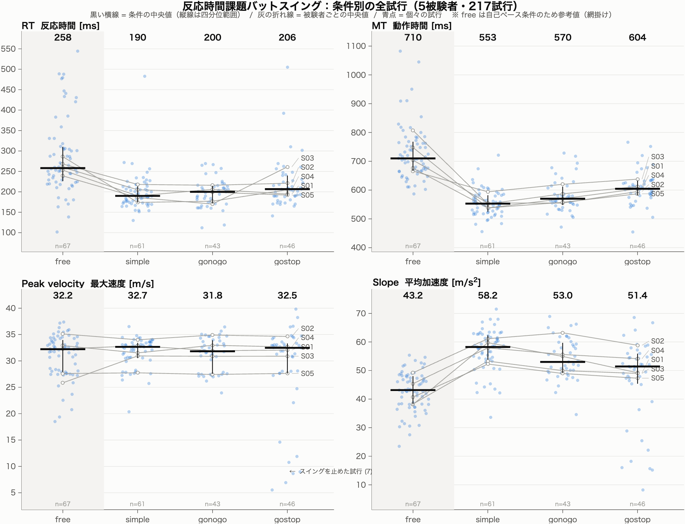

# 6.1 Pandoc — Markdown から Word への変換

作成：2026-08-28 ／ 加藤 和太郎（student）

本プロジェクトの原稿（`Manuscript/*/draft.md`、学会抄録、各 `技術説明.md`）はすべて Markdown で
書かれている。一方、学会や共著者とのやりとりで要求されるのは **Word（.docx）と PDF** である。
この橋渡しを行うのが Pandoc。

**本ドキュメントに書かれていることは、すべてこの環境で実際に動かして確認した結果である。**
未検証の事項は §11 に分けて明記した。

---

## 1. 結論だけ先に

現在このフォルダで通っている変換は、次の1行にすべて入っている。

```bash
cd "/Users/watarokato/mshinyalab_baseball_projects/Project002_反応時間課題バットスイング（加藤）/sandbox/6.1_Pandoc"

pandoc 抄録_テスト.md -o 抄録_テスト.docx -V lang=ja --citeproc \
  --bibliography="reference/選択反応課題　参考文献.bib" \
  --csl="$HOME/Zotero/styles/nature.csl"
```

これで **本文・表・数式・図・引用文献リスト**を含む Word ファイルが1発で作れる。
PDF が要るときは、できた docx を Word で開いて「名前を付けて保存 → PDF」。

| オプション | 役割 |
| --- | --- |
| `-o *.docx` | 出力ファイル。拡張子で形式が決まる |
| `-V lang=ja` | 文書の言語を日本語に設定（Word の校正機能が日本語になる） |
| `--citeproc` | 引用と文献リストを処理する。**これが無いと `[@key]` がそのまま出る** |
| `--bibliography=` | Zotero から書き出した `.bib` |
| `--csl=` | 引用の書式（§8） |

---

## 2. 環境（2026-08-28 時点・すべて確認済み）

| 項目 | 状態 |
| --- | --- |
| Pandoc | **3.10.2** / arm64 ネイティブ / `/usr/local/bin/pandoc` |
| Zotero | **9.0.6**（文献 14 件） |
| Better BibTeX | **9.0.63**（有効・自動書き出し設定済み） |
| Microsoft Word | 導入済み ← **PDF 化はこれに任せる** |
| Homebrew | 未導入（**不要だった**） |
| LaTeX | 未導入（**不要だった**） |
| OS | macOS 15.0 / Apple Silicon |

### Pandoc の導入手順（実際に通ったもの）

1. <https://github.com/jgm/pandoc/releases/latest> を開く
2. **`pandoc-<バージョン>-arm64-macOS.pkg`** をダウンロード（`x86_64` ではなく **arm64**）
3. ダブルクリックしてインストール
4. **ターミナルを開き直して** `pandoc --version` で確認

Homebrew は不要。**PDF エンジン（LaTeX）も入れなかった**。理由は §9。

---

## 3. 基本の変換

### 3-1. Markdown → Word

```bash
pandoc draft.md -o 出力.docx -V lang=ja
```

### 3-2. Word → Markdown（赤入り原稿の回収）

共著者や指導教員から赤入りの Word が返ってきたとき、Markdown に戻して差分を見る。

```bash
pandoc 赤入り.docx -t markdown -o review.md --track-changes=all
```

| `--track-changes` | 挙動 |
| --- | --- |
| `accept` | 変更履歴を反映した最終形（**既定値**） |
| `reject` | 変更履歴を破棄した元の形 |
| `all` | 挿入・削除を注記つきで残す。**誰が何を直したか読みたいときはこれ** |

**md → docx → md と往復させると元には戻らない。** HTML コメントは docx の時点で消え、
表の記法も別形式に変わる。**md を正（single source of truth）とし、docx は生成物**として扱うこと。
このフォルダの `逆変換.md` は、その往復を試した結果である（作業用ファイル）。

### 3-3. 複数ファイルを1本にまとめる

論文本体は `1. Introduction` 〜 `5. Conclusion` に分かれている。並べる順に列挙するだけでよい。

```bash
cd Manuscript
pandoc "0. Abstruct/draft.md" "1. Introduction/draft.md" "2. Methods/draft.md" \
       "3. Results/draft.md" "4. Discussion/draft.md" "5. Conclusion/draft.md" \
       -o 論文全体.docx -V lang=ja
```

---

## 4. 図の挿入

### 4-1. 書き方

```markdown

```

**`![ ]` の中に書いた文字が、そのままキャプションとして図の下に出力される。**
`` と空にするとキャプションは出ない。

### 4-2. 置き場所でキャプションの有無が変わる（重要）

| 書き方 | 結果 |
| --- | --- |
| **段落に画像だけを単独で置く**（前後に空行） | **図（figure）扱い。キャプションが付く** |
| 文中に他の文字と混ぜて置く | インライン画像扱い。**キャプションは付かない** |

「Figure 1. …」を**画像の次の行に別段落として**書いても、それはただの本文段落であり、
Word の「Image Caption」スタイルは当たらない。**キャプションは必ず `![ ]` の中に書くこと。**

### 4-3. 大きさは自動調整される

`figure/fig1. onset局面比較_MT正規化.png` は 1497 × 633 px（110 dpi ＝ 34.5 cm 相当）だが、
docx に埋め込まれた実寸は **14.8 cm × 6.27 cm** だった。
**Pandoc が本文幅に合わせて自動縮小する**ので、`{width=}` を書かなくてもページからはみ出さない。

明示したい場合：

```markdown
{width=60%}
```

`width=60%` は本文幅に対する割合。`width=12cm` のような絶対指定も効く。

### 4-4. ファイル名に半角スペースがあるとき

`fig1. onset局面比較_MT正規化.png` は `fig1.` の後にスペースが入っている。3通り試して**すべて通った**が、
確実なのは **`<>` で囲む**形。

```markdown


```

**新しく図を置くときは、スペースを `_` に置き換えておくほうが安全。**

### 4-5. 画像が入らないとき

Pandoc は画像パスを**カレントディレクトリ基準**で解決する。別フォルダから実行するなら：

```bash
--resource-path=.:figure
```

**画像が見つからなくても Pandoc は警告を出すだけで変換自体は成功する。**
キャプション文字列だけが残った docx が普通に出来上がるので、**変換後は必ず docx を開いて目視確認する**こと。

```
[WARNING] Could not fetch resource figure/xxx.png: replacing image with description
```

この警告が出たら、**ファイル名が実物と食い違っている**。

---

## 5. 数式

md 中の `$...$` / `$$...$$` は、docx で **Word の数式オブジェクト（OMML）** になる。
画像ではないので **Word 上でそのまま数式として編集できる**。
`Manuscript/2. Methods/LaTeX変換用数式一覧.md` を手で打ち直す必要はない。

### 数式の警告は「出力形式によって出る」

```
[WARNING] Could not convert TeX math \bar{a} = \frac{v_{\max}}{T_{\mathrm{MT}}}, \qquad ...
          , rendering as TeX
```

**原因は出力形式の違いであり、docx 変換の失敗ではない。**

| 出力形式 | 結果 |
| --- | --- |
| **docx** | **OMML に変換される。警告は出ない** |
| `-t plain` などテキスト系 | Unicode で表現しきれず、TeX のまま出力される。**警告が出る** |

この警告に遭遇したのは、**できた docx を `-t plain` で読み返して中身を確認したとき**だった。
docx 自体は正しく作れていた。**警告文だけを見て慌てないこと。**

---

## 6. 表と文字装飾

実データ（抄録の表）で確認した結果：

| 要素 | 結果 |
| --- | --- |
| 表のレイアウト | 崩れなし |
| 桁揃え（`:---` / `---:`） | 反映される |
| `**強調**` / `~~取り消し線~~` | 書式つきで反映 |
| 上付き `^9)^` | 上付きになる |
| インラインコード `` `median(M,2)` `` | 等幅フォントになる |
| コードブロック | 等幅・枠付き |
| 入れ子リスト | 階層が保たれる |

### HTML コメントは docx に出ない（好都合）

```markdown
<!-- 執筆方針のメモ。これは docx に出力されない -->
```

**内部メモを md に書き残したまま、提出用 docx にはきれいな本文だけを出せる。**

ただし **`>` の引用ブロックと表は普通に出力される**。抄録 `draft.md` の
「**作成**：2026-08-26」や「§0 前提」の表は**そのまま docx に載る**。
**提出前に、本文として出す範囲を確認すること**（§12 の要対処事項）。

---

## 7. 文献の引用（Zotero → Pandoc）

Zotero が直接 Pandoc に繋がるわけではない。**Zotero から `.bib` を書き出し、それを Pandoc に読ませる。**

```
Zotero ──BBT が自動書き出し──> reference/*.bib ──pandoc --citeproc──> docx
```

### 7-1. Better BibTeX の導入（実施済み）

1. <https://github.com/retorquere/zotero-better-bibtex/releases/latest> から
   `zotero-better-bibtex-<版>.xpi` を **右クリックで保存**（左クリックすると壊れる）
2. Zotero の **ツール → プラグイン**（macOS では**画面最上部のメニューバー**）
3. 右上の**歯車アイコン → 「ファイルからプラグインをインストール...」**
4. `.xpi` を選択し、Zotero を再起動

### 7-2. `.bib` の自動書き出し（設定済み）

コレクションを**右クリック →「コレクションを書き出し...」**、形式に **Better BibTeX** を選び、
**「Keep updated」にチェック**を入れて保存する。
以後 Zotero に文献を追加・修正すると **`.bib` が自動で書き換わる**。

**保存ダイアログはフォルダを選ぶ形式である。** ファイル名のつもりで `refs.bib` と入力すると
**その名前のフォルダが作られる**（実際に一度そうなった）。
保存先を確実に指定するには、ダイアログで **`⌘ + Shift + G`** を押してパスを直接貼り付ける。

**書き出した `.bib` を手で移動・リネームしないこと。** Zotero が書き出し先のパスを記憶しているため、
移動しても元の場所に書き続ける。設定をやり直す場合は
**編集 → 設定 → Better BibTeX → Automatic export** で古い登録を削除する。

現在の登録：

```
path    : sandbox/6.1_Pandoc/reference/選択反応課題　参考文献.bib
enabled : true
status  : done
```

### 7-3. citation key

```
citekeyFormat: auth.lower + shorttitle(3, 3) + year   （BBT の既定）
  → kidaIntensiveBaseballPractice2005
```

短くしたければ **設定 → Better BibTeX → Citation keys** で `auth.lower + year`（→ `kida2005`）に
変更できる。**変更すると既存の key が全部変わる**ので、本文に `[@...]` を書き始める前に決めること。

### 7-4. md での書き方

```markdown
統合課題である [@nasuBehavioralMeasuresCognitiveMotor2020]。
複数まとめて [@kidaIntensiveBaseballPractice2005; @muraskinKnowingWhenNot2015]。
ページ指定 [@welchHittingBaseballBiomechanical1995, pp. 193-201]。
文中に著者名を出す：@amicoTennisExpertiseReduces2022 は…
著者名を出さず年だけ [-@zhangGoNoGoRatios2024]。
```

### 7-5. 文献リストの位置

```markdown
## 5. 引用文献

::: {#refs}
:::

## 6. 次のセクション
```

**`::: {#refs}` を置いた位置にリストが入る。** 書かないと**文書のいちばん最後**に付く。
採番も並び順も CSL が決めるので、こちらで指定しなくてよい。

---

## 8. CSL（引用の書式）の選択

**`~/Zotero/styles/` にある CSL をそのまま `--csl=` に指定できる。**（15種類が導入済み）

```bash
--csl="$HOME/Zotero/styles/nature.csl"
```

### 8-1. 番号式と著者年式で、書けることが変わる

| 記法 | `nature.csl`（上付き番号） | `ieee.csl`（`[1]`） | `apa.csl`（著者年） |
| --- | --- | --- | --- |
| 単一 `[@key]` | ⁶ | [6] | (Imai et al., 2022) |
| ページ指定 `[@key, pp. 193-201]` | ⁵ ← **落ちる** | [5, pp. 193–201] | (Welch et al., 1995, pp. 193–201) |
| 文中著者 `@key` | ⁷ ← **著者名が出ない** | [7] ← 同じく出ない | Amico & Schaefer (2022) |

**上付き番号スタイルはページ指定を表示しない。** CSL の仕様であり、Pandoc の不具合ではない。
「Nasu ら (2020) は…」と著者名を文中に出したいなら、**著者年式でなければならない**。

### 8-2. 字数への影響（抄録では死活問題）

引用5箇所を入れた抄録本文の実測値：

| | 本文の字数 |
| --- | --- |
| 引用なし（原文） | 573 字 |
| `nature.csl`（上付き番号） | **580 字**（+7） |
| `apa.csl` | **645 字**（+72） |
| `elsevier-harvard.csl` | **647 字**（+74） |

**学会抄録は600字以内。著者年式にすると、引用を入れた時点で規定を超える。**
抄録では番号式（または引用なし）が現実的で、著者年式が向くのは字数制限の緩い**論文本体**のほう。

### 8-3. 文献リストの並び順

- **番号式**：本文への**出現順**
- **著者年式**：著者名の**アルファベット順**

### 8-4. どれを選ぶか

- `引用番号対応表.md` が上付き番号形式なので、**そのまま移行するなら `nature.csl` が近い**
- ただしその形式では**ページ指定と文中著者名が使えなくなる**
- 論文本体で「Nasu ら (2020) は…」と書きたいなら `apa.csl` か `elsevier-harvard.csl`
  （投稿先が Journal of Biomechanics 系なら後者）

---

## 9. PDF をどう作るか

**docx を Word で開き、ファイル → 名前を付けて保存 → PDF。** これで足りている。

Pandoc から直接 PDF を作るには LaTeX 等の PDF エンジンが要り、
**日本語 PDF は LaTeX 側のフォント設定が最大の詰まりどころ**になる。
Word が導入済みである以上、その手間を負う理由がない。**今回 LaTeX は導入しなかった。**

将来どうしても自動化したくなった場合の参考：エンジンは **LuaLaTeX**（`pdflatex` は日本語を扱えない）。

```bash
brew install --cask basictex
sudo tlmgr install luatexja haranoaji collection-langjapanese
pandoc draft.md -o out.pdf --pdf-engine=lualatex \
  -V documentclass=ltjsarticle -V CJKmainfont="Hiragino Sans GB"
```

**この環境で使える日本語フォントは `Hiragino Sans GB`・`BIZ UDGothic`・`BIZ UDMincho`・`Osaka` のみ。**
「ヒラギノ角ゴシック（Hiragino Sans）」「ヒラギノ明朝」は**未ダウンロード状態**なので、
指定すると `font not found` で失敗する。確認は次のコマンド：

```bash
system_profiler SPFontsDataType | grep -E "^ +Family:" | sort -u
```

---

## 10. このフォルダの構成

```
6.1_Pandoc/
├── 技術説明.md                      ← 本ファイル
├── 抄録_テスト.md                   ← 変換テスト用（A4 1ページ・実質約1,000字）
├── 抄録_テスト.docx                 ← nature.csl（上付き番号）で出力
├── 抄録_テスト_apa.docx             ← apa.csl（著者年）で出力
├── 逆変換.md                        ← docx → md の往復テスト結果
├── figure/
│   ├── fig1. onset局面比較_MT正規化.png        1497×633（横長）
│   ├── 条件別_全被験者_RT-MT-PeakVel-Slope.png 1962×1501（大）
│   └── test_small.png                          400×169（英数字名・切り分け用）
└── reference/
    └── 選択反応課題　参考文献.bib   ← Zotero が自動更新（14件）
```

`抄録_テスト.md` は `Manuscript/2026バイオメカニクス学会_抄録/draft.md` から本文（573字）を抜き、
変換テストに必要な要素（HTMLコメント・引用ブロック・表・強調・取り消し線・上付き・数式・
入れ子リスト・チェックボックス・図・引用・コードブロック）を1つずつ入れたもの。
各要素に**「着目点1〜9」**の番号を振ってあるので、変換後の docx と見比べて確認できる。
**原稿ではないので自由に編集してよい。**

### Git 運用

md を正とする以上、生成物の docx は Git に入れると差分が読めず、コンフリクトの原因にしかならない。
**共著者に送った版など、記録として残す必要があるものだけ**を日付つきファイル名でコミットする。

```gitignore
# Pandoc の生成物・作業ファイル
sandbox/6.1_Pandoc/*.docx
sandbox/6.1_Pandoc/逆変換.md
.DS_Store
```

`.bib` は Zotero が自動生成するが、**共同作業者が Zotero を持たない場合に必要**なので
コミットしておくとよい。

---

## 11. トラブルシューティング（実際に遭遇したもの）

| 症状 | 原因 | 対処 |
| --- | --- | --- |
| `pandoc: command not found` | インストール直後で PATH 未反映 | **ターミナルを開き直す** |
| `Could not fetch resource ...png` | **ファイル名が実物と食い違っている** | 名前を確認。スペース入りは `<>` で囲む（§4-4） |
| **図が入っていないのに変換は成功する** | Pandoc は画像欠落を警告どまりにする | **必ず docx を開いて目視確認**（§4-5） |
| `Could not convert TeX math ...` | **`-t plain` 等での出力時のみ**。docx では出ない | **無視してよい**。docx を Word で開いて確認（§5） |
| `[@key]` がそのまま出力される | `--citeproc` を付け忘れている | `--citeproc` を付ける |
| 文献リストが文書の最後に付く | `::: {#refs}` を書いていない | 出したい位置に置く（§7-5） |
| ページ指定が出ない／文中著者名が出ない | **番号式 CSL の仕様** | 著者年式の CSL に変える（§8-1） |
| キャプションが二重に出る | `` の `img` もキャプションになる | キャプションは `![ ]` の中だけに書く（§4-2） |
| Zotero の書き出しで `refs.bib` フォルダができる | 保存ダイアログは**フォルダを選ぶ形式** | `⌘ + Shift + G` でパスを直接指定（§7-2） |
| Zotero の「ツール」が見つからない | macOS では**画面最上部のメニューバー**にある | フルスクリーンなら画面上端にカーソルを当てる |
| 日本語ファイル名・パスでエラー | パスに空白・全角が含まれる | **常に `"` で囲む習慣にする** |

---

## 12. 次にやること

- [x] Pandoc の導入（3.10.2 / arm64）
- [x] md → docx（表・装飾・数式・HTMLコメントの挙動確認）
- [x] 図の挿入（記法・キャプション・自動縮小・スペース入りファイル名）
- [x] Zotero + Better BibTeX の導入と `.bib` の自動書き出し
- [x] `--citeproc` による引用と文献リストの自動生成
- [x] CSL の比較（番号式 / 著者年式、字数への影響）
- [ ] **【要対処】抄録の提出範囲を切り出す。** `draft.md` をそのまま変換すると、
      「§0 前提」「前提4の根拠」などの**執筆過程の検討メモがそのまま提出用 docx に載る**。
      本文は573字なのに、その何倍もの内部資料が付いてくる。
      → 提出範囲だけを別ファイル（例：`submission.md`）に切り出すのが素直
- [ ] **CSL を決める。** 学会の投稿規定を確認したうえで §8-4 の判断を行う
- [ ] **citation key の形式を決める**（§7-3）。本文に `[@...]` を書き始める前に
- [ ] **`--reference-doc` で学会指定の書式を適用する**（未検証）。
      学会から Word テンプレートが配布されていれば、それを直接指定すればスタイルだけが使われる

      ```bash
      pandoc -o reference/reference.docx --print-default-data-file reference.docx
      # Word でスタイルを学会指定に直して保存し、
      pandoc draft.md -o out.docx --reference-doc=reference/reference.docx
      ```

- [ ] **`引用番号対応表.md` からの移行を判断する。** citeproc に移せば採番は自動になるが、
      本文の `[1]` を `[@kida...]` に書き換える作業が発生する。
      **抄録は文献を引用しない方針なので急がないが、論文本体でこそ効く**
- [ ] 確定した変換コマンドを `convert.sh` として残す
